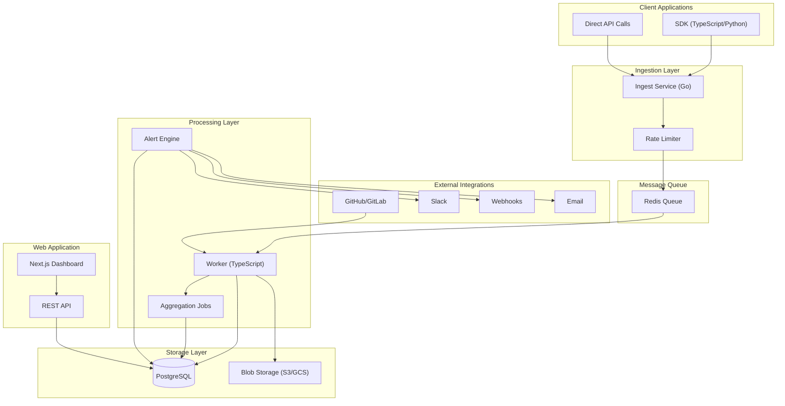
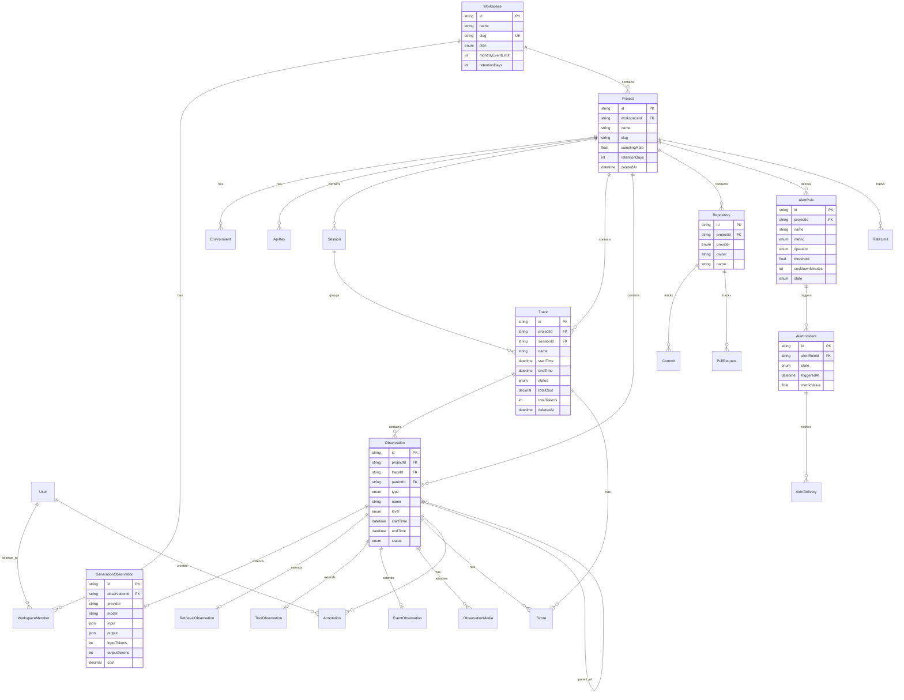
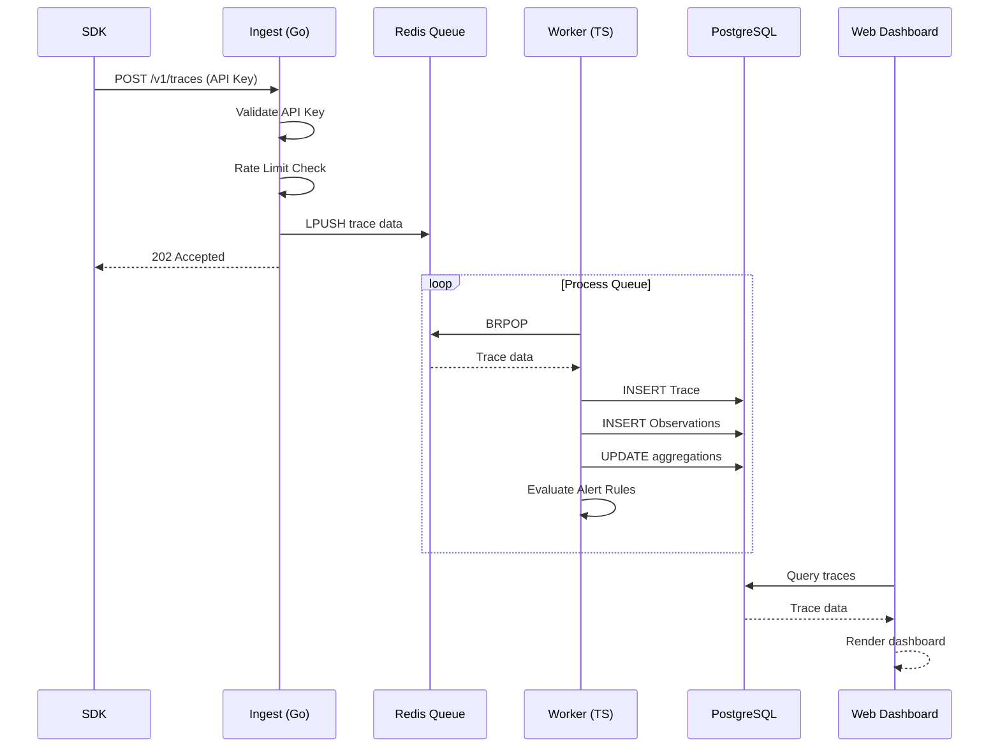
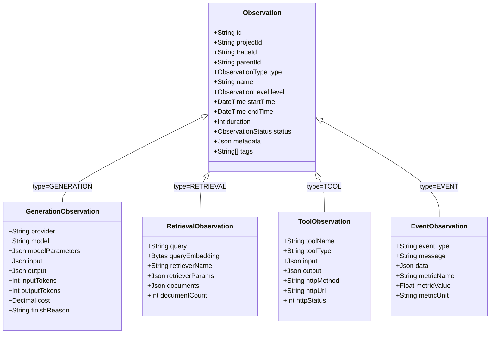

# CognObserve - Observability Schema Design

> **Status**: Draft
> **Created**: 2024-01-XX
> **Last Updated**: 2024-01-XX

## Table of Contents

1. [Overview](#overview)
2. [Design Principles](#design-principles)
3. [Domain Model](#domain-model)
   - [System Architecture Diagram](#system-architecture-diagram)
   - [Entity Relationship Diagram](#entity-relationship-diagram)
   - [Data Flow Diagram](#data-flow-diagram)
   - [Observation Type Hierarchy](#observation-type-hierarchy)
4. [Schema Specification](#schema-specification)
5. [Implementation Phases](#implementation-phases)
6. [Future Considerations](#future-considerations)
7. [Appendix](#appendix)

---

## Overview

### Purpose

This document defines the complete data model for CognObserve's observability platform. It covers:

- **LLM Observability**: Tracing, monitoring, and debugging AI/LLM applications
- **Git Intelligence**: Detecting breaking changes and regressions from code changes
- **Multi-tenancy**: Workspace and project isolation for teams

### Goals

1. **Scalability**: Handle millions of traces per day
2. **Extensibility**: Easy to add new observation types without breaking changes
3. **Query Performance**: Optimized for common dashboard and debugging queries
4. **Type Safety**: Strong typing across all services (Go, TypeScript)

---

## Design Principles

### 1. Separation of Concerns

Base observations contain common fields; type-specific data lives in dedicated tables.

```
Observation (base)
    ├── GenerationObservation (LLM-specific)
    ├── RetrievalObservation (RAG-specific)
    ├── ToolObservation (function calls)
    └── EventObservation (logs/metrics)
```

### 2. Write-Optimized Ingestion

- Append-only observations
- Async aggregation via worker
- Denormalized counters on parent entities

### 3. Read-Optimized Analytics

- Pre-computed aggregations on Trace
- Composite indexes for time-range queries
- Ready for materialized views

### 4. Event Sourcing Ready

- Immutable observations
- All mutations are new records
- Supports replay and reprocessing

### 5. Multi-tenancy from Day 1

- All entities scoped to Project/Workspace
- Ready for row-level security (RLS)
- Sharding-friendly key design

---

## Domain Model

### System Architecture Diagram



### Entity Relationship Diagram



### Data Flow Diagram



### Observation Type Hierarchy



### High-Level Architecture (Text)

```
┌─────────────────────────────────────────────────────────────────────────┐
│                              MULTI-TENANCY                              │
├─────────────────────────────────────────────────────────────────────────┤
│  Workspace ──┬── Member (User + Role)                                   │
│              ├── Project ──┬── Environment (dev/staging/prod)           │
│              │             ├── ApiKey                                   │
│              │             └── Repository (git integration)             │
│              └── Billing/Quota                                          │
└─────────────────────────────────────────────────────────────────────────┘

┌─────────────────────────────────────────────────────────────────────────┐
│                            OBSERVABILITY CORE                           │
├─────────────────────────────────────────────────────────────────────────┤
│  Trace ────── Session (optional grouping)                               │
│    │                                                                    │
│    └── Observation (base) ──┬── GenerationObservation (LLM)             │
│              │              ├── RetrievalObservation (RAG)              │
│              │              ├── ToolObservation (function calls)        │
│              │              └── EventObservation (logs/custom)          │
│              │                                                          │
│              └── ObservationMedia (attachments: images, audio, files)   │
└─────────────────────────────────────────────────────────────────────────┘

┌─────────────────────────────────────────────────────────────────────────┐
│                              INTELLIGENCE                               │
├─────────────────────────────────────────────────────────────────────────┤
│  Score ──────── Evaluation (quality, correctness, etc.)                 │
│  Alert ──────── AlertRule + NotificationChannel                         │
│  Annotation ─── Human feedback on observations                          │
└─────────────────────────────────────────────────────────────────────────┘

┌─────────────────────────────────────────────────────────────────────────┐
│                             GIT INTELLIGENCE                            │
├─────────────────────────────────────────────────────────────────────────┤
│  Repository ──┬── Commit                                                │
│               ├── PullRequest                                           │
│               └── ChangeAnalysis (breaking changes, regressions)        │
│                         │                                               │
│                         └── linked to Trace (version correlation)       │
└─────────────────────────────────────────────────────────────────────────┘
```

### Entity Relationships

```
Workspace (1) ──── (*) Project
Project (1) ──── (*) Environment
Project (1) ──── (*) ApiKey
Project (1) ──── (*) Session
Project (1) ──── (*) Trace
Project (1) ──── (*) Observation  // denormalized for direct queries
Project (1) ──── (*) Repository
Project (1) ──── (*) AlertRule
Project (1) ──── (*) RateLimit

Session (1) ──── (*) Trace
Trace (1) ──── (*) Observation
Observation (1) ──── (0..1) GenerationObservation
Observation (1) ──── (0..1) RetrievalObservation
Observation (1) ──── (0..1) ToolObservation
Observation (1) ──── (0..1) EventObservation
Observation (1) ──── (*) ObservationMedia
Observation (1) ──── (*) Score
Observation (1) ──── (*) Annotation

AlertRule (1) ──── (*) AlertIncident
AlertIncident (1) ──── (*) AlertDelivery

Repository (1) ──── (*) Commit
Repository (1) ──── (*) PullRequest
```

---

## Schema Specification

### Enums

```prisma
enum Plan {
  FREE
  PRO
  TEAM
  ENTERPRISE
}

enum WorkspaceRole {
  OWNER
  ADMIN
  MEMBER
  VIEWER
}

enum ApiScope {
  INGEST
  READ
  WRITE
  ADMIN
}

enum TraceStatus {
  RUNNING
  COMPLETED
  ERROR
}

enum ObservationType {
  GENERATION    // LLM calls
  RETRIEVAL     // RAG/vector search
  TOOL          // Function/API calls
  EVENT         // Logs, metrics, custom
}

enum ObservationLevel {
  DEBUG
  INFO
  WARN
  ERROR
}

enum ObservationStatus {
  RUNNING
  COMPLETED
  ERROR
  CANCELLED
}

enum MediaType {
  IMAGE
  AUDIO
  VIDEO
  FILE
}

enum ScoreSource {
  HUMAN
  MODEL
  RULE
  SDK
}

enum AnnotationType {
  COMMENT
  CORRECTION
  FLAG
}

enum AlertMetric {
  ERROR_RATE
  LATENCY_P50
  LATENCY_P95
  LATENCY_P99
  COST_TOTAL
  COST_PER_TRACE
  TOKEN_USAGE
  TRACE_COUNT
}

enum AlertOperator {
  GT
  GTE
  LT
  LTE
  EQ
}

enum AlertState {
  OK
  ALERTING
}

enum IncidentState {
  OPEN
  ACKNOWLEDGED
  RESOLVED
}

enum AlertChannel {
  EMAIL
  SLACK
  WEBHOOK
  PAGERDUTY
}

enum GitProvider {
  GITHUB
  GITLAB
  BITBUCKET
}

enum AnalysisStatus {
  PENDING
  PROCESSING
  COMPLETED
  FAILED
}

enum PRState {
  OPEN
  MERGED
  CLOSED
}

enum DeliveryStatus {
  PENDING
  SENT
  FAILED
  SKIPPED
}
```

---

### Multi-Tenancy Models

#### Workspace

Root entity for multi-tenancy. Contains billing, quotas, and team members.

```prisma
model Workspace {
  id          String   @id @default(cuid())
  name        String
  slug        String   @unique
  plan        Plan     @default(FREE)

  createdAt   DateTime @default(now())
  updatedAt   DateTime @updatedAt

  members     WorkspaceMember[]
  projects    Project[]

  // Quotas
  monthlyEventLimit  Int @default(10000)
  retentionDays      Int @default(30)

  @@index([slug])
}
```

#### WorkspaceMember

Links users to workspaces with roles.

```prisma
model WorkspaceMember {
  id          String   @id @default(cuid())
  workspaceId String
  userId      String
  role        WorkspaceRole @default(MEMBER)

  createdAt   DateTime @default(now())

  workspace   Workspace @relation(fields: [workspaceId], references: [id], onDelete: Cascade)
  user        User      @relation(fields: [userId], references: [id], onDelete: Cascade)

  @@unique([workspaceId, userId])
  @@index([userId])
}
```

#### User

Platform users (authentication handled externally).

```prisma
model User {
  id            String   @id @default(cuid())
  email         String   @unique
  name          String?
  avatarUrl     String?

  createdAt     DateTime @default(now())
  updatedAt     DateTime @updatedAt

  memberships   WorkspaceMember[]
  annotations   Annotation[]
}
```

#### Project

Logical grouping within a workspace. All observability data is scoped to a project.

```prisma
model Project {
  id            String   @id @default(cuid())
  workspaceId   String
  name          String
  slug          String
  description   String?

  // Sampling & Retention
  samplingRate      Float    @default(1.0)  // 0.0-1.0, for high-volume control
  retentionDays     Int      @default(30)   // auto-delete after N days
  dailyCostBudget   Decimal? @db.Decimal(10, 2)  // optional cost limit

  // Soft delete
  deletedAt     DateTime?

  createdAt     DateTime @default(now())
  updatedAt     DateTime @updatedAt

  workspace     Workspace    @relation(fields: [workspaceId], references: [id], onDelete: Cascade)
  environments  Environment[]
  apiKeys       ApiKey[]
  traces        Trace[]
  observations  Observation[]
  sessions      Session[]
  repositories  Repository[]
  alertRules    AlertRule[]
  rateLimits    RateLimit[]

  @@unique([workspaceId, slug])
  @@index([workspaceId])
  @@index([deletedAt])
}
```

#### Environment

Separates dev/staging/prod within a project.

```prisma
model Environment {
  id          String   @id @default(cuid())
  projectId   String
  name        String   // dev, staging, prod, custom
  color       String?  // for UI
  isDefault   Boolean  @default(false)

  createdAt   DateTime @default(now())

  project     Project  @relation(fields: [projectId], references: [id], onDelete: Cascade)
  traces      Trace[]
  apiKeys     ApiKey[]

  @@unique([projectId, name])
}
```

#### ApiKey

Authentication for SDK/API access.

```prisma
model ApiKey {
  id            String    @id @default(cuid())
  projectId     String
  environmentId String?

  name          String
  keyHash       String    @unique  // hashed, never store plain
  keyPrefix     String              // "co_pk_" for display
  scopes        ApiScope[]

  lastUsedAt    DateTime?
  expiresAt     DateTime?
  revokedAt     DateTime?
  createdAt     DateTime  @default(now())

  project       Project     @relation(fields: [projectId], references: [id], onDelete: Cascade)
  environment   Environment? @relation(fields: [environmentId], references: [id])

  @@index([keyHash])
  @@index([projectId])
}
```

---

### Observability Core Models

#### Session

Groups related traces (e.g., user session, conversation thread).

```prisma
model Session {
  id          String   @id @default(cuid())
  projectId   String
  externalId  String?  // client-provided session ID

  userId      String?  // end-user ID (from client app)
  userProps   Json?    // end-user properties

  // Aggregations (denormalized, updated by worker)
  traceCount        Int       @default(0)
  observationCount  Int       @default(0)
  totalCost         Decimal?  @db.Decimal(10, 6)
  totalTokens       Int?
  totalDuration     Int?      // ms, sum of all trace durations
  errorCount        Int       @default(0)
  firstTraceAt      DateTime?
  lastTraceAt       DateTime?

  createdAt   DateTime @default(now())
  updatedAt   DateTime @updatedAt

  project     Project  @relation(fields: [projectId], references: [id], onDelete: Cascade)
  traces      Trace[]

  @@unique([projectId, externalId])
  @@index([projectId, createdAt])
  @@index([projectId, userId])
  @@index([projectId, lastTraceAt])
}
```

#### Trace

Top-level entity representing an end-to-end request or operation.

```prisma
model Trace {
  id            String    @id @default(cuid())
  projectId     String
  environmentId String?
  sessionId     String?

  externalId    String?   // client-provided trace ID
  name          String?

  // Request context
  userId        String?   // end-user
  userProps     Json?

  // Git correlation
  version       String?   // app version / commit SHA
  release       String?   // release tag

  // Timing
  startTime     DateTime
  endTime       DateTime?
  duration      Int?      // ms, computed on completion

  // Status
  status        TraceStatus @default(RUNNING)
  level         ObservationLevel @default(INFO)

  // Metadata
  metadata      Json?
  tags          String[]

  // Cost aggregation (denormalized for queries)
  totalCost         Decimal?  @db.Decimal(10, 6)
  inputTokens       Int?      // sum of all generation input tokens
  outputTokens      Int?      // sum of all generation output tokens
  totalTokens       Int?

  // Soft delete
  deletedAt     DateTime?

  createdAt     DateTime  @default(now())
  updatedAt     DateTime  @updatedAt

  project       Project      @relation(fields: [projectId], references: [id], onDelete: Cascade)
  environment   Environment? @relation(fields: [environmentId], references: [id])
  session       Session?     @relation(fields: [sessionId], references: [id])
  observations  Observation[]
  scores        Score[]

  @@unique([projectId, externalId])
  @@index([projectId, createdAt])
  @@index([projectId, startTime])
  @@index([projectId, userId])
  @@index([projectId, status])
  @@index([projectId, version])
  @@index([projectId, deletedAt, createdAt])
  @@index([sessionId])
}
```

#### Observation (Base)

Individual operation within a trace. Uses type-specific relations for specialized data.

```prisma
model Observation {
  id            String    @id @default(cuid())
  projectId     String    // denormalized for direct queries without join
  traceId       String
  parentId      String?   // for nested spans

  type          ObservationType
  name          String
  level         ObservationLevel @default(INFO)

  // Timing
  startTime     DateTime
  endTime       DateTime?
  duration      Int?      // ms

  // Status
  status        ObservationStatus @default(RUNNING)
  statusCode    Int?
  errorMessage  String?
  errorStack    String?

  // Common metadata
  metadata      Json?
  tags          String[]

  // Ordering within trace
  sequence      Int       @default(0)
  depth         Int       @default(0)

  createdAt     DateTime  @default(now())
  updatedAt     DateTime  @updatedAt

  project       Project   @relation(fields: [projectId], references: [id], onDelete: Cascade)
  trace         Trace     @relation(fields: [traceId], references: [id], onDelete: Cascade)
  parent        Observation?  @relation("ObservationHierarchy", fields: [parentId], references: [id])
  children      Observation[] @relation("ObservationHierarchy")

  // Type-specific relations (only one will be populated)
  generation    GenerationObservation?
  retrieval     RetrievalObservation?
  tool          ToolObservation?
  event         EventObservation?

  // Attachments
  media         ObservationMedia[]
  scores        Score[]
  annotations   Annotation[]

  @@index([projectId, createdAt])
  @@index([projectId, type, status])
  @@index([traceId, startTime])
  @@index([traceId, type])
  @@index([traceId, parentId])
  @@index([traceId, sequence])
}
```

#### GenerationObservation

LLM-specific data: model, tokens, cost.

```prisma
model GenerationObservation {
  id              String   @id @default(cuid())
  observationId   String   @unique

  // Model info
  provider        String   // openai, anthropic, etc.
  model           String   // gpt-4, claude-3-opus, etc.
  modelParameters Json?    // temperature, max_tokens, etc.

  // Input/Output
  input           Json     // messages array or prompt string
  inputTokens     Int?
  output          Json?    // completion
  outputTokens    Int?

  // Cost
  totalTokens     Int?
  cost            Decimal? @db.Decimal(10, 6)

  // Quality signals
  finishReason    String?  // stop, length, tool_calls, etc.

  observation     Observation @relation(fields: [observationId], references: [id], onDelete: Cascade)

  @@index([provider, model])
}
```

#### RetrievalObservation

RAG/vector search data.

```prisma
model RetrievalObservation {
  id              String   @id @default(cuid())
  observationId   String   @unique

  // Query
  query           String
  queryEmbedding  Bytes?   // optional: store embedding

  // Retriever info
  retrieverName   String?
  retrieverParams Json?    // top_k, threshold, etc.

  // Results
  documents       Json     // array of { id, content, score, metadata }
  documentCount   Int

  observation     Observation @relation(fields: [observationId], references: [id], onDelete: Cascade)
}
```

#### ToolObservation

Function/API call data.

```prisma
model ToolObservation {
  id              String   @id @default(cuid())
  observationId   String   @unique

  toolName        String
  toolType        String?  // function, api, mcp, etc.

  input           Json?
  output          Json?

  // For API calls
  httpMethod      String?
  httpUrl         String?
  httpStatus      Int?

  observation     Observation @relation(fields: [observationId], references: [id], onDelete: Cascade)

  @@index([toolName])
}
```

#### EventObservation

Generic logs, metrics, and custom events.

```prisma
model EventObservation {
  id              String   @id @default(cuid())
  observationId   String   @unique

  eventType       String   // log, metric, custom
  message         String?
  data            Json?

  // For metrics
  metricName      String?
  metricValue     Float?
  metricUnit      String?

  observation     Observation @relation(fields: [observationId], references: [id], onDelete: Cascade)

  @@index([eventType])
  @@index([metricName])
}
```

#### ObservationMedia

Attachments: images, audio, files.

```prisma
model ObservationMedia {
  id              String   @id @default(cuid())
  observationId   String

  type            MediaType // IMAGE, AUDIO, VIDEO, FILE
  mimeType        String
  fileName        String?
  fileSize        Int?

  // Storage
  storageProvider String   // s3, gcs, local
  storagePath     String
  publicUrl       String?

  // For images
  width           Int?
  height          Int?

  // For audio/video
  duration        Float?   // seconds

  createdAt       DateTime @default(now())

  observation     Observation @relation(fields: [observationId], references: [id], onDelete: Cascade)

  @@index([observationId])
}
```

---

### Evaluation & Feedback Models

#### Score

Quality scores from humans, models, or rules.

```prisma
model Score {
  id              String   @id @default(cuid())
  traceId         String?
  observationId   String?

  name            String   // accuracy, relevance, toxicity, etc.
  value           Float    // score value within [minValue, maxValue]

  // Score range (allows custom scales beyond 0-1)
  minValue        Float    @default(0)
  maxValue        Float    @default(1)

  source          ScoreSource // HUMAN, MODEL, RULE, SDK

  // For model-based evals
  evalModel       String?
  evalPrompt      String?
  reasoning       String?

  // Metadata
  metadata        Json?

  createdAt       DateTime @default(now())
  createdBy       String?  // user ID for human scores

  trace           Trace?       @relation(fields: [traceId], references: [id], onDelete: Cascade)
  observation     Observation? @relation(fields: [observationId], references: [id], onDelete: Cascade)

  @@index([traceId, name])
  @@index([observationId, name])
  @@index([name, source])
}
```

#### Annotation

Human feedback and corrections.

```prisma
model Annotation {
  id              String   @id @default(cuid())
  observationId   String
  userId          String

  type            AnnotationType // COMMENT, CORRECTION, FLAG
  content         String

  // For corrections
  correctedOutput Json?

  createdAt       DateTime @default(now())
  updatedAt       DateTime @updatedAt

  observation     Observation @relation(fields: [observationId], references: [id], onDelete: Cascade)
  user            User        @relation(fields: [userId], references: [id])

  @@index([observationId])
}
```

---

### Alerting Models

#### AlertRule

Defines conditions for triggering alerts.

```prisma
model AlertRule {
  id              String   @id @default(cuid())
  projectId       String

  name            String
  description     String?
  isEnabled       Boolean  @default(true)

  // Conditions
  metric          AlertMetric  // ERROR_RATE, LATENCY_P99, COST, etc.
  operator        AlertOperator // GT, LT, EQ, etc.
  threshold       Float
  windowMinutes   Int          // evaluation window

  // Filters
  filters         Json?        // { environment, model, tags, etc. }

  // Notification
  channels        AlertChannel[]

  // Alert behavior
  cooldownMinutes    Int      @default(60)    // don't re-alert within window
  repeatIntervalMins Int?                      // re-alert if still triggered (null = no repeat)
  maxIncidentsPerDay Int      @default(10)    // prevent alert storms

  // State
  state           AlertState   @default(OK)
  lastTriggeredAt DateTime?
  incidentsToday  Int          @default(0)    // reset daily by worker

  createdAt       DateTime @default(now())
  updatedAt       DateTime @updatedAt

  project         Project  @relation(fields: [projectId], references: [id], onDelete: Cascade)
  incidents       AlertIncident[]

  @@index([projectId, isEnabled])
}
```

#### AlertIncident

Individual alert occurrences.

```prisma
model AlertIncident {
  id              String   @id @default(cuid())
  alertRuleId     String

  state           IncidentState @default(OPEN)

  triggeredAt     DateTime
  resolvedAt      DateTime?
  acknowledgedAt  DateTime?
  acknowledgedBy  String?

  // Snapshot of values when triggered
  metricValue     Float
  threshold       Float

  alertRule       AlertRule @relation(fields: [alertRuleId], references: [id], onDelete: Cascade)
  deliveries      AlertDelivery[]

  @@index([alertRuleId, state])
  @@index([triggeredAt])
}
```

#### AlertDelivery

Tracks notification delivery attempts for each incident.

```prisma
model AlertDelivery {
  id              String   @id @default(cuid())
  incidentId      String

  channel         AlertChannel
  status          DeliveryStatus @default(PENDING)

  attempts        Int      @default(0)
  maxAttempts     Int      @default(3)
  lastAttemptAt   DateTime?
  nextAttemptAt   DateTime?

  // Response details
  responseCode    Int?
  responseBody    String?
  error           String?

  createdAt       DateTime @default(now())
  updatedAt       DateTime @updatedAt

  incident        AlertIncident @relation(fields: [incidentId], references: [id], onDelete: Cascade)

  @@index([incidentId])
  @@index([status, nextAttemptAt])
}
```

---

### Rate Limiting Models

#### RateLimit

Tracks API usage for rate limiting per project.

```prisma
model RateLimit {
  id            String   @id @default(cuid())
  projectId     String

  windowStart   DateTime
  windowMinutes Int      @default(1)  // 1, 5, 60, etc.

  eventCount    Int      @default(0)
  byteCount     Int      @default(0)

  project       Project  @relation(fields: [projectId], references: [id], onDelete: Cascade)

  @@unique([projectId, windowStart, windowMinutes])
  @@index([projectId, windowStart])
}
```

---

### Git Intelligence Models

#### Repository

Connected git repositories.

```prisma
model Repository {
  id              String   @id @default(cuid())
  projectId       String

  provider        GitProvider // GITHUB, GITLAB, BITBUCKET
  owner           String
  name            String
  defaultBranch   String   @default("main")

  // OAuth/App connection
  installationId  String?
  accessToken     String?  // encrypted

  isActive        Boolean  @default(true)
  lastSyncAt      DateTime?

  createdAt       DateTime @default(now())
  updatedAt       DateTime @updatedAt

  project         Project  @relation(fields: [projectId], references: [id], onDelete: Cascade)
  commits         Commit[]
  pullRequests    PullRequest[]

  @@unique([projectId, provider, owner, name])
  @@index([projectId])
}
```

#### Commit

Individual commits with analysis.

```prisma
model Commit {
  id              String   @id @default(cuid())
  repositoryId    String

  sha             String
  message         String
  author          String
  authorEmail     String?

  committedAt     DateTime

  // Analysis
  analysisStatus  AnalysisStatus @default(PENDING)
  analysisResult  Json?          // breaking changes, risk score, etc.

  createdAt       DateTime @default(now())

  repository      Repository @relation(fields: [repositoryId], references: [id], onDelete: Cascade)

  @@unique([repositoryId, sha])
  @@index([repositoryId, committedAt])
}
```

#### PullRequest

Pull requests with change analysis.

```prisma
model PullRequest {
  id              String   @id @default(cuid())
  repositoryId    String

  number          Int
  title           String
  state           PRState  // OPEN, MERGED, CLOSED

  baseBranch      String
  headBranch      String

  author          String

  // Analysis
  analysisStatus  AnalysisStatus @default(PENDING)
  analysisResult  Json?          // breaking changes, regression risk
  riskScore       Float?         // 0-1

  openedAt        DateTime
  mergedAt        DateTime?
  closedAt        DateTime?

  createdAt       DateTime @default(now())
  updatedAt       DateTime @updatedAt

  repository      Repository @relation(fields: [repositoryId], references: [id], onDelete: Cascade)

  @@unique([repositoryId, number])
  @@index([repositoryId, state])
}
```

---

## Implementation Phases

> **Note:** Phases are designed to deliver incremental value. Each phase should be fully tested before moving to the next. Consider deploying observation types together (Phase 2) to avoid migration complexity.

### Phase 1: Foundation + Basic Observability

**Goal**: Multi-tenancy with end-to-end trace validation ("hello world")

| Model | Priority | Notes |
|-------|----------|-------|
| User | P0 | Basic user entity |
| Workspace | P0 | Multi-tenancy root |
| WorkspaceMember | P0 | User-workspace link |
| Project | P0 | Project within workspace |
| Environment | P1 | Can defer, use default |
| ApiKey | P0 | Required for ingestion |
| Trace | P0 | Validate end-to-end flow |
| RateLimit | P1 | Basic rate limiting |

**Tasks**:
- [ ] Create Prisma schema for Phase 1 models
- [ ] Generate and run migrations
- [ ] Create basic CRUD API endpoints
- [ ] Implement API key generation and validation
- [ ] Add authentication middleware
- [ ] Implement basic trace ingestion (Go ingest → Redis → Worker → DB)
- [ ] Create simple trace list API to validate the flow
- [ ] Add rate limiting middleware

**Validation**: Can create project, generate API key, ingest a trace, and query it back.

---

### Phase 2: Full Observability Core

**Goal**: Complete observation hierarchy with all types (deploy together to avoid migration complexity)

| Model | Priority | Notes |
|-------|----------|-------|
| Observation | P0 | Base observation |
| GenerationObservation | P0 | LLM calls |
| RetrievalObservation | P0 | RAG support |
| ToolObservation | P0 | Function calls |
| EventObservation | P0 | Logs/metrics |
| Session | P1 | Optional grouping |

**Tasks**:
- [ ] Create Prisma schema for all observation types (single migration)
- [ ] Update proto definitions for full ingestion API
- [ ] Implement Go ingest handlers for all observation types
- [ ] Implement worker for async processing and aggregation
- [ ] Create trace list/detail API endpoints
- [ ] Build trace viewer UI with observation hierarchy

**Validation**: Can ingest complex traces with nested observations of all types.

---

### Phase 3: Git Intelligence

**Goal**: Code change correlation (high value for debugging regressions)

| Model | Priority | Notes |
|-------|----------|-------|
| Repository | P0 | Git connections |
| Commit | P0 | Commit tracking |
| PullRequest | P1 | PR analysis |

**Tasks**:
- [ ] Create git schema
- [ ] Implement GitHub App/OAuth integration
- [ ] Build commit sync worker
- [ ] Add `version` field correlation in trace queries
- [ ] Create commit/version comparison UI
- [ ] Build PR risk assessment (Phase 3.5)

**Validation**: Can link traces to commits, compare error rates between versions.

---

### Phase 4: Evaluation & Feedback

**Goal**: Quality scoring and human feedback

| Model | Priority | Notes |
|-------|----------|-------|
| Score | P0 | Quality scores |
| Annotation | P1 | Human feedback |
| ObservationMedia | P1 | Attachments |

**Tasks**:
- [ ] Create scoring schema
- [ ] Implement score API (create, query, aggregate)
- [ ] Build annotation UI
- [ ] Add score visualization to trace viewer
- [ ] Implement media upload/storage

**Validation**: Can score observations, add annotations, view aggregate quality metrics.

---

### Phase 5: Alerting

**Goal**: Proactive monitoring with reliable delivery

| Model | Priority | Notes |
|-------|----------|-------|
| AlertRule | P0 | Alert definitions |
| AlertIncident | P0 | Alert occurrences |
| AlertDelivery | P0 | Delivery tracking |

**Tasks**:
- [ ] Create alerting schema
- [ ] Implement alert rule evaluation engine in worker
- [ ] Build alert delivery system with retries
- [ ] Integrate notification channels (Slack, email, webhook)
- [ ] Build alert management UI
- [ ] Add cooldown and storm prevention logic

**Validation**: Can define rules, receive alerts, track delivery status.

---

## Future Considerations

### Scaling Strategies

1. **Table Partitioning**
   - Partition Trace/Observation by `createdAt` (monthly)
   - Partition by `projectId` for large tenants

2. **Read Replicas**
   - Route dashboard queries to replicas
   - Keep write path on primary

3. **Archival**
   - Move old data to cold storage (S3/GCS)
   - Keep metadata for querying

4. **Sharding**
   - Shard by `workspaceId` for horizontal scale
   - Use consistent hashing

### Additional Features

| Feature | Schema Impact |
|---------|---------------|
| Prompt Registry | Add `Prompt`, `PromptVersion` models |
| A/B Testing | Add experiment fields to Trace |
| Datasets | Add `Dataset`, `DatasetItem` models |
| Cost Budgets | Add `Budget`, `BudgetAlert` models |
| Audit Log | Add `AuditEvent` model |
| RBAC | Add `Role`, `Permission` models |

### Performance Optimizations

1. **Materialized Views**
   - Daily/hourly aggregations
   - Per-model cost summaries

2. **Caching**
   - Redis for hot traces
   - Query result caching

3. **Async Processing**
   - Token counting
   - Cost calculation
   - Aggregation updates

---

## Appendix

### Index Strategy

| Table | Index | Purpose |
|-------|-------|---------|
| Trace | `(projectId, createdAt)` | Time-range queries |
| Trace | `(projectId, userId)` | User filtering |
| Trace | `(projectId, status)` | Status filtering |
| Trace | `(projectId, deletedAt, createdAt)` | Soft delete filtering |
| Observation | `(projectId, createdAt)` | Direct project queries |
| Observation | `(projectId, type, status)` | Error filtering by project |
| Observation | `(traceId, startTime)` | Trace timeline |
| Observation | `(traceId, type)` | Type filtering |
| GenerationObservation | `(provider, model)` | Model analytics |
| Session | `(projectId, lastTraceAt)` | Recent sessions |

### JSON Column Indexing

Several models use `Json` columns for flexible metadata. For production performance, consider these PostgreSQL GIN indexes:

```sql
-- Trace metadata (for custom attribute queries)
CREATE INDEX idx_trace_metadata ON "Trace" USING GIN (metadata jsonb_path_ops);

-- Observation metadata
CREATE INDEX idx_observation_metadata ON "Observation" USING GIN (metadata jsonb_path_ops);

-- GenerationObservation model parameters (for queries like "temperature > 0.7")
CREATE INDEX idx_generation_params ON "GenerationObservation" USING GIN ("modelParameters" jsonb_path_ops);
```

**Best Practices:**
1. Only create GIN indexes on JSON fields you actually query
2. For frequently-queried paths, consider extracting to dedicated columns
3. Use `jsonb_path_ops` for containment queries (`@>`) - smaller and faster
4. Monitor index size - GIN indexes can grow large

**Query Examples:**
```sql
-- Find traces with specific metadata
SELECT * FROM "Trace"
WHERE metadata @> '{"customer_id": "cust_123"}';

-- Find generations with high temperature
SELECT * FROM "GenerationObservation"
WHERE "modelParameters" @> '{"temperature": 0.9}';
```

### Naming Conventions

- **Tables**: PascalCase singular (`Trace`, `Observation`)
- **Columns**: camelCase (`createdAt`, `projectId`)
- **Enums**: UPPER_SNAKE_CASE values (`RUNNING`, `COMPLETED`)
- **Indexes**: Composite on common query patterns

### Security Considerations

- Never store plain API keys (hash with bcrypt/argon2)
- Encrypt sensitive fields (accessToken)
- Scope all queries by projectId/workspaceId
- Implement rate limiting on ingest endpoints
- Audit log for sensitive operations
