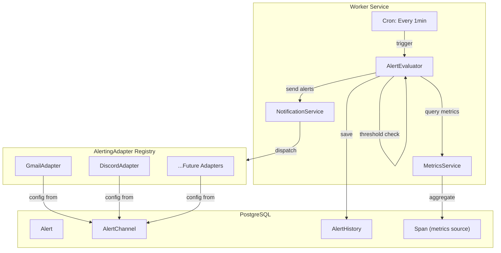
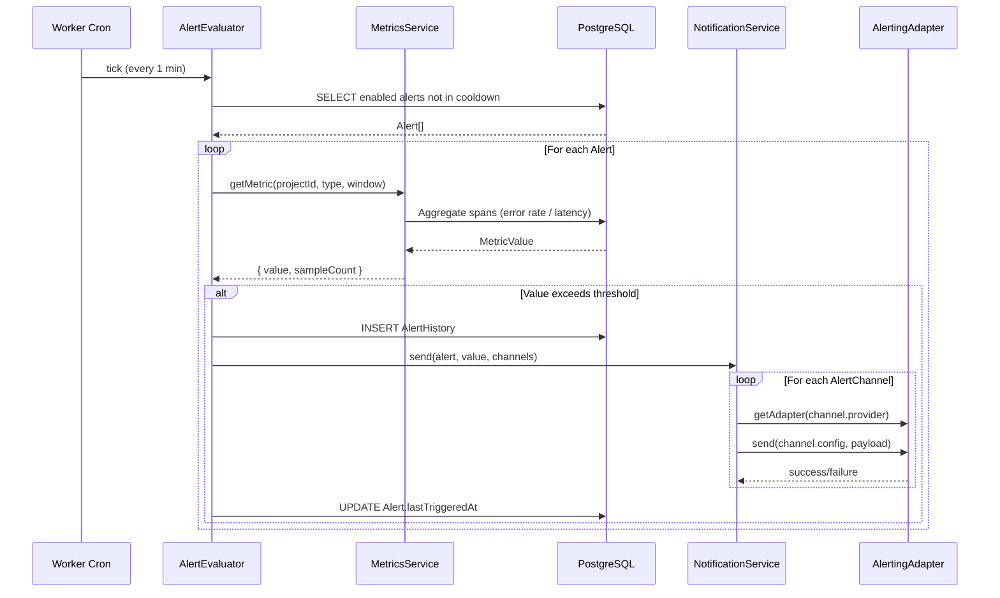
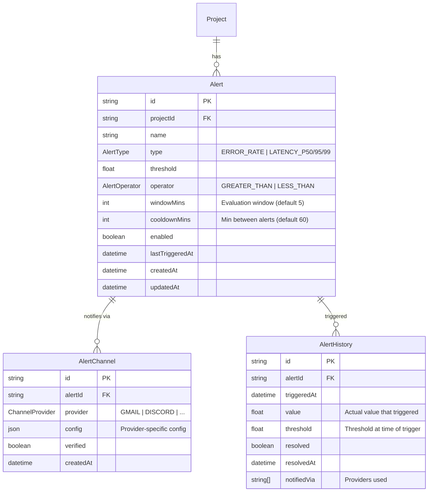

# Sprint 1: Core Alerting + Adapter Pattern

**Issue:** #80
**Points:** 8
**Dependencies:** None (Foundation sprint)

---

## 1. Overview

Build the alerting foundation: database models, alert evaluation worker, metrics calculation, and the extensible AlertingAdapter pattern for notification providers.

### Deliverables

| Component | Type | Priority |
|-----------|------|----------|
| Alert/AlertChannel/AlertHistory models | Migration | P0 |
| AlertingAdapter interface | Library | P0 |
| Alert evaluation worker job | Worker | P0 |
| Metrics service (error rate, latency) | Library | P0 |
| Alerts tRPC router (CRUD) | API | P0 |

---

## 2. Architecture

### 2.1 System Context



### 2.2 Alert Evaluation Flow



---

## 3. Database Design

### 3.1 Schema Diagram



### 3.2 Prisma Schema

```prisma
// packages/db/prisma/schema.prisma

// ============================================================
// ALERTING MODELS
// ============================================================

model Alert {
  id              String         @id @default(cuid())
  projectId       String
  project         Project        @relation(fields: [projectId], references: [id], onDelete: Cascade)
  name            String
  type            AlertType
  threshold       Float
  operator        AlertOperator  @default(GREATER_THAN)
  windowMins      Int            @default(5)
  cooldownMins    Int            @default(60)
  enabled         Boolean        @default(true)
  lastTriggeredAt DateTime?
  channels        AlertChannel[]
  history         AlertHistory[]
  createdAt       DateTime       @default(now())
  updatedAt       DateTime       @updatedAt

  @@index([projectId])
  @@index([enabled, lastTriggeredAt])
  @@map("alerts")
}

model AlertChannel {
  id        String          @id @default(cuid())
  alertId   String
  alert     Alert           @relation(fields: [alertId], references: [id], onDelete: Cascade)
  provider  ChannelProvider
  config    Json            // Encrypted at application level
  verified  Boolean         @default(false)
  createdAt DateTime        @default(now())

  @@index([alertId])
  @@map("alert_channels")
}

model AlertHistory {
  id          String    @id @default(cuid())
  alertId     String
  alert       Alert     @relation(fields: [alertId], references: [id], onDelete: Cascade)
  triggeredAt DateTime  @default(now())
  value       Float
  threshold   Float
  resolved    Boolean   @default(false)
  resolvedAt  DateTime?
  notifiedVia String[]

  @@index([alertId, triggeredAt])
  @@index([triggeredAt])
  @@map("alert_history")
}

enum AlertType {
  ERROR_RATE
  LATENCY_P50
  LATENCY_P95
  LATENCY_P99
}

enum AlertOperator {
  GREATER_THAN
  LESS_THAN
}

enum ChannelProvider {
  GMAIL
  DISCORD
  SLACK
  PAGERDUTY
  WEBHOOK
}

// Add relation to Project
model Project {
  // ... existing fields
  alerts Alert[]
}
```

### 3.3 Migration SQL

```sql
-- Migration: add_alerting

-- 1. Create enums
CREATE TYPE "AlertType" AS ENUM ('ERROR_RATE', 'LATENCY_P50', 'LATENCY_P95', 'LATENCY_P99');
CREATE TYPE "AlertOperator" AS ENUM ('GREATER_THAN', 'LESS_THAN');
CREATE TYPE "ChannelProvider" AS ENUM ('GMAIL', 'DISCORD', 'SLACK', 'PAGERDUTY', 'WEBHOOK');

-- 2. Create alerts table
CREATE TABLE "alerts" (
  "id" TEXT PRIMARY KEY,
  "projectId" TEXT NOT NULL,
  "name" TEXT NOT NULL,
  "type" "AlertType" NOT NULL,
  "threshold" DOUBLE PRECISION NOT NULL,
  "operator" "AlertOperator" NOT NULL DEFAULT 'GREATER_THAN',
  "windowMins" INTEGER NOT NULL DEFAULT 5,
  "cooldownMins" INTEGER NOT NULL DEFAULT 60,
  "enabled" BOOLEAN NOT NULL DEFAULT true,
  "lastTriggeredAt" TIMESTAMPTZ,
  "createdAt" TIMESTAMPTZ NOT NULL DEFAULT NOW(),
  "updatedAt" TIMESTAMPTZ NOT NULL DEFAULT NOW(),

  CONSTRAINT "alerts_projectId_fkey"
    FOREIGN KEY ("projectId") REFERENCES "Project"("id") ON DELETE CASCADE
);

CREATE INDEX "alerts_projectId_idx" ON "alerts" ("projectId");
CREATE INDEX "alerts_enabled_lastTriggered_idx" ON "alerts" ("enabled", "lastTriggeredAt");

-- 3. Create alert_channels table
CREATE TABLE "alert_channels" (
  "id" TEXT PRIMARY KEY,
  "alertId" TEXT NOT NULL,
  "provider" "ChannelProvider" NOT NULL,
  "config" JSONB NOT NULL,
  "verified" BOOLEAN NOT NULL DEFAULT false,
  "createdAt" TIMESTAMPTZ NOT NULL DEFAULT NOW(),

  CONSTRAINT "alert_channels_alertId_fkey"
    FOREIGN KEY ("alertId") REFERENCES "alerts"("id") ON DELETE CASCADE
);

CREATE INDEX "alert_channels_alertId_idx" ON "alert_channels" ("alertId");

-- 4. Create alert_history table
CREATE TABLE "alert_history" (
  "id" TEXT PRIMARY KEY,
  "alertId" TEXT NOT NULL,
  "triggeredAt" TIMESTAMPTZ NOT NULL DEFAULT NOW(),
  "value" DOUBLE PRECISION NOT NULL,
  "threshold" DOUBLE PRECISION NOT NULL,
  "resolved" BOOLEAN NOT NULL DEFAULT false,
  "resolvedAt" TIMESTAMPTZ,
  "notifiedVia" TEXT[] NOT NULL DEFAULT '{}',

  CONSTRAINT "alert_history_alertId_fkey"
    FOREIGN KEY ("alertId") REFERENCES "alerts"("id") ON DELETE CASCADE
);

CREATE INDEX "alert_history_alertId_triggeredAt_idx" ON "alert_history" ("alertId", "triggeredAt");
CREATE INDEX "alert_history_triggeredAt_idx" ON "alert_history" ("triggeredAt");
```

---

## 4. AlertingAdapter Pattern

### 4.1 Zod Schemas (Source of Truth)

```typescript
// packages/api/src/schemas/alerting.ts

import { z } from "zod";

/**
 * Alert types - Zod schema as source of truth
 */
export const AlertTypeSchema = z.enum([
  "ERROR_RATE",
  "LATENCY_P50",
  "LATENCY_P95",
  "LATENCY_P99",
]);
export type AlertType = z.infer<typeof AlertTypeSchema>;

/**
 * Alert operators
 */
export const AlertOperatorSchema = z.enum(["GREATER_THAN", "LESS_THAN"]);
export type AlertOperator = z.infer<typeof AlertOperatorSchema>;

/**
 * Channel providers - extensible enum
 */
export const ChannelProviderSchema = z.enum([
  "GMAIL",
  "DISCORD",
  "SLACK",
  "PAGERDUTY",
  "WEBHOOK",
]);
export type ChannelProvider = z.infer<typeof ChannelProviderSchema>;

/**
 * Provider-specific config schemas
 */
export const GmailConfigSchema = z.object({
  email: z.string().email(),
});
export type GmailConfig = z.infer<typeof GmailConfigSchema>;

export const DiscordConfigSchema = z.object({
  webhookUrl: z.string().url().startsWith("https://discord.com/api/webhooks/"),
});
export type DiscordConfig = z.infer<typeof DiscordConfigSchema>;

/**
 * Union of all provider configs
 */
export const ChannelConfigSchema = z.discriminatedUnion("provider", [
  z.object({ provider: z.literal("GMAIL"), ...GmailConfigSchema.shape }),
  z.object({ provider: z.literal("DISCORD"), ...DiscordConfigSchema.shape }),
]);
export type ChannelConfig = z.infer<typeof ChannelConfigSchema>;

/**
 * Alert notification payload
 */
export const AlertPayloadSchema = z.object({
  alertId: z.string(),
  alertName: z.string(),
  projectId: z.string(),
  projectName: z.string(),
  type: AlertTypeSchema,
  threshold: z.number(),
  actualValue: z.number(),
  operator: AlertOperatorSchema,
  triggeredAt: z.string().datetime(),
  dashboardUrl: z.string().url().optional(),
});
export type AlertPayload = z.infer<typeof AlertPayloadSchema>;
```

### 4.2 AlertingAdapter Interface

```typescript
// packages/api/src/lib/alerting/adapter.ts

import { ChannelProvider, AlertPayload } from "../../schemas/alerting";

/**
 * Result of sending an alert notification
 */
export interface SendResult {
  success: boolean;
  provider: ChannelProvider;
  error?: string;
  messageId?: string;
}

/**
 * AlertingAdapter interface - implement this for each provider
 *
 * @example
 * ```ts
 * const adapter = AlertingAdapter.create("DISCORD");
 * await adapter.send(config, payload);
 * ```
 */
export interface IAlertingAdapter {
  /**
   * Provider identifier
   */
  readonly provider: ChannelProvider;

  /**
   * Send an alert notification
   * @param config - Provider-specific configuration (from AlertChannel.config)
   * @param payload - Alert data to send
   */
  send(config: unknown, payload: AlertPayload): Promise<SendResult>;

  /**
   * Validate provider-specific configuration
   * @param config - Configuration to validate
   * @returns Validated config or throws ZodError
   */
  validateConfig(config: unknown): unknown;

  /**
   * Send a test notification to verify configuration
   * @param config - Provider-specific configuration
   */
  sendTest(config: unknown): Promise<SendResult>;
}

/**
 * Abstract base class with common functionality
 */
export abstract class BaseAlertingAdapter implements IAlertingAdapter {
  abstract readonly provider: ChannelProvider;

  abstract send(config: unknown, payload: AlertPayload): Promise<SendResult>;
  abstract validateConfig(config: unknown): unknown;

  async sendTest(config: unknown): Promise<SendResult> {
    const testPayload: AlertPayload = {
      alertId: "test-alert-id",
      alertName: "Test Alert",
      projectId: "test-project-id",
      projectName: "Test Project",
      type: "ERROR_RATE",
      threshold: 5.0,
      actualValue: 7.5,
      operator: "GREATER_THAN",
      triggeredAt: new Date().toISOString(),
    };

    return this.send(config, testPayload);
  }

  protected createSuccessResult(messageId?: string): SendResult {
    return {
      success: true,
      provider: this.provider,
      messageId,
    };
  }

  protected createErrorResult(error: string): SendResult {
    return {
      success: false,
      provider: this.provider,
      error,
    };
  }
}
```

### 4.3 Adapter Registry

```typescript
// packages/api/src/lib/alerting/registry.ts

import { ChannelProvider } from "../../schemas/alerting";
import { IAlertingAdapter } from "./adapter";

/**
 * Registry for AlertingAdapter implementations.
 * Allows runtime registration and retrieval of adapters.
 *
 * @example
 * ```ts
 * // Register adapters at startup
 * AdapterRegistry.register(new GmailAdapter());
 * AdapterRegistry.register(new DiscordAdapter());
 *
 * // Get adapter by provider
 * const adapter = AdapterRegistry.get("DISCORD");
 * await adapter.send(config, payload);
 * ```
 */
export class AdapterRegistry {
  private static adapters = new Map<ChannelProvider, IAlertingAdapter>();

  /**
   * Register an adapter for a provider
   */
  static register(adapter: IAlertingAdapter): void {
    if (this.adapters.has(adapter.provider)) {
      console.warn(`Overwriting existing adapter for ${adapter.provider}`);
    }
    this.adapters.set(adapter.provider, adapter);
    console.log(`Registered AlertingAdapter: ${adapter.provider}`);
  }

  /**
   * Get adapter for a provider
   * @throws Error if adapter not registered
   */
  static get(provider: ChannelProvider): IAlertingAdapter {
    const adapter = this.adapters.get(provider);
    if (!adapter) {
      throw new Error(`No adapter registered for provider: ${provider}`);
    }
    return adapter;
  }

  /**
   * Check if adapter is registered
   */
  static has(provider: ChannelProvider): boolean {
    return this.adapters.has(provider);
  }

  /**
   * Get all registered providers
   */
  static getRegisteredProviders(): ChannelProvider[] {
    return Array.from(this.adapters.keys());
  }

  /**
   * Clear all adapters (for testing)
   */
  static clear(): void {
    this.adapters.clear();
  }
}

/**
 * Convenience function to get adapter
 */
export function getAdapter(provider: ChannelProvider): IAlertingAdapter {
  return AdapterRegistry.get(provider);
}
```

### 4.4 Factory Function

```typescript
// packages/api/src/lib/alerting/index.ts

import { ChannelProvider } from "../../schemas/alerting";
import { IAlertingAdapter } from "./adapter";
import { AdapterRegistry } from "./registry";

// Re-export everything
export * from "./adapter";
export * from "./registry";
export * from "../../schemas/alerting";

/**
 * Main entry point for getting an alerting adapter.
 *
 * @example
 * ```ts
 * import { AlertingAdapter } from "@cognobserve/api/lib/alerting";
 *
 * // Get adapter by provider
 * const discord = AlertingAdapter("DISCORD");
 * await discord.send(config, payload);
 *
 * // Or use the class directly
 * const gmail = AlertingAdapter("GMAIL");
 * await gmail.sendTest({ email: "user@example.com" });
 * ```
 */
export function AlertingAdapter(provider: ChannelProvider): IAlertingAdapter {
  return AdapterRegistry.get(provider);
}

// Attach static methods for convenience
AlertingAdapter.register = AdapterRegistry.register.bind(AdapterRegistry);
AlertingAdapter.has = AdapterRegistry.has.bind(AdapterRegistry);
AlertingAdapter.getProviders = AdapterRegistry.getRegisteredProviders.bind(AdapterRegistry);
```

---

## 5. Metrics Service

### 5.1 Metrics Calculation

```typescript
// packages/api/src/lib/alerting/metrics-service.ts

import { prisma } from "@cognobserve/db";
import { AlertType } from "../../schemas/alerting";

export interface MetricResult {
  value: number;
  sampleCount: number;
  windowStart: Date;
  windowEnd: Date;
}

/**
 * Service for calculating metrics used in alert evaluation.
 */
export class MetricsService {
  /**
   * Get metric value for a project within a time window.
   */
  async getMetric(
    projectId: string,
    type: AlertType,
    windowMins: number
  ): Promise<MetricResult> {
    const windowEnd = new Date();
    const windowStart = new Date(windowEnd.getTime() - windowMins * 60 * 1000);

    switch (type) {
      case "ERROR_RATE":
        return this.getErrorRate(projectId, windowStart, windowEnd);
      case "LATENCY_P50":
        return this.getLatencyPercentile(projectId, windowStart, windowEnd, 50);
      case "LATENCY_P95":
        return this.getLatencyPercentile(projectId, windowStart, windowEnd, 95);
      case "LATENCY_P99":
        return this.getLatencyPercentile(projectId, windowStart, windowEnd, 99);
      default:
        throw new Error(`Unknown metric type: ${type}`);
    }
  }

  /**
   * Calculate error rate as percentage of spans with ERROR level.
   */
  private async getErrorRate(
    projectId: string,
    windowStart: Date,
    windowEnd: Date
  ): Promise<MetricResult> {
    const result = await prisma.$queryRaw<
      Array<{ total: bigint; errors: bigint }>
    >`
      SELECT
        COUNT(*) as total,
        COUNT(*) FILTER (WHERE s."level" = 'ERROR') as errors
      FROM "Span" s
      INNER JOIN "Trace" t ON s."traceId" = t."id"
      WHERE t."projectId" = ${projectId}
        AND s."startTime" >= ${windowStart}
        AND s."startTime" < ${windowEnd}
    `;

    const { total, errors } = result[0] ?? { total: 0n, errors: 0n };
    const totalNum = Number(total);
    const errorsNum = Number(errors);
    const errorRate = totalNum > 0 ? (errorsNum / totalNum) * 100 : 0;

    return {
      value: errorRate,
      sampleCount: totalNum,
      windowStart,
      windowEnd,
    };
  }

  /**
   * Calculate latency percentile in milliseconds.
   */
  private async getLatencyPercentile(
    projectId: string,
    windowStart: Date,
    windowEnd: Date,
    percentile: number
  ): Promise<MetricResult> {
    const result = await prisma.$queryRaw<
      Array<{ percentile_value: number; sample_count: bigint }>
    >`
      SELECT
        COALESCE(
          PERCENTILE_CONT(${percentile / 100}) WITHIN GROUP (
            ORDER BY EXTRACT(EPOCH FROM (s."endTime" - s."startTime")) * 1000
          ),
          0
        ) as percentile_value,
        COUNT(*) as sample_count
      FROM "Span" s
      INNER JOIN "Trace" t ON s."traceId" = t."id"
      WHERE t."projectId" = ${projectId}
        AND s."startTime" >= ${windowStart}
        AND s."startTime" < ${windowEnd}
        AND s."endTime" IS NOT NULL
    `;

    const { percentile_value, sample_count } = result[0] ?? {
      percentile_value: 0,
      sample_count: 0n,
    };

    return {
      value: percentile_value,
      sampleCount: Number(sample_count),
      windowStart,
      windowEnd,
    };
  }
}
```

---

## 6. Alert Evaluator Worker

### 6.1 Evaluator Implementation

```typescript
// apps/worker/src/jobs/alert-evaluator.ts

import { prisma } from "@cognobserve/db";
import {
  AlertingAdapter,
  AlertPayload,
  AlertOperator
} from "@cognobserve/api/lib/alerting";
import { MetricsService } from "@cognobserve/api/lib/alerting/metrics-service";

const EVALUATION_INTERVAL_MS = 60_000; // 1 minute

/**
 * Alert evaluation worker job.
 * Runs every minute to check enabled alerts against thresholds.
 */
export class AlertEvaluator {
  private metricsService: MetricsService;
  private isRunning = false;
  private intervalId?: NodeJS.Timeout;

  constructor() {
    this.metricsService = new MetricsService();
  }

  /**
   * Start the evaluator loop
   */
  start(): void {
    if (this.isRunning) {
      console.warn("AlertEvaluator already running");
      return;
    }

    this.isRunning = true;
    console.log("AlertEvaluator started");

    // Run immediately, then on interval
    this.evaluate();
    this.intervalId = setInterval(() => this.evaluate(), EVALUATION_INTERVAL_MS);
  }

  /**
   * Stop the evaluator loop
   */
  stop(): void {
    if (this.intervalId) {
      clearInterval(this.intervalId);
      this.intervalId = undefined;
    }
    this.isRunning = false;
    console.log("AlertEvaluator stopped");
  }

  /**
   * Run a single evaluation cycle
   */
  async evaluate(): Promise<void> {
    const startTime = Date.now();
    console.log("AlertEvaluator: Starting evaluation cycle");

    try {
      // Get all enabled alerts not in cooldown
      const alerts = await this.getEligibleAlerts();
      console.log(`AlertEvaluator: Found ${alerts.length} eligible alerts`);

      for (const alert of alerts) {
        await this.evaluateAlert(alert);
      }

      const duration = Date.now() - startTime;
      console.log(`AlertEvaluator: Cycle completed in ${duration}ms`);
    } catch (error) {
      console.error("AlertEvaluator: Error during evaluation", error);
    }
  }

  /**
   * Get alerts that are enabled and not in cooldown
   */
  private async getEligibleAlerts() {
    return prisma.alert.findMany({
      where: {
        enabled: true,
        OR: [
          { lastTriggeredAt: null },
          {
            lastTriggeredAt: {
              lt: new Date(Date.now() - 60_000), // At least 1 min ago
            },
          },
        ],
      },
      include: {
        channels: true,
        project: {
          select: { id: true, name: true, workspaceId: true },
        },
      },
    });
  }

  /**
   * Evaluate a single alert
   */
  private async evaluateAlert(
    alert: Awaited<ReturnType<typeof this.getEligibleAlerts>>[number]
  ): Promise<void> {
    try {
      // Check cooldown
      if (alert.lastTriggeredAt) {
        const cooldownMs = alert.cooldownMins * 60 * 1000;
        const timeSinceLastTrigger = Date.now() - alert.lastTriggeredAt.getTime();
        if (timeSinceLastTrigger < cooldownMs) {
          return; // Still in cooldown
        }
      }

      // Get current metric value
      const metric = await this.metricsService.getMetric(
        alert.projectId,
        alert.type,
        alert.windowMins
      );

      // Skip if no samples
      if (metric.sampleCount === 0) {
        return;
      }

      // Check threshold
      const isTriggered = this.checkThreshold(
        metric.value,
        alert.threshold,
        alert.operator
      );

      if (!isTriggered) {
        return;
      }

      console.log(
        `AlertEvaluator: Alert "${alert.name}" triggered - ` +
          `value=${metric.value.toFixed(2)}, threshold=${alert.threshold}`
      );

      // Create alert payload
      const payload: AlertPayload = {
        alertId: alert.id,
        alertName: alert.name,
        projectId: alert.projectId,
        projectName: alert.project.name,
        type: alert.type,
        threshold: alert.threshold,
        actualValue: metric.value,
        operator: alert.operator,
        triggeredAt: new Date().toISOString(),
      };

      // Send notifications
      const notifiedVia: string[] = [];
      for (const channel of alert.channels) {
        try {
          const adapter = AlertingAdapter(channel.provider);
          const result = await adapter.send(channel.config, payload);

          if (result.success) {
            notifiedVia.push(channel.provider);
          } else {
            console.error(
              `AlertEvaluator: Failed to send via ${channel.provider}:`,
              result.error
            );
          }
        } catch (error) {
          console.error(
            `AlertEvaluator: Error sending via ${channel.provider}:`,
            error
          );
        }
      }

      // Record history and update last triggered
      await prisma.$transaction([
        prisma.alertHistory.create({
          data: {
            alertId: alert.id,
            value: metric.value,
            threshold: alert.threshold,
            notifiedVia,
          },
        }),
        prisma.alert.update({
          where: { id: alert.id },
          data: { lastTriggeredAt: new Date() },
        }),
      ]);
    } catch (error) {
      console.error(`AlertEvaluator: Error evaluating alert ${alert.id}:`, error);
    }
  }

  /**
   * Check if value exceeds threshold based on operator
   */
  private checkThreshold(
    value: number,
    threshold: number,
    operator: AlertOperator
  ): boolean {
    switch (operator) {
      case "GREATER_THAN":
        return value > threshold;
      case "LESS_THAN":
        return value < threshold;
      default:
        return false;
    }
  }
}
```

### 6.2 Worker Integration

```typescript
// apps/worker/src/index.ts (additions)

import { AlertEvaluator } from "./jobs/alert-evaluator";
import { AdapterRegistry } from "@cognobserve/api/lib/alerting";
// Import adapters (from Sprint 2)
// import { GmailAdapter } from "@cognobserve/api/lib/alerting/adapters/gmail";
// import { DiscordAdapter } from "@cognobserve/api/lib/alerting/adapters/discord";

async function main() {
  // Register alerting adapters
  // AdapterRegistry.register(new GmailAdapter());
  // AdapterRegistry.register(new DiscordAdapter());

  // Start alert evaluator
  const alertEvaluator = new AlertEvaluator();
  alertEvaluator.start();

  // ... existing worker code

  // Graceful shutdown
  process.on("SIGTERM", async () => {
    alertEvaluator.stop();
    // ... other cleanup
  });
}
```

---

## 7. Alerts tRPC Router

```typescript
// packages/api/src/routers/alerts.ts

import { z } from "zod";
import { TRPCError } from "@trpc/server";
import { prisma } from "@cognobserve/db";
import { createRouter, protectedProcedure } from "../trpc";
import {
  AlertTypeSchema,
  AlertOperatorSchema,
  ChannelProviderSchema,
  ChannelConfigSchema,
} from "../schemas/alerting";
import { AlertingAdapter } from "../lib/alerting";

/**
 * Input schemas
 */
const CreateAlertSchema = z.object({
  projectId: z.string(),
  name: z.string().min(1).max(100),
  type: AlertTypeSchema,
  threshold: z.number().min(0),
  operator: AlertOperatorSchema.default("GREATER_THAN"),
  windowMins: z.number().int().min(1).max(60).default(5),
  cooldownMins: z.number().int().min(1).max(1440).default(60),
});

const UpdateAlertSchema = z.object({
  id: z.string(),
  name: z.string().min(1).max(100).optional(),
  threshold: z.number().min(0).optional(),
  operator: AlertOperatorSchema.optional(),
  windowMins: z.number().int().min(1).max(60).optional(),
  cooldownMins: z.number().int().min(1).max(1440).optional(),
  enabled: z.boolean().optional(),
});

const AddChannelSchema = z.object({
  alertId: z.string(),
  provider: ChannelProviderSchema,
  config: z.record(z.unknown()), // Validated by adapter
});

/**
 * Alerts Router
 */
export const alertsRouter = createRouter({
  /**
   * List alerts for a project
   */
  list: protectedProcedure
    .input(z.object({ projectId: z.string() }))
    .query(async ({ input }) => {
      return prisma.alert.findMany({
        where: { projectId: input.projectId },
        include: {
          channels: {
            select: { id: true, provider: true, verified: true },
          },
          _count: { select: { history: true } },
        },
        orderBy: { createdAt: "desc" },
      });
    }),

  /**
   * Get single alert with full details
   */
  get: protectedProcedure
    .input(z.object({ id: z.string() }))
    .query(async ({ input }) => {
      const alert = await prisma.alert.findUnique({
        where: { id: input.id },
        include: {
          channels: true,
          history: {
            take: 10,
            orderBy: { triggeredAt: "desc" },
          },
        },
      });

      if (!alert) {
        throw new TRPCError({ code: "NOT_FOUND", message: "Alert not found" });
      }

      return alert;
    }),

  /**
   * Create new alert
   */
  create: protectedProcedure
    .input(CreateAlertSchema)
    .mutation(async ({ input }) => {
      // Verify project exists
      const project = await prisma.project.findUnique({
        where: { id: input.projectId },
      });

      if (!project) {
        throw new TRPCError({ code: "NOT_FOUND", message: "Project not found" });
      }

      return prisma.alert.create({
        data: input,
        include: { channels: true },
      });
    }),

  /**
   * Update alert
   */
  update: protectedProcedure
    .input(UpdateAlertSchema)
    .mutation(async ({ input }) => {
      const { id, ...data } = input;

      return prisma.alert.update({
        where: { id },
        data,
        include: { channels: true },
      });
    }),

  /**
   * Delete alert
   */
  delete: protectedProcedure
    .input(z.object({ id: z.string() }))
    .mutation(async ({ input }) => {
      await prisma.alert.delete({ where: { id: input.id } });
      return { success: true };
    }),

  /**
   * Toggle alert enabled/disabled
   */
  toggle: protectedProcedure
    .input(z.object({ id: z.string() }))
    .mutation(async ({ input }) => {
      const alert = await prisma.alert.findUnique({ where: { id: input.id } });

      if (!alert) {
        throw new TRPCError({ code: "NOT_FOUND" });
      }

      return prisma.alert.update({
        where: { id: input.id },
        data: { enabled: !alert.enabled },
      });
    }),

  /**
   * Get alert history
   */
  history: protectedProcedure
    .input(
      z.object({
        alertId: z.string(),
        limit: z.number().int().min(1).max(100).default(50),
        cursor: z.string().optional(),
      })
    )
    .query(async ({ input }) => {
      const { alertId, limit, cursor } = input;

      const history = await prisma.alertHistory.findMany({
        where: { alertId },
        take: limit + 1,
        cursor: cursor ? { id: cursor } : undefined,
        orderBy: { triggeredAt: "desc" },
      });

      let nextCursor: string | undefined;
      if (history.length > limit) {
        const next = history.pop();
        nextCursor = next?.id;
      }

      return { items: history, nextCursor };
    }),

  /**
   * Add notification channel to alert
   */
  addChannel: protectedProcedure
    .input(AddChannelSchema)
    .mutation(async ({ input }) => {
      // Validate config with adapter
      const adapter = AlertingAdapter(input.provider);
      const validatedConfig = adapter.validateConfig(input.config);

      return prisma.alertChannel.create({
        data: {
          alertId: input.alertId,
          provider: input.provider,
          config: validatedConfig as object,
        },
      });
    }),

  /**
   * Remove notification channel
   */
  removeChannel: protectedProcedure
    .input(z.object({ channelId: z.string() }))
    .mutation(async ({ input }) => {
      await prisma.alertChannel.delete({ where: { id: input.channelId } });
      return { success: true };
    }),

  /**
   * Test notification channel
   */
  testChannel: protectedProcedure
    .input(z.object({ channelId: z.string() }))
    .mutation(async ({ input }) => {
      const channel = await prisma.alertChannel.findUnique({
        where: { id: input.channelId },
      });

      if (!channel) {
        throw new TRPCError({ code: "NOT_FOUND" });
      }

      const adapter = AlertingAdapter(channel.provider);
      const result = await adapter.sendTest(channel.config);

      // Mark as verified if successful
      if (result.success) {
        await prisma.alertChannel.update({
          where: { id: input.channelId },
          data: { verified: true },
        });
      }

      return result;
    }),
});

export type AlertsRouter = typeof alertsRouter;
```

---

## 8. File Structure

```
packages/
├── api/
│   └── src/
│       ├── lib/
│       │   └── alerting/
│       │       ├── index.ts              # Main exports + AlertingAdapter()
│       │       ├── adapter.ts            # IAlertingAdapter interface
│       │       ├── registry.ts           # AdapterRegistry
│       │       ├── metrics-service.ts    # Error rate / latency calculation
│       │       └── adapters/             # Provider implementations (Sprint 2)
│       │           ├── gmail.ts
│       │           └── discord.ts
│       ├── routers/
│       │   ├── index.ts                  # MODIFY: Add alerts router
│       │   └── alerts.ts                 # NEW: Alerts CRUD API
│       └── schemas/
│           └── alerting.ts               # NEW: Zod schemas
│
├── db/
│   └── prisma/
│       ├── schema.prisma                 # MODIFY: Add alerting models
│       └── migrations/
│           └── XXXXXX_add_alerting/
│               └── migration.sql
│
apps/
└── worker/
    └── src/
        ├── index.ts                      # MODIFY: Start AlertEvaluator
        └── jobs/
            └── alert-evaluator.ts        # NEW: Cron job
```

---

## 9. Testing Checklist

### Unit Tests
- [ ] `AlertTypeSchema` validates correctly
- [ ] `ChannelProviderSchema` validates all providers
- [ ] `AdapterRegistry.register()` stores adapter
- [ ] `AdapterRegistry.get()` retrieves adapter
- [ ] `AdapterRegistry.get()` throws for unknown provider
- [ ] `MetricsService.getMetric()` returns correct error rate
- [ ] `MetricsService.getMetric()` returns correct percentiles
- [ ] `AlertEvaluator.checkThreshold()` works for GREATER_THAN
- [ ] `AlertEvaluator.checkThreshold()` works for LESS_THAN

### Integration Tests
- [ ] `alerts.create` creates alert with valid input
- [ ] `alerts.list` returns alerts for project
- [ ] `alerts.addChannel` validates config with adapter
- [ ] `alerts.toggle` flips enabled state
- [ ] `AlertEvaluator` triggers alert when threshold exceeded
- [ ] `AlertEvaluator` respects cooldown period
- [ ] `AlertEvaluator` creates AlertHistory on trigger

### Database Tests
- [ ] Migration runs without errors
- [ ] Cascade delete removes channels and history
- [ ] Indexes are created correctly

---

## 10. Definition of Done

- [ ] Database migration applied successfully
- [ ] Alert, AlertChannel, AlertHistory models created
- [ ] AlertingAdapter interface implemented
- [ ] AdapterRegistry working with register/get
- [ ] MetricsService calculates error rate correctly
- [ ] MetricsService calculates latency percentiles correctly
- [ ] AlertEvaluator runs on 1-minute interval
- [ ] AlertEvaluator respects cooldown
- [ ] AlertEvaluator creates history records
- [ ] Alerts tRPC router has all CRUD endpoints
- [ ] All unit tests passing
- [ ] Integration tests passing
- [ ] Code reviewed and merged
