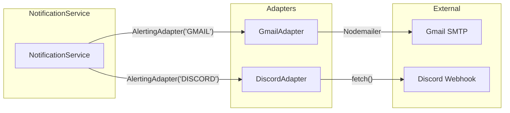

# Sprint 2: Gmail & Discord Providers

**Issue:** #80
**Points:** 5
**Dependencies:** Sprint 1 (Core Alerting + Adapter Pattern)

---

## 1. Overview

Implement the first two notification providers: Gmail (via Nodemailer/SMTP) and Discord (via webhooks). These serve as reference implementations for the AlertingAdapter pattern.

### Deliverables

| Component | Type | Priority |
|-----------|------|----------|
| GmailAdapter | Library | P0 |
| DiscordAdapter | Library | P0 |
| Email templates | Library | P1 |
| Environment configuration | Config | P0 |
| Adapter registration at startup | Worker | P0 |

---

## 2. Architecture

### 2.1 Provider Flow



### 2.2 Adapter Configuration

| Provider | Config Schema | Environment Variables |
|----------|--------------|----------------------|
| Gmail | `{ email: string }` | `SMTP_HOST`, `SMTP_PORT`, `SMTP_USER`, `SMTP_PASS`, `SMTP_FROM` |
| Discord | `{ webhookUrl: string }` | None (webhook URL in channel config) |

---

## 3. Gmail Adapter

### 3.1 Implementation

```typescript
// packages/api/src/lib/alerting/adapters/gmail.ts

import nodemailer from "nodemailer";
import type { Transporter } from "nodemailer";
import {
  BaseAlertingAdapter,
  SendResult,
} from "../adapter";
import {
  AlertPayload,
  GmailConfigSchema,
  GmailConfig,
} from "../../../schemas/alerting";
import { env } from "../../../env";

/**
 * Gmail/SMTP adapter for sending alert notifications via email.
 *
 * @example
 * ```ts
 * const adapter = new GmailAdapter();
 * await adapter.send({ email: "user@example.com" }, payload);
 * ```
 */
export class GmailAdapter extends BaseAlertingAdapter {
  readonly provider = "GMAIL" as const;
  private transporter: Transporter;

  constructor() {
    super();
    this.transporter = nodemailer.createTransport({
      host: env.SMTP_HOST,
      port: env.SMTP_PORT,
      secure: env.SMTP_PORT === 465,
      auth: {
        user: env.SMTP_USER,
        pass: env.SMTP_PASS,
      },
    });
  }

  /**
   * Validate Gmail-specific configuration
   */
  validateConfig(config: unknown): GmailConfig {
    return GmailConfigSchema.parse(config);
  }

  /**
   * Send alert notification via email
   */
  async send(config: unknown, payload: AlertPayload): Promise<SendResult> {
    try {
      const validConfig = this.validateConfig(config);

      const html = this.buildEmailHtml(payload);
      const text = this.buildEmailText(payload);

      const info = await this.transporter.sendMail({
        from: env.SMTP_FROM,
        to: validConfig.email,
        subject: this.buildSubject(payload),
        text,
        html,
      });

      return this.createSuccessResult(info.messageId);
    } catch (error) {
      const message = error instanceof Error ? error.message : "Unknown error";
      return this.createErrorResult(message);
    }
  }

  /**
   * Build email subject line
   */
  private buildSubject(payload: AlertPayload): string {
    const icon = this.getAlertIcon(payload.type);
    return `${icon} Alert: ${payload.alertName} - ${payload.projectName}`;
  }

  /**
   * Build HTML email body
   */
  private buildEmailHtml(payload: AlertPayload): string {
    const typeLabel = this.getTypeLabel(payload.type);
    const operatorSymbol = payload.operator === "GREATER_THAN" ? ">" : "<";
    const valueFormatted = this.formatValue(payload.type, payload.actualValue);
    const thresholdFormatted = this.formatValue(payload.type, payload.threshold);

    return `
<!DOCTYPE html>
<html>
<head>
  <meta charset="utf-8">
  <style>
    body { font-family: -apple-system, BlinkMacSystemFont, 'Segoe UI', Roboto, sans-serif; line-height: 1.6; color: #333; }
    .container { max-width: 600px; margin: 0 auto; padding: 20px; }
    .header { background: #dc2626; color: white; padding: 20px; border-radius: 8px 8px 0 0; }
    .header h1 { margin: 0; font-size: 20px; }
    .content { background: #f9fafb; padding: 20px; border: 1px solid #e5e7eb; border-top: none; }
    .metric-box { background: white; border: 1px solid #e5e7eb; border-radius: 8px; padding: 16px; margin: 16px 0; }
    .metric-label { color: #6b7280; font-size: 14px; margin-bottom: 4px; }
    .metric-value { font-size: 32px; font-weight: bold; color: #dc2626; }
    .threshold { color: #6b7280; font-size: 14px; }
    .details { margin-top: 20px; }
    .details-row { display: flex; justify-content: space-between; padding: 8px 0; border-bottom: 1px solid #e5e7eb; }
    .details-label { color: #6b7280; }
    .footer { text-align: center; padding: 20px; color: #9ca3af; font-size: 12px; }
    .button { display: inline-block; background: #eab308; color: #1f2937; padding: 12px 24px; text-decoration: none; border-radius: 6px; font-weight: 500; margin-top: 16px; }
  </style>
</head>
<body>
  <div class="container">
    <div class="header">
      <h1>Alert Triggered: ${payload.alertName}</h1>
    </div>
    <div class="content">
      <div class="metric-box">
        <div class="metric-label">${typeLabel}</div>
        <div class="metric-value">${valueFormatted}</div>
        <div class="threshold">Threshold: ${operatorSymbol} ${thresholdFormatted}</div>
      </div>

      <div class="details">
        <div class="details-row">
          <span class="details-label">Project</span>
          <span>${payload.projectName}</span>
        </div>
        <div class="details-row">
          <span class="details-label">Alert Type</span>
          <span>${typeLabel}</span>
        </div>
        <div class="details-row">
          <span class="details-label">Triggered At</span>
          <span>${new Date(payload.triggeredAt).toLocaleString()}</span>
        </div>
      </div>

      ${payload.dashboardUrl ? `<a href="${payload.dashboardUrl}" class="button">View Dashboard</a>` : ""}
    </div>
    <div class="footer">
      <p>This alert was sent by CognObserve</p>
      <p>Manage your alerts in project settings</p>
    </div>
  </div>
</body>
</html>
    `.trim();
  }

  /**
   * Build plain text email body
   */
  private buildEmailText(payload: AlertPayload): string {
    const typeLabel = this.getTypeLabel(payload.type);
    const operatorSymbol = payload.operator === "GREATER_THAN" ? ">" : "<";
    const valueFormatted = this.formatValue(payload.type, payload.actualValue);
    const thresholdFormatted = this.formatValue(payload.type, payload.threshold);

    return `
ALERT TRIGGERED: ${payload.alertName}

${typeLabel}: ${valueFormatted}
Threshold: ${operatorSymbol} ${thresholdFormatted}

Project: ${payload.projectName}
Triggered At: ${new Date(payload.triggeredAt).toLocaleString()}

${payload.dashboardUrl ? `View Dashboard: ${payload.dashboardUrl}` : ""}

---
This alert was sent by CognObserve
    `.trim();
  }

  /**
   * Get human-readable type label
   */
  private getTypeLabel(type: AlertPayload["type"]): string {
    const labels: Record<AlertPayload["type"], string> = {
      ERROR_RATE: "Error Rate",
      LATENCY_P50: "Latency (P50)",
      LATENCY_P95: "Latency (P95)",
      LATENCY_P99: "Latency (P99)",
    };
    return labels[type];
  }

  /**
   * Format value based on type
   */
  private formatValue(type: AlertPayload["type"], value: number): string {
    if (type === "ERROR_RATE") {
      return `${value.toFixed(2)}%`;
    }
    return `${value.toFixed(0)}ms`;
  }

  /**
   * Get alert icon emoji
   */
  private getAlertIcon(type: AlertPayload["type"]): string {
    const icons: Record<AlertPayload["type"], string> = {
      ERROR_RATE: "🚨",
      LATENCY_P50: "⏱️",
      LATENCY_P95: "⏱️",
      LATENCY_P99: "⏱️",
    };
    return icons[type];
  }
}
```

### 3.2 Environment Variables

```typescript
// packages/api/src/env.ts (additions)

import { createEnv } from "@t3-oss/env-nextjs";
import { z } from "zod";

export const env = createEnv({
  server: {
    // ... existing vars

    // SMTP Configuration for Gmail Adapter
    SMTP_HOST: z.string().default("smtp.gmail.com"),
    SMTP_PORT: z.coerce.number().default(587),
    SMTP_USER: z.string().optional(),
    SMTP_PASS: z.string().optional(),
    SMTP_FROM: z.string().email().optional(),
  },
  // ...
});
```

---

## 4. Discord Adapter

### 4.1 Implementation

```typescript
// packages/api/src/lib/alerting/adapters/discord.ts

import {
  BaseAlertingAdapter,
  SendResult,
} from "../adapter";
import {
  AlertPayload,
  DiscordConfigSchema,
  DiscordConfig,
} from "../../../schemas/alerting";

/**
 * Discord webhook adapter for sending alert notifications.
 *
 * @example
 * ```ts
 * const adapter = new DiscordAdapter();
 * await adapter.send(
 *   { webhookUrl: "https://discord.com/api/webhooks/..." },
 *   payload
 * );
 * ```
 */
export class DiscordAdapter extends BaseAlertingAdapter {
  readonly provider = "DISCORD" as const;

  /**
   * Validate Discord-specific configuration
   */
  validateConfig(config: unknown): DiscordConfig {
    return DiscordConfigSchema.parse(config);
  }

  /**
   * Send alert notification via Discord webhook
   */
  async send(config: unknown, payload: AlertPayload): Promise<SendResult> {
    try {
      const validConfig = this.validateConfig(config);
      const embed = this.buildEmbed(payload);

      const response = await fetch(validConfig.webhookUrl, {
        method: "POST",
        headers: { "Content-Type": "application/json" },
        body: JSON.stringify({ embeds: [embed] }),
      });

      if (!response.ok) {
        const text = await response.text();
        return this.createErrorResult(`Discord API error: ${response.status} - ${text}`);
      }

      return this.createSuccessResult();
    } catch (error) {
      const message = error instanceof Error ? error.message : "Unknown error";
      return this.createErrorResult(message);
    }
  }

  /**
   * Build Discord embed object
   * @see https://discord.com/developers/docs/resources/message#embed-object
   */
  private buildEmbed(payload: AlertPayload): DiscordEmbed {
    const typeLabel = this.getTypeLabel(payload.type);
    const operatorSymbol = payload.operator === "GREATER_THAN" ? ">" : "<";
    const valueFormatted = this.formatValue(payload.type, payload.actualValue);
    const thresholdFormatted = this.formatValue(payload.type, payload.threshold);
    const color = this.getColor(payload.type);

    return {
      title: `🚨 Alert: ${payload.alertName}`,
      description: `Alert triggered for **${payload.projectName}**`,
      color,
      fields: [
        {
          name: typeLabel,
          value: `**${valueFormatted}**`,
          inline: true,
        },
        {
          name: "Threshold",
          value: `${operatorSymbol} ${thresholdFormatted}`,
          inline: true,
        },
        {
          name: "Project",
          value: payload.projectName,
          inline: true,
        },
      ],
      timestamp: payload.triggeredAt,
      footer: {
        text: "CognObserve Alerting",
      },
    };
  }

  /**
   * Get human-readable type label
   */
  private getTypeLabel(type: AlertPayload["type"]): string {
    const labels: Record<AlertPayload["type"], string> = {
      ERROR_RATE: "Error Rate",
      LATENCY_P50: "Latency (P50)",
      LATENCY_P95: "Latency (P95)",
      LATENCY_P99: "Latency (P99)",
    };
    return labels[type];
  }

  /**
   * Format value based on type
   */
  private formatValue(type: AlertPayload["type"], value: number): string {
    if (type === "ERROR_RATE") {
      return `${value.toFixed(2)}%`;
    }
    return `${value.toFixed(0)}ms`;
  }

  /**
   * Get embed color based on alert type
   * Colors are in decimal format
   */
  private getColor(type: AlertPayload["type"]): number {
    // Red for errors, orange for latency
    if (type === "ERROR_RATE") {
      return 0xdc2626; // Red
    }
    return 0xf59e0b; // Amber
  }
}

/**
 * Discord embed structure
 */
interface DiscordEmbed {
  title: string;
  description?: string;
  color: number;
  fields: Array<{
    name: string;
    value: string;
    inline?: boolean;
  }>;
  timestamp?: string;
  footer?: {
    text: string;
    icon_url?: string;
  };
  thumbnail?: {
    url: string;
  };
}
```

---

## 5. Adapter Registration

### 5.1 Initialize Adapters at Startup

```typescript
// packages/api/src/lib/alerting/init.ts

import { AdapterRegistry } from "./registry";
import { GmailAdapter } from "./adapters/gmail";
import { DiscordAdapter } from "./adapters/discord";
import { env } from "../../env";

/**
 * Initialize all alerting adapters.
 * Call this at application startup.
 */
export function initializeAlertingAdapters(): void {
  console.log("Initializing alerting adapters...");

  // Always register Discord (no server-side config needed)
  AdapterRegistry.register(new DiscordAdapter());

  // Only register Gmail if SMTP is configured
  if (env.SMTP_USER && env.SMTP_PASS && env.SMTP_FROM) {
    AdapterRegistry.register(new GmailAdapter());
    console.log("Gmail adapter registered");
  } else {
    console.warn(
      "Gmail adapter not registered: SMTP_USER, SMTP_PASS, or SMTP_FROM not configured"
    );
  }

  console.log(
    `Alerting adapters initialized: ${AdapterRegistry.getRegisteredProviders().join(", ")}`
  );
}

/**
 * Get list of available providers (for UI)
 */
export function getAvailableProviders(): string[] {
  return AdapterRegistry.getRegisteredProviders();
}
```

### 5.2 Worker Startup

```typescript
// apps/worker/src/index.ts

import { initializeAlertingAdapters } from "@cognobserve/api/lib/alerting/init";
import { AlertEvaluator } from "./jobs/alert-evaluator";

async function main() {
  console.log("Worker starting...");

  // Initialize alerting adapters
  initializeAlertingAdapters();

  // Start alert evaluator
  const alertEvaluator = new AlertEvaluator();
  alertEvaluator.start();

  // ... rest of worker initialization
}

main().catch(console.error);
```

---

## 6. API Updates

### 6.1 Get Available Providers

```typescript
// packages/api/src/routers/alerts.ts (additions)

import { getAvailableProviders } from "../lib/alerting/init";

export const alertsRouter = createRouter({
  // ... existing routes

  /**
   * Get list of available notification providers
   */
  getProviders: protectedProcedure.query(() => {
    return getAvailableProviders();
  }),
});
```

---

## 7. Testing

### 7.1 Gmail Adapter Tests

```typescript
// packages/api/src/lib/alerting/adapters/__tests__/gmail.test.ts

import { describe, it, expect, vi, beforeEach } from "vitest";
import { GmailAdapter } from "../gmail";
import { AlertPayload } from "../../../../schemas/alerting";

// Mock nodemailer
vi.mock("nodemailer", () => ({
  createTransport: vi.fn(() => ({
    sendMail: vi.fn().mockResolvedValue({ messageId: "test-message-id" }),
  })),
}));

describe("GmailAdapter", () => {
  let adapter: GmailAdapter;

  beforeEach(() => {
    adapter = new GmailAdapter();
  });

  const validConfig = { email: "test@example.com" };

  const testPayload: AlertPayload = {
    alertId: "alert-1",
    alertName: "High Error Rate",
    projectId: "proj-1",
    projectName: "My Project",
    type: "ERROR_RATE",
    threshold: 5,
    actualValue: 7.5,
    operator: "GREATER_THAN",
    triggeredAt: new Date().toISOString(),
  };

  describe("validateConfig", () => {
    it("should accept valid email config", () => {
      expect(() => adapter.validateConfig(validConfig)).not.toThrow();
    });

    it("should reject invalid email", () => {
      expect(() => adapter.validateConfig({ email: "not-an-email" })).toThrow();
    });

    it("should reject missing email", () => {
      expect(() => adapter.validateConfig({})).toThrow();
    });
  });

  describe("send", () => {
    it("should send email successfully", async () => {
      const result = await adapter.send(validConfig, testPayload);
      expect(result.success).toBe(true);
      expect(result.provider).toBe("GMAIL");
      expect(result.messageId).toBe("test-message-id");
    });

    it("should return error for invalid config", async () => {
      const result = await adapter.send({ email: "invalid" }, testPayload);
      expect(result.success).toBe(false);
      expect(result.error).toBeDefined();
    });
  });
});
```

### 7.2 Discord Adapter Tests

```typescript
// packages/api/src/lib/alerting/adapters/__tests__/discord.test.ts

import { describe, it, expect, vi, beforeEach } from "vitest";
import { DiscordAdapter } from "../discord";
import { AlertPayload } from "../../../../schemas/alerting";

// Mock fetch
const mockFetch = vi.fn();
global.fetch = mockFetch;

describe("DiscordAdapter", () => {
  let adapter: DiscordAdapter;

  beforeEach(() => {
    adapter = new DiscordAdapter();
    mockFetch.mockReset();
  });

  const validConfig = {
    webhookUrl: "https://discord.com/api/webhooks/123/abc",
  };

  const testPayload: AlertPayload = {
    alertId: "alert-1",
    alertName: "High Latency",
    projectId: "proj-1",
    projectName: "My Project",
    type: "LATENCY_P95",
    threshold: 1000,
    actualValue: 1500,
    operator: "GREATER_THAN",
    triggeredAt: new Date().toISOString(),
  };

  describe("validateConfig", () => {
    it("should accept valid Discord webhook URL", () => {
      expect(() => adapter.validateConfig(validConfig)).not.toThrow();
    });

    it("should reject non-Discord URLs", () => {
      expect(() =>
        adapter.validateConfig({ webhookUrl: "https://example.com/webhook" })
      ).toThrow();
    });

    it("should reject missing webhookUrl", () => {
      expect(() => adapter.validateConfig({})).toThrow();
    });
  });

  describe("send", () => {
    it("should send to Discord successfully", async () => {
      mockFetch.mockResolvedValueOnce({ ok: true });

      const result = await adapter.send(validConfig, testPayload);

      expect(result.success).toBe(true);
      expect(result.provider).toBe("DISCORD");
      expect(mockFetch).toHaveBeenCalledWith(
        validConfig.webhookUrl,
        expect.objectContaining({
          method: "POST",
          headers: { "Content-Type": "application/json" },
        })
      );
    });

    it("should handle Discord API errors", async () => {
      mockFetch.mockResolvedValueOnce({
        ok: false,
        status: 429,
        text: () => Promise.resolve("Rate limited"),
      });

      const result = await adapter.send(validConfig, testPayload);

      expect(result.success).toBe(false);
      expect(result.error).toContain("429");
    });

    it("should handle network errors", async () => {
      mockFetch.mockRejectedValueOnce(new Error("Network error"));

      const result = await adapter.send(validConfig, testPayload);

      expect(result.success).toBe(false);
      expect(result.error).toBe("Network error");
    });
  });
});
```

---

## 8. File Structure

```
packages/
├── api/
│   └── src/
│       ├── lib/
│       │   └── alerting/
│       │       ├── index.ts
│       │       ├── adapter.ts
│       │       ├── registry.ts
│       │       ├── metrics-service.ts
│       │       ├── init.ts                    # NEW: Adapter initialization
│       │       └── adapters/
│       │           ├── gmail.ts               # NEW: Gmail adapter
│       │           ├── discord.ts             # NEW: Discord adapter
│       │           └── __tests__/
│       │               ├── gmail.test.ts      # NEW: Gmail tests
│       │               └── discord.test.ts    # NEW: Discord tests
│       ├── routers/
│       │   └── alerts.ts                      # MODIFY: Add getProviders
│       ├── schemas/
│       │   └── alerting.ts                    # Already created in Sprint 1
│       └── env.ts                             # MODIFY: Add SMTP vars
│
apps/
└── worker/
    └── src/
        └── index.ts                           # MODIFY: Initialize adapters
```

---

## 9. Environment Setup

### 9.1 Gmail App Password Setup

For Gmail SMTP, users need to:
1. Enable 2-Factor Authentication on Google Account
2. Create an App Password at https://myaccount.google.com/apppasswords
3. Use the app password as `SMTP_PASS`

### 9.2 Discord Webhook Setup

1. Go to Discord Server Settings > Integrations > Webhooks
2. Create New Webhook
3. Copy Webhook URL
4. Use as `webhookUrl` in channel config

### 9.3 Example .env

```env
# Gmail/SMTP Configuration
SMTP_HOST=smtp.gmail.com
SMTP_PORT=587
SMTP_USER=your-email@gmail.com
SMTP_PASS=your-app-password
SMTP_FROM="CognObserve Alerts <your-email@gmail.com>"
```

---

## 10. Definition of Done

- [ ] GmailAdapter implemented with HTML email template
- [ ] DiscordAdapter implemented with embed message
- [ ] Both adapters validate config with Zod schemas
- [ ] Both adapters handle errors gracefully
- [ ] Adapter initialization at worker startup
- [ ] SMTP environment variables documented
- [ ] `alerts.getProviders` endpoint returns available adapters
- [ ] Unit tests for both adapters passing
- [ ] Integration test: Gmail sends real email (manual)
- [ ] Integration test: Discord sends real message (manual)
- [ ] Documentation for setting up Gmail App Password
- [ ] Documentation for creating Discord webhook
