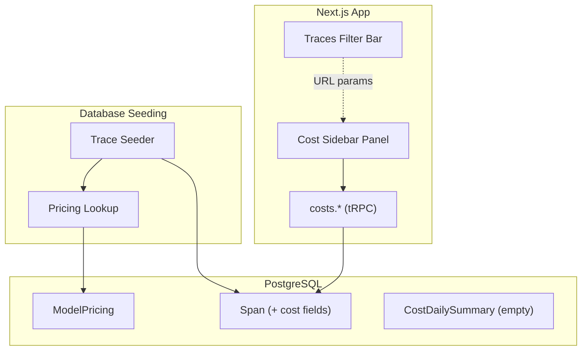

# Cost Tracking Foundation

**Issue:** #80
**Points:** 8
**Status:** Partially Implemented

---

## 1. Overview

Cost tracking for LLM usage: model pricing configuration, cost calculation, and an analytics sidebar panel integrated with the traces view.

### Implementation Status

| Component | Type | Status | Notes |
|-----------|------|--------|-------|
| ModelPricing table | Migration | Done | Seeded with default pricing |
| Cost fields on Span | Migration | Done | inputCost, outputCost, totalCost, pricingId |
| CostDailySummary table | Migration | Done | Schema exists but not populated |
| Pricing seed data | Seed | Done | 17 models from OpenAI, Anthropic, Google, Mistral |
| Cost calculation (seeding) | Seed | Done | Costs calculated during trace seeding |
| Worker cost calculation | Worker | **Not Implemented** | Future: calculate on ingestion |
| Cost dashboard API | API | Done | costs.* router with filtering |
| Cost sidebar panel | UI | Done | Integrated in project layout |
| Filter integration | UI | Done | Synced with traces filter bar |

---

## 2. Current Architecture



**Note:** Currently, costs are calculated during seeding. Production implementation should move cost calculation to the worker service during trace ingestion.

---

## 3. Database Schema

### 3.1 ModelPricing Table

```prisma
model ModelPricing {
  id                    String    @id @default(cuid())
  provider              String    // openai, anthropic, google, mistral
  model                 String    // gpt-4o, claude-3-5-sonnet, etc
  displayName           String    // Human-readable name
  inputPricePerMillion  Decimal   @db.Decimal(10, 6)
  outputPricePerMillion Decimal   @db.Decimal(10, 6)
  effectiveFrom         DateTime  @default(now())
  effectiveTo           DateTime? // null = current price
  createdAt             DateTime  @default(now())
  updatedAt             DateTime  @updatedAt

  spans Span[]

  @@unique([provider, model, effectiveFrom])
  @@index([provider, model])
  @@map("model_pricing")
}
```

### 3.2 Span Cost Fields

```prisma
model Span {
  // ... existing fields ...

  // Cost tracking fields
  inputCost   Decimal?      @db.Decimal(10, 6)
  outputCost  Decimal?      @db.Decimal(10, 6)
  totalCost   Decimal?      @db.Decimal(10, 6)
  pricingId   String?
  pricing     ModelPricing? @relation(fields: [pricingId], references: [id])

  @@index([pricingId])
}
```

### 3.3 Seeded Pricing Data

| Provider | Model | Input $/1M | Output $/1M |
|----------|-------|------------|-------------|
| openai | gpt-4o | 2.50 | 10.00 |
| openai | gpt-4o-mini | 0.15 | 0.60 |
| openai | gpt-4-turbo | 10.00 | 30.00 |
| openai | gpt-4 | 30.00 | 60.00 |
| openai | gpt-3.5-turbo | 0.50 | 1.50 |
| openai | o1 | 15.00 | 60.00 |
| openai | o1-mini | 3.00 | 12.00 |
| anthropic | claude-3-5-sonnet | 3.00 | 15.00 |
| anthropic | claude-3-opus | 15.00 | 75.00 |
| anthropic | claude-3-sonnet | 3.00 | 15.00 |
| anthropic | claude-3-haiku | 0.25 | 1.25 |
| google | gemini-1.5-pro | 1.25 | 5.00 |
| google | gemini-1.5-flash | 0.075 | 0.30 |
| google | gemini-2.0-flash | 0.10 | 0.40 |
| mistral | mistral-large | 2.00 | 6.00 |
| mistral | mistral-small | 0.20 | 0.60 |
| mistral | mixtral-8x7b | 0.70 | 0.70 |

---

## 4. API Design

### 4.1 Zod Schemas

```typescript
// packages/api/src/schemas/cost.ts

export const PresetTimeRangeSchema = z.enum(["24h", "7d", "30d"]);
export const TimeRangeSchema = z.union([
  PresetTimeRangeSchema,
  z.literal("custom"),
]);

export const CustomDateRangeSchema = z.object({
  from: z.string(), // ISO datetime string
  to: z.string(),
});

export const CostOverviewSchema = z.object({
  totalCost: z.number(),
  costChange: z.number(), // % vs previous period
  totalTokens: z.number(),
  inputTokens: z.number(),
  outputTokens: z.number(),
  tokenChange: z.number(),
  avgCostPerTrace: z.number(),
  billableSpans: z.number(),
  breakdown: z.object({
    inputCost: z.number(),
    outputCost: z.number(),
  }),
});

export const ModelCostBreakdownSchema = z.object({
  model: z.string(),
  displayName: z.string(),
  provider: z.string(),
  cost: z.number(),
  percentage: z.number(),
  tokens: z.number(),
  spanCount: z.number(),
});

export const CostTimePointSchema = z.object({
  date: z.string(),
  cost: z.number(),
  inputCost: z.number(),
  outputCost: z.number(),
  tokens: z.number(),
});
```

### 4.2 Costs Router

```typescript
// packages/api/src/routers/costs.ts

const CostQueryInput = z.object({
  workspaceSlug: z.string(),
  projectId: z.string(),
  timeRange: TimeRangeSchema.default("7d"),
  customFrom: z.string().optional(),
  customTo: z.string().optional(),
  // Filter params (synced with trace filters)
  search: z.string().optional(),
  types: z.array(SpanTypeSchema).optional(),
  levels: z.array(SpanLevelSchema).optional(),
  models: z.array(z.string()).optional(),
  minDuration: z.number().min(0).optional(),
  maxDuration: z.number().min(0).optional(),
});

export const costsRouter = createRouter({
  getOverview: protectedProcedure
    .input(CostQueryInput)
    .query(async ({ input }): Promise<CostOverview> => {
      // Queries directly from Span table
      // Returns: totalCost, inputTokens, outputTokens, totalTokens,
      //          breakdown, avgCostPerTrace, billableSpans, costChange
    }),

  getByModel: protectedProcedure
    .input(CostQueryInput)
    .query(async ({ input }): Promise<ModelCostBreakdown[]> => {
      // Groups spans by model
      // Returns cost breakdown per model
    }),

  getTimeSeries: protectedProcedure
    .input(CostQueryInput)
    .query(async ({ input }): Promise<CostTimePoint[]> => {
      // Groups spans by date
      // Returns daily cost data points
    }),

  listPricing: protectedProcedure
    .query(async () => {
      // Returns all current model pricing
    }),
});
```

---

## 5. UI Implementation

### 5.1 Cost Sidebar Panel

The cost analytics are displayed in a sidebar panel on the project traces page, not as a separate page.

**Location:** `apps/web/src/components/costs/cost-sidebar-panel.tsx`

**Features:**
- Total Cost with % change indicator
- Input/Output Cost breakdown
- Input/Output/Total Tokens
- Avg Cost per Trace
- Billable Spans count
- Token Usage chart (area chart)
- Model Usage chart (pie chart)
- Cost Trend chart (area chart)
- Cost by Model chart (horizontal bar chart)

### 5.2 Filter Integration

The cost sidebar is integrated with the traces filter bar via URL params:

```typescript
// apps/web/src/components/costs/cost-context.tsx

interface ProjectFilterContextValue {
  filters: TraceFilters;
  timeRange: TimeRange;
  customRange: CustomDateRange | undefined;
  setFilters: (filters: Partial<TraceFilters>) => void;
  setTimeRange: (range: TimeRange) => void;
  setCustomDateRange: (from: string, to: string) => void;
  // ... other methods
}
```

**Filter capabilities:**
- Preset time ranges: 24h, 7d, 30d
- Custom date range with exact time selection
- Search by trace name
- Filter by span types, levels, models
- Filter by duration range

### 5.3 Project Layout

```typescript
// apps/web/src/app/workspace/[workspaceSlug]/projects/[projectId]/layout.tsx

export default function ProjectLayout({ children }) {
  return (
    <ProjectFilterProvider>
      <div className="flex h-full">
        <div className="flex-1 overflow-auto">{children}</div>
        <aside className="w-72 border-l">
          <CostSidebarPanel {...filterProps} />
        </aside>
      </div>
    </ProjectFilterProvider>
  );
}
```

---

## 6. Seeding Implementation

### 6.1 Model Pricing Seed

```typescript
// packages/db/seeding/model-pricing.ts

export async function seedModelPricing(): Promise<void> {
  // Upserts pricing for all supported models
  // Uses effectiveFrom date for versioning
}
```

### 6.2 Trace Seed with Costs

```typescript
// packages/db/seeding/traces.ts

export async function seedTraces() {
  // 1. Load model pricing into cache
  const pricingData = await prisma.modelPricing.findMany();

  // 2. For each LLM span, calculate costs:
  if (isLLMSpan && model) {
    const pricing = modelPricingCache.get(model);
    if (pricing) {
      inputCost = promptTokens * pricing.inputPricePerMillion / 1_000_000;
      outputCost = completionTokens * pricing.outputPricePerMillion / 1_000_000;
      totalCost = inputCost + outputCost;
      pricingId = pricing.id;
    }
  }

  // 3. Create span with cost fields populated
}
```

---

## 7. File Structure

```
packages/
├── api/
│   └── src/
│       ├── routers/
│       │   └── costs.ts              # Cost analytics API
│       └── schemas/
│           └── cost.ts               # Zod schemas
│
├── db/
│   └── seeding/
│       ├── model-pricing.ts          # Pricing seed
│       └── traces.ts                 # Traces with costs
│
apps/
└── web/
    └── src/
        ├── app/.../projects/[projectId]/
        │   └── layout.tsx            # Project layout with sidebar
        └── components/
            └── costs/
                ├── cost-context.tsx          # Filter context
                └── cost-sidebar-panel.tsx    # Main sidebar component
```

---

## 8. Future Work

### 8.1 Worker Cost Calculation (Not Implemented)

Move cost calculation from seeding to real-time worker processing:

```typescript
// apps/worker/src/processors/trace-processor.ts

async processTrace(traceId: string): Promise<void> {
  // After persisting spans, calculate costs
  const billableSpans = trace.spans.filter(
    s => s.model && (s.promptTokens || s.completionTokens)
  );

  for (const span of billableSpans) {
    const cost = await this.pricingService.calculateSpanCost(span);
    if (cost) {
      await this.prisma.span.update({
        where: { id: span.id },
        data: { inputCost, outputCost, totalCost, pricingId },
      });
    }
  }

  // Update daily summary
  await this.updateDailySummary(trace.projectId, billableSpans);
}
```

### 8.2 CostDailySummary Aggregation (Not Implemented)

Pre-aggregate daily costs for faster queries at scale:

```typescript
async updateDailySummary(projectId: string, spans: Span[]) {
  // Group spans by date and model
  // Upsert into CostDailySummary table
  // Maintain "__all__" summary for totals
}
```

### 8.3 Budget Alerts (Not Implemented)

- Project budget configuration
- Alert thresholds (50%, 80%, 100%)
- Email/Slack notifications

---

## 9. Definition of Done

### Completed
- [x] Database migration applied (ModelPricing, Span cost fields, CostDailySummary)
- [x] Model pricing seeded with default data (17 models)
- [x] Cost fields added to Span (inputCost, outputCost, totalCost, pricingId)
- [x] Seeding calculates costs based on token counts
- [x] Cost API endpoints functional (getOverview, getByModel, getTimeSeries)
- [x] Cost sidebar panel displays metrics
- [x] Token breakdown (input/output/total tokens)
- [x] Cost breakdown (input/output costs)
- [x] Time series chart renders
- [x] Model breakdown charts work
- [x] Filter integration with traces filter bar
- [x] Custom date range with time selection

### Not Implemented (Future)
- [ ] Worker calculates costs on trace ingestion
- [ ] CostDailySummary populated for fast aggregation
- [ ] Budget configuration and alerts
- [ ] Pricing management UI
