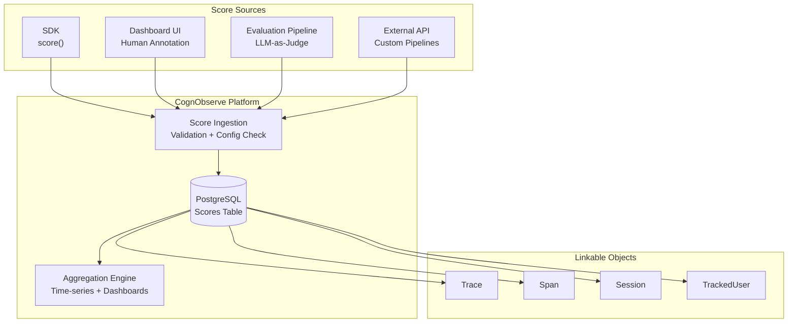
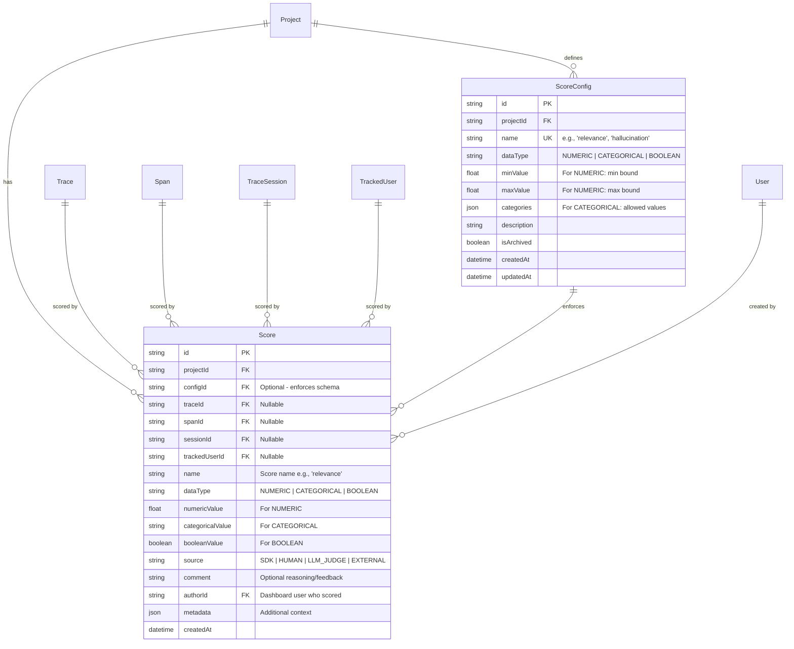

# Sprint 3: Evaluations & Scoring

**Issue:** #104
**Points:** 8
**Dependencies:** #102 Sessions, #103 User Tracking

---

## 1. Executive Summary

Build a comprehensive evaluation and scoring system for measuring LLM output quality. This feature enables quality monitoring, regression detection, and continuous improvement of AI applications.

### Industry Context

Based on research of industry-standard platforms:

| Platform | Approach | Key Features |
|----------|----------|--------------|
| **Langfuse** | Flexible score model | Numeric/Categorical/Boolean types, ScoreConfigs, LLM-as-Judge |
| **Braintrust** | Semantic evaluation | LLM-specific metrics, CI/CD integration, quality gates |
| **RAGAS** | RAG-focused | Faithfulness, Answer Relevancy, Context Precision |
| **OpenAI Evals** | Framework-based | Ground-truth evals, Model-graded evals, benchmarks |
| **Confident AI** | Real-time grading | DeepEval framework, multi-turn evaluation |

### Design Principles (Derived from Industry Best Practices)

1. **Flexible Data Model**: Support numeric, categorical, and boolean scores
2. **Multiple Sources**: Human annotation, SDK-based, LLM-as-Judge, external pipelines
3. **Schema Enforcement**: Optional ScoreConfigs for standardization
4. **Linkable**: Scores attach to traces, spans, sessions, or users
5. **Aggregatable**: Support time-series analysis and dashboards

---

## 2. Use Cases

| Use Case | Description | Priority |
|----------|-------------|----------|
| **Quality Monitoring** | Track average response quality over time | P0 |
| **Regression Detection** | Alert when quality drops after changes | P0 |
| **Human Annotation** | Manual scoring by QA team | P0 |
| **LLM-as-Judge** | Automated scoring using evaluation LLM | P1 |
| **RAG Evaluation** | Faithfulness, relevancy for RAG systems | P1 |
| **A/B Comparison** | Compare quality across prompt versions | P2 |
| **Cost-Quality Tradeoff** | Correlate quality with model costs | P2 |

---

## 3. Architecture

### 3.1 Data Flow



### 3.2 Score Linking Strategy

Following industry patterns, scores can link to exactly ONE of these objects:

```
Score
├── traceId (most common) ──────► Trace
├── spanId ─────────────────────► Span (for granular LLM call scoring)
├── sessionId ──────────────────► TraceSession (conversation-level)
└── trackedUserId ──────────────► TrackedUser (user satisfaction)
```

**Design Decision**: Use optional foreign keys with CHECK constraint ensuring exactly one is set.

---

## 4. Database Design

### 4.1 Schema Diagram



### 4.2 Prisma Schema

```prisma
// packages/db/prisma/schema.prisma

// ============================================================
// Score Configuration (Schema Enforcement)
// ============================================================

enum ScoreDataType {
  NUMERIC
  CATEGORICAL
  BOOLEAN
}

model ScoreConfig {
  id          String        @id @default(cuid())
  projectId   String
  project     Project       @relation(fields: [projectId], references: [id], onDelete: Cascade)

  name        String        // "relevance", "hallucination", "quality"
  dataType    ScoreDataType
  description String?

  // For NUMERIC type
  minValue    Float?        // e.g., 0
  maxValue    Float?        // e.g., 1

  // For CATEGORICAL type
  categories  Json?         // e.g., ["good", "neutral", "bad"]

  isArchived  Boolean       @default(false)
  createdAt   DateTime      @default(now())
  updatedAt   DateTime      @updatedAt

  scores      Score[]

  @@unique([projectId, name])
  @@index([projectId, isArchived])
  @@map("score_configs")
}

// ============================================================
// Score (Evaluation Result)
// ============================================================

enum ScoreSource {
  SDK           // Programmatic via SDK
  HUMAN         // Manual annotation in dashboard
  LLM_JUDGE     // LLM-as-a-Judge evaluation
  EXTERNAL      // External evaluation pipeline
}

model Score {
  id            String        @id @default(cuid())
  projectId     String
  project       Project       @relation(fields: [projectId], references: [id], onDelete: Cascade)

  // Optional config reference for schema enforcement
  configId      String?
  config        ScoreConfig?  @relation(fields: [configId], references: [id], onDelete: SetNull)

  // Linkable objects (exactly ONE must be set)
  traceId       String?
  trace         Trace?        @relation(fields: [traceId], references: [id], onDelete: Cascade)
  spanId        String?
  span          Span?         @relation(fields: [spanId], references: [id], onDelete: Cascade)
  sessionId     String?
  session       TraceSession? @relation(fields: [sessionId], references: [id], onDelete: Cascade)
  trackedUserId String?
  trackedUser   TrackedUser?  @relation(fields: [trackedUserId], references: [id], onDelete: Cascade)

  // Score identity
  name          String        // "relevance", "faithfulness", etc.
  dataType      ScoreDataType

  // Value (one will be populated based on dataType)
  numericValue     Float?     // For NUMERIC: 0.0 - 1.0 typically
  categoricalValue String?    // For CATEGORICAL: "good", "bad", etc.
  booleanValue     Boolean?   // For BOOLEAN: true/false

  // Provenance
  source        ScoreSource   @default(SDK)
  authorId      String?       // Dashboard user (for HUMAN source)
  author        User?         @relation(fields: [authorId], references: [id], onDelete: SetNull)

  // Context
  comment       String?       // Reasoning or feedback text
  metadata      Json?         // Additional context

  createdAt     DateTime      @default(now())

  @@index([projectId, createdAt(sort: Desc)])
  @@index([projectId, name])
  @@index([traceId])
  @@index([spanId])
  @@index([sessionId])
  @@index([trackedUserId])
  @@index([configId])
  @@map("scores")
}
```

### 4.3 Migration SQL

```sql
-- Migration: 104_add_evaluations

-- 1. Create score_configs table
CREATE TABLE "score_configs" (
  "id" TEXT PRIMARY KEY,
  "projectId" TEXT NOT NULL,
  "name" TEXT NOT NULL,
  "dataType" TEXT NOT NULL CHECK ("dataType" IN ('NUMERIC', 'CATEGORICAL', 'BOOLEAN')),
  "description" TEXT,
  "minValue" DOUBLE PRECISION,
  "maxValue" DOUBLE PRECISION,
  "categories" JSONB,
  "isArchived" BOOLEAN NOT NULL DEFAULT FALSE,
  "createdAt" TIMESTAMPTZ NOT NULL DEFAULT NOW(),
  "updatedAt" TIMESTAMPTZ NOT NULL DEFAULT NOW(),

  CONSTRAINT "score_configs_projectId_fkey"
    FOREIGN KEY ("projectId") REFERENCES "Project"("id") ON DELETE CASCADE
);

CREATE UNIQUE INDEX "score_configs_projectId_name_key" ON "score_configs" ("projectId", "name");
CREATE INDEX "score_configs_projectId_isArchived_idx" ON "score_configs" ("projectId", "isArchived");

-- 2. Create ScoreSource enum type
CREATE TYPE "ScoreSource" AS ENUM ('SDK', 'HUMAN', 'LLM_JUDGE', 'EXTERNAL');

-- 3. Create scores table
CREATE TABLE "scores" (
  "id" TEXT PRIMARY KEY,
  "projectId" TEXT NOT NULL,
  "configId" TEXT,
  "traceId" TEXT,
  "spanId" TEXT,
  "sessionId" TEXT,
  "trackedUserId" TEXT,
  "name" TEXT NOT NULL,
  "dataType" TEXT NOT NULL CHECK ("dataType" IN ('NUMERIC', 'CATEGORICAL', 'BOOLEAN')),
  "numericValue" DOUBLE PRECISION,
  "categoricalValue" TEXT,
  "booleanValue" BOOLEAN,
  "source" "ScoreSource" NOT NULL DEFAULT 'SDK',
  "authorId" TEXT,
  "comment" TEXT,
  "metadata" JSONB,
  "createdAt" TIMESTAMPTZ NOT NULL DEFAULT NOW(),

  CONSTRAINT "scores_projectId_fkey"
    FOREIGN KEY ("projectId") REFERENCES "Project"("id") ON DELETE CASCADE,
  CONSTRAINT "scores_configId_fkey"
    FOREIGN KEY ("configId") REFERENCES "score_configs"("id") ON DELETE SET NULL,
  CONSTRAINT "scores_traceId_fkey"
    FOREIGN KEY ("traceId") REFERENCES "Trace"("id") ON DELETE CASCADE,
  CONSTRAINT "scores_spanId_fkey"
    FOREIGN KEY ("spanId") REFERENCES "Span"("id") ON DELETE CASCADE,
  CONSTRAINT "scores_sessionId_fkey"
    FOREIGN KEY ("sessionId") REFERENCES "trace_sessions"("id") ON DELETE CASCADE,
  CONSTRAINT "scores_trackedUserId_fkey"
    FOREIGN KEY ("trackedUserId") REFERENCES "tracked_users"("id") ON DELETE CASCADE,
  CONSTRAINT "scores_authorId_fkey"
    FOREIGN KEY ("authorId") REFERENCES "users"("id") ON DELETE SET NULL,

  -- Ensure at least one linkable object is set
  CONSTRAINT "scores_link_check" CHECK (
    (CASE WHEN "traceId" IS NOT NULL THEN 1 ELSE 0 END +
     CASE WHEN "spanId" IS NOT NULL THEN 1 ELSE 0 END +
     CASE WHEN "sessionId" IS NOT NULL THEN 1 ELSE 0 END +
     CASE WHEN "trackedUserId" IS NOT NULL THEN 1 ELSE 0 END) = 1
  )
);

-- 4. Create indexes
CREATE INDEX "scores_projectId_createdAt_idx" ON "scores" ("projectId", "createdAt" DESC);
CREATE INDEX "scores_projectId_name_idx" ON "scores" ("projectId", "name");
CREATE INDEX "scores_traceId_idx" ON "scores" ("traceId");
CREATE INDEX "scores_spanId_idx" ON "scores" ("spanId");
CREATE INDEX "scores_sessionId_idx" ON "scores" ("sessionId");
CREATE INDEX "scores_trackedUserId_idx" ON "scores" ("trackedUserId");
CREATE INDEX "scores_configId_idx" ON "scores" ("configId");
```

---

## 5. Zod Schemas

```typescript
// packages/api/src/schemas/scores.ts

import { z } from "zod";

// ============================================================
// Enums
// ============================================================

export const ScoreDataTypeSchema = z.enum(["NUMERIC", "CATEGORICAL", "BOOLEAN"]);
export type ScoreDataType = z.infer<typeof ScoreDataTypeSchema>;

export const ScoreSourceSchema = z.enum(["SDK", "HUMAN", "LLM_JUDGE", "EXTERNAL"]);
export type ScoreSource = z.infer<typeof ScoreSourceSchema>;

// ============================================================
// Score Config Schemas
// ============================================================

export const CreateScoreConfigSchema = z.object({
  projectId: z.string(),
  name: z.string().min(1).max(100).regex(/^[a-z][a-z0-9_]*$/), // lowercase with underscores
  dataType: ScoreDataTypeSchema,
  description: z.string().max(500).optional(),
  minValue: z.number().optional(), // For NUMERIC
  maxValue: z.number().optional(), // For NUMERIC
  categories: z.array(z.string()).min(2).optional(), // For CATEGORICAL
}).refine((data) => {
  if (data.dataType === "NUMERIC") {
    return data.minValue !== undefined && data.maxValue !== undefined;
  }
  if (data.dataType === "CATEGORICAL") {
    return data.categories !== undefined && data.categories.length >= 2;
  }
  return true;
}, {
  message: "NUMERIC requires min/maxValue, CATEGORICAL requires categories array",
});
export type CreateScoreConfigInput = z.infer<typeof CreateScoreConfigSchema>;

export const ScoreConfigSchema = z.object({
  id: z.string(),
  projectId: z.string(),
  name: z.string(),
  dataType: ScoreDataTypeSchema,
  description: z.string().nullable(),
  minValue: z.number().nullable(),
  maxValue: z.number().nullable(),
  categories: z.array(z.string()).nullable(),
  isArchived: z.boolean(),
  createdAt: z.date(),
  updatedAt: z.date(),
});
export type ScoreConfig = z.infer<typeof ScoreConfigSchema>;

// ============================================================
// Score Schemas
// ============================================================

/**
 * Base score input - used by SDK and API
 */
export const CreateScoreSchema = z.object({
  projectId: z.string(),
  configId: z.string().optional(),

  // Exactly one must be provided
  traceId: z.string().optional(),
  spanId: z.string().optional(),
  sessionId: z.string().optional(),
  trackedUserId: z.string().optional(),

  // Score identity
  name: z.string().min(1).max(100),

  // Value - one of these based on type
  value: z.union([
    z.number(),           // NUMERIC
    z.string(),           // CATEGORICAL
    z.boolean(),          // BOOLEAN
  ]),

  // Optional context
  source: ScoreSourceSchema.optional().default("SDK"),
  comment: z.string().max(2000).optional(),
  metadata: z.record(z.unknown()).optional(),
}).refine((data) => {
  const linkCount = [data.traceId, data.spanId, data.sessionId, data.trackedUserId]
    .filter(Boolean).length;
  return linkCount === 1;
}, {
  message: "Exactly one of traceId, spanId, sessionId, or trackedUserId must be provided",
});
export type CreateScoreInput = z.infer<typeof CreateScoreSchema>;

/**
 * Score list filters
 */
export const ScoreListFiltersSchema = z.object({
  projectId: z.string(),
  traceId: z.string().optional(),
  spanId: z.string().optional(),
  sessionId: z.string().optional(),
  trackedUserId: z.string().optional(),
  name: z.string().optional(),
  source: ScoreSourceSchema.optional(),
  configId: z.string().optional(),
  from: z.date().optional(),
  to: z.date().optional(),
  limit: z.number().int().min(1).max(100).default(50),
  cursor: z.string().optional(),
});
export type ScoreListFilters = z.infer<typeof ScoreListFiltersSchema>;

/**
 * Score with resolved value
 */
export const ScoreSchema = z.object({
  id: z.string(),
  projectId: z.string(),
  configId: z.string().nullable(),
  traceId: z.string().nullable(),
  spanId: z.string().nullable(),
  sessionId: z.string().nullable(),
  trackedUserId: z.string().nullable(),
  name: z.string(),
  dataType: ScoreDataTypeSchema,
  numericValue: z.number().nullable(),
  categoricalValue: z.string().nullable(),
  booleanValue: z.boolean().nullable(),
  source: ScoreSourceSchema,
  authorId: z.string().nullable(),
  comment: z.string().nullable(),
  metadata: z.record(z.unknown()).nullable(),
  createdAt: z.date(),
});
export type Score = z.infer<typeof ScoreSchema>;

/**
 * Aggregation result for a score name
 */
export const ScoreAggregationSchema = z.object({
  name: z.string(),
  dataType: ScoreDataTypeSchema,
  count: z.number(),
  // For NUMERIC
  avg: z.number().nullable(),
  min: z.number().nullable(),
  max: z.number().nullable(),
  stdDev: z.number().nullable(),
  // For CATEGORICAL
  distribution: z.record(z.number()).nullable(), // { "good": 45, "bad": 12 }
  // For BOOLEAN
  trueCount: z.number().nullable(),
  falseCount: z.number().nullable(),
});
export type ScoreAggregation = z.infer<typeof ScoreAggregationSchema>;

// ============================================================
// Pre-defined Score Types (Industry Standard)
// ============================================================

/**
 * Common evaluation metric names following industry conventions
 */
export const STANDARD_SCORE_NAMES = {
  // Quality metrics
  QUALITY: "quality",
  RELEVANCE: "relevance",
  COHERENCE: "coherence",
  FLUENCY: "fluency",

  // Accuracy metrics
  ACCURACY: "accuracy",
  CORRECTNESS: "correctness",
  HALLUCINATION: "hallucination", // 0 = none, 1 = severe
  GROUNDEDNESS: "groundedness",
  FAITHFULNESS: "faithfulness",

  // RAG-specific (RAGAS framework)
  CONTEXT_RELEVANCY: "context_relevancy",
  CONTEXT_PRECISION: "context_precision",
  CONTEXT_RECALL: "context_recall",
  ANSWER_RELEVANCY: "answer_relevancy",

  // Safety metrics
  TOXICITY: "toxicity",
  BIAS: "bias",
  SAFETY: "safety",

  // User satisfaction
  HELPFULNESS: "helpfulness",
  SATISFACTION: "satisfaction",
  THUMBS: "thumbs", // Boolean: thumbs up/down
} as const;

export const StandardScoreNameSchema = z.enum([
  "quality", "relevance", "coherence", "fluency",
  "accuracy", "correctness", "hallucination", "groundedness", "faithfulness",
  "context_relevancy", "context_precision", "context_recall", "answer_relevancy",
  "toxicity", "bias", "safety",
  "helpfulness", "satisfaction", "thumbs",
]);
export type StandardScoreName = z.infer<typeof StandardScoreNameSchema>;
```

---

## 6. API Design

### 6.1 Scores Router

```typescript
// packages/api/src/routers/scores.ts

import { z } from "zod";
import { TRPCError } from "@trpc/server";
import { prisma, ScoreDataType, ScoreSource, Prisma } from "@cognobserve/db";
import { createRouter, protectedProcedure, workspaceMiddleware } from "../trpc";
import {
  CreateScoreSchema,
  CreateScoreConfigSchema,
  ScoreListFiltersSchema,
  ScoreDataTypeSchema,
} from "../schemas/scores";

export const scoresRouter = createRouter({
  // ============================================================
  // Score Config Management
  // ============================================================

  /**
   * List score configs for a project
   */
  listConfigs: protectedProcedure
    .input(z.object({
      workspaceSlug: z.string(),
      projectId: z.string(),
      includeArchived: z.boolean().default(false),
    }))
    .use(workspaceMiddleware)
    .query(async ({ ctx, input }) => {
      const configs = await prisma.scoreConfig.findMany({
        where: {
          projectId: input.projectId,
          project: { workspaceId: ctx.workspace.id },
          ...(input.includeArchived ? {} : { isArchived: false }),
        },
        orderBy: { name: "asc" },
      });
      return configs;
    }),

  /**
   * Create a score config
   */
  createConfig: protectedProcedure
    .input(CreateScoreConfigSchema.extend({
      workspaceSlug: z.string(),
    }))
    .use(workspaceMiddleware)
    .mutation(async ({ ctx, input }) => {
      const { workspaceSlug, ...data } = input;

      // Verify project belongs to workspace
      const project = await prisma.project.findFirst({
        where: { id: data.projectId, workspaceId: ctx.workspace.id },
      });
      if (!project) {
        throw new TRPCError({ code: "NOT_FOUND", message: "Project not found" });
      }

      return prisma.scoreConfig.create({ data });
    }),

  /**
   * Archive/restore a score config
   */
  archiveConfig: protectedProcedure
    .input(z.object({
      workspaceSlug: z.string(),
      configId: z.string(),
      isArchived: z.boolean(),
    }))
    .use(workspaceMiddleware)
    .mutation(async ({ ctx, input }) => {
      const config = await prisma.scoreConfig.findFirst({
        where: { id: input.configId },
        include: { project: { select: { workspaceId: true } } },
      });

      if (!config || config.project.workspaceId !== ctx.workspace.id) {
        throw new TRPCError({ code: "NOT_FOUND" });
      }

      return prisma.scoreConfig.update({
        where: { id: input.configId },
        data: { isArchived: input.isArchived },
      });
    }),

  // ============================================================
  // Score CRUD
  // ============================================================

  /**
   * Create a score
   */
  create: protectedProcedure
    .input(CreateScoreSchema.extend({
      workspaceSlug: z.string(),
    }))
    .use(workspaceMiddleware)
    .mutation(async ({ ctx, input }) => {
      const { workspaceSlug, value, ...data } = input;

      // Verify project access
      const project = await prisma.project.findFirst({
        where: { id: data.projectId, workspaceId: ctx.workspace.id },
      });
      if (!project) {
        throw new TRPCError({ code: "NOT_FOUND", message: "Project not found" });
      }

      // Determine data type from value
      let dataType: ScoreDataType;
      let numericValue: number | null = null;
      let categoricalValue: string | null = null;
      let booleanValue: boolean | null = null;

      if (typeof value === "number") {
        dataType = "NUMERIC";
        numericValue = value;
      } else if (typeof value === "boolean") {
        dataType = "BOOLEAN";
        booleanValue = value;
      } else {
        dataType = "CATEGORICAL";
        categoricalValue = value;
      }

      // Validate against config if provided
      if (data.configId) {
        const config = await prisma.scoreConfig.findUnique({
          where: { id: data.configId },
        });

        if (!config) {
          throw new TRPCError({ code: "NOT_FOUND", message: "Score config not found" });
        }

        if (config.dataType !== dataType) {
          throw new TRPCError({
            code: "BAD_REQUEST",
            message: `Value type mismatch. Config expects ${config.dataType}`,
          });
        }

        // Validate numeric bounds
        if (dataType === "NUMERIC" && config.minValue !== null && config.maxValue !== null) {
          if (numericValue! < config.minValue || numericValue! > config.maxValue) {
            throw new TRPCError({
              code: "BAD_REQUEST",
              message: `Numeric value must be between ${config.minValue} and ${config.maxValue}`,
            });
          }
        }

        // Validate categorical options
        if (dataType === "CATEGORICAL" && config.categories) {
          const categories = config.categories as string[];
          if (!categories.includes(categoricalValue!)) {
            throw new TRPCError({
              code: "BAD_REQUEST",
              message: `Categorical value must be one of: ${categories.join(", ")}`,
            });
          }
        }

        // Use config name if not provided
        if (!data.name) {
          data.name = config.name;
        }
      }

      // Set author for human scores
      const authorId = data.source === "HUMAN" ? ctx.session.user.id : null;

      return prisma.score.create({
        data: {
          ...data,
          dataType,
          numericValue,
          categoricalValue,
          booleanValue,
          authorId,
        },
      });
    }),

  /**
   * List scores with filters
   */
  list: protectedProcedure
    .input(ScoreListFiltersSchema.extend({
      workspaceSlug: z.string(),
    }))
    .use(workspaceMiddleware)
    .query(async ({ ctx, input }) => {
      const { workspaceSlug, projectId, limit, cursor, ...filters } = input;

      // Verify project access
      const project = await prisma.project.findFirst({
        where: { id: projectId, workspaceId: ctx.workspace.id },
      });
      if (!project) {
        throw new TRPCError({ code: "NOT_FOUND" });
      }

      const where: Prisma.ScoreWhereInput = {
        projectId,
        ...(filters.traceId && { traceId: filters.traceId }),
        ...(filters.spanId && { spanId: filters.spanId }),
        ...(filters.sessionId && { sessionId: filters.sessionId }),
        ...(filters.trackedUserId && { trackedUserId: filters.trackedUserId }),
        ...(filters.name && { name: filters.name }),
        ...(filters.source && { source: filters.source }),
        ...(filters.configId && { configId: filters.configId }),
        ...(filters.from && { createdAt: { gte: filters.from } }),
        ...(filters.to && { createdAt: { lte: filters.to } }),
      };

      const scores = await prisma.score.findMany({
        where,
        take: limit + 1,
        cursor: cursor ? { id: cursor } : undefined,
        orderBy: { createdAt: "desc" },
        include: {
          config: { select: { id: true, name: true, dataType: true } },
          author: { select: { id: true, name: true, email: true } },
        },
      });

      let nextCursor: string | undefined;
      if (scores.length > limit) {
        const next = scores.pop();
        nextCursor = next?.id;
      }

      return { items: scores, nextCursor };
    }),

  /**
   * Get scores for a trace
   */
  byTrace: protectedProcedure
    .input(z.object({
      workspaceSlug: z.string(),
      traceId: z.string(),
    }))
    .use(workspaceMiddleware)
    .query(async ({ ctx, input }) => {
      const trace = await prisma.trace.findFirst({
        where: { id: input.traceId },
        include: { project: { select: { workspaceId: true } } },
      });

      if (!trace || trace.project.workspaceId !== ctx.workspace.id) {
        throw new TRPCError({ code: "NOT_FOUND" });
      }

      return prisma.score.findMany({
        where: { traceId: input.traceId },
        orderBy: { createdAt: "desc" },
        include: {
          config: { select: { name: true, dataType: true } },
          author: { select: { name: true } },
        },
      });
    }),

  /**
   * Delete a score
   */
  delete: protectedProcedure
    .input(z.object({
      workspaceSlug: z.string(),
      scoreId: z.string(),
    }))
    .use(workspaceMiddleware)
    .mutation(async ({ ctx, input }) => {
      const score = await prisma.score.findFirst({
        where: { id: input.scoreId },
        include: { project: { select: { workspaceId: true } } },
      });

      if (!score || score.project.workspaceId !== ctx.workspace.id) {
        throw new TRPCError({ code: "NOT_FOUND" });
      }

      await prisma.score.delete({ where: { id: input.scoreId } });
      return { success: true };
    }),

  // ============================================================
  // Aggregations & Analytics
  // ============================================================

  /**
   * Get aggregated stats for scores
   */
  aggregate: protectedProcedure
    .input(z.object({
      workspaceSlug: z.string(),
      projectId: z.string(),
      name: z.string().optional(), // Filter by score name
      traceId: z.string().optional(),
      from: z.date().optional(),
      to: z.date().optional(),
    }))
    .use(workspaceMiddleware)
    .query(async ({ ctx, input }) => {
      const { projectId, name, traceId, from, to } = input;

      const project = await prisma.project.findFirst({
        where: { id: projectId, workspaceId: ctx.workspace.id },
      });
      if (!project) {
        throw new TRPCError({ code: "NOT_FOUND" });
      }

      // Get aggregations per score name
      const result = await prisma.$queryRaw<Array<{
        name: string;
        data_type: string;
        count: bigint;
        avg_value: number | null;
        min_value: number | null;
        max_value: number | null;
        std_dev: number | null;
        true_count: bigint | null;
        false_count: bigint | null;
      }>>`
        SELECT
          name,
          "dataType" as data_type,
          COUNT(*) as count,
          AVG("numericValue") as avg_value,
          MIN("numericValue") as min_value,
          MAX("numericValue") as max_value,
          STDDEV("numericValue") as std_dev,
          COUNT(*) FILTER (WHERE "booleanValue" = true) as true_count,
          COUNT(*) FILTER (WHERE "booleanValue" = false) as false_count
        FROM "scores"
        WHERE "projectId" = ${projectId}
          ${name ? Prisma.sql`AND name = ${name}` : Prisma.empty}
          ${traceId ? Prisma.sql`AND "traceId" = ${traceId}` : Prisma.empty}
          ${from ? Prisma.sql`AND "createdAt" >= ${from}` : Prisma.empty}
          ${to ? Prisma.sql`AND "createdAt" <= ${to}` : Prisma.empty}
        GROUP BY name, "dataType"
        ORDER BY count DESC
      `;

      // Get categorical distributions separately
      const categoricalDistributions = await prisma.$queryRaw<Array<{
        name: string;
        value: string;
        count: bigint;
      }>>`
        SELECT
          name,
          "categoricalValue" as value,
          COUNT(*) as count
        FROM "scores"
        WHERE "projectId" = ${projectId}
          AND "dataType" = 'CATEGORICAL'
          ${name ? Prisma.sql`AND name = ${name}` : Prisma.empty}
          ${from ? Prisma.sql`AND "createdAt" >= ${from}` : Prisma.empty}
          ${to ? Prisma.sql`AND "createdAt" <= ${to}` : Prisma.empty}
        GROUP BY name, "categoricalValue"
      `;

      // Build distribution map
      const distMap = new Map<string, Record<string, number>>();
      for (const row of categoricalDistributions) {
        if (!distMap.has(row.name)) {
          distMap.set(row.name, {});
        }
        distMap.get(row.name)![row.value] = Number(row.count);
      }

      return result.map((row) => ({
        name: row.name,
        dataType: row.data_type as ScoreDataType,
        count: Number(row.count),
        avg: row.avg_value,
        min: row.min_value,
        max: row.max_value,
        stdDev: row.std_dev,
        distribution: distMap.get(row.name) ?? null,
        trueCount: row.true_count ? Number(row.true_count) : null,
        falseCount: row.false_count ? Number(row.false_count) : null,
      }));
    }),

  /**
   * Get score trends over time
   */
  trends: protectedProcedure
    .input(z.object({
      workspaceSlug: z.string(),
      projectId: z.string(),
      name: z.string(),
      days: z.number().int().min(1).max(90).default(30),
      granularity: z.enum(["hour", "day", "week"]).default("day"),
    }))
    .use(workspaceMiddleware)
    .query(async ({ ctx, input }) => {
      const { projectId, name, days, granularity } = input;

      const project = await prisma.project.findFirst({
        where: { id: projectId, workspaceId: ctx.workspace.id },
      });
      if (!project) {
        throw new TRPCError({ code: "NOT_FOUND" });
      }

      const startDate = new Date();
      startDate.setDate(startDate.getDate() - days);

      const truncFn = granularity === "hour"
        ? Prisma.sql`date_trunc('hour', "createdAt")`
        : granularity === "week"
        ? Prisma.sql`date_trunc('week', "createdAt")`
        : Prisma.sql`date_trunc('day', "createdAt")`;

      const result = await prisma.$queryRaw<Array<{
        bucket: Date;
        count: bigint;
        avg_value: number | null;
      }>>`
        SELECT
          ${truncFn} as bucket,
          COUNT(*) as count,
          AVG("numericValue") as avg_value
        FROM "scores"
        WHERE "projectId" = ${projectId}
          AND name = ${name}
          AND "createdAt" >= ${startDate}
        GROUP BY bucket
        ORDER BY bucket ASC
      `;

      return result.map((row) => ({
        timestamp: row.bucket,
        count: Number(row.count),
        avgValue: row.avg_value,
      }));
    }),
});

export type ScoresRouter = typeof scoresRouter;
```

---

## 7. SDK Integration

### 7.1 Types

```typescript
// packages/sdk/src/types.ts

// Add to existing types

export interface ScoreInput {
  /** Score name (e.g., 'relevance', 'quality') */
  name: string;

  /** Score value - number (0-1), string (category), or boolean */
  value: number | string | boolean;

  /** Optional reasoning or feedback */
  comment?: string;

  /** Additional metadata */
  metadata?: Record<string, unknown>;

  /** Optional config ID for schema enforcement */
  configId?: string;
}

export interface ScoreOptions extends ScoreInput {
  /** Link to specific trace (defaults to current trace) */
  traceId?: string;

  /** Link to specific span */
  spanId?: string;

  /** Link to session */
  sessionId?: string;

  /** Link to tracked user */
  userId?: string;
}
```

### 7.2 SDK Methods

```typescript
// packages/sdk/src/cognobserve.ts

// Add to CognObserveClient class

/**
 * Score a trace or span
 *
 * @example
 * ```typescript
 * // Score current trace
 * CognObserve.score({ name: 'relevance', value: 0.95 });
 *
 * // Score with comment
 * CognObserve.score({
 *   name: 'quality',
 *   value: 0.8,
 *   comment: 'Good response but slightly verbose',
 * });
 *
 * // Categorical score
 * CognObserve.score({ name: 'sentiment', value: 'positive' });
 *
 * // Boolean score (thumbs up/down)
 * CognObserve.score({ name: 'thumbs', value: true });
 *
 * // Score specific trace
 * CognObserve.score({
 *   traceId: 'trace-123',
 *   name: 'accuracy',
 *   value: 0.92,
 * });
 * ```
 */
score(options: ScoreOptions): void {
  this.ensureInitialized();

  // Get trace ID from options or current context
  let traceId = options.traceId;
  let spanId = options.spanId;

  if (!traceId && !spanId && !options.sessionId && !options.userId) {
    const context = getActiveContext();
    if (context?.trace) {
      traceId = context.trace.id;
      if (context.span) {
        spanId = context.span.id;
      }
    }
  }

  if (!traceId && !spanId && !options.sessionId && !options.userId) {
    if (this.config?.debug) {
      console.warn('[CognObserve] score() called without target. Provide traceId, spanId, sessionId, or userId.');
    }
    return;
  }

  // Queue the score for sending
  this.transport!.enqueueScore({
    trace_id: traceId,
    span_id: spanId,
    session_id: options.sessionId,
    user_id: options.userId,
    name: options.name,
    value: options.value,
    comment: options.comment,
    metadata: options.metadata,
    config_id: options.configId,
  });

  if (this.config?.debug) {
    console.log(`[CognObserve] Score "${options.name}": ${options.value}`);
  }
}

/**
 * Convenience method for thumbs up/down feedback
 */
thumbs(isPositive: boolean, comment?: string): void {
  this.score({
    name: 'thumbs',
    value: isPositive,
    comment,
  });
}
```

### 7.3 Transport Update

```typescript
// packages/sdk/src/transport.ts

// Add to Transport class

interface ScoreRequest {
  trace_id?: string;
  span_id?: string;
  session_id?: string;
  user_id?: string;
  name: string;
  value: number | string | boolean;
  comment?: string;
  metadata?: Record<string, unknown>;
  config_id?: string;
}

private scoreQueue: ScoreRequest[] = [];

enqueueScore(score: ScoreRequest): void {
  this.scoreQueue.push(score);
  this.scheduleBatchSend();
}

// Update flush() to send scores
async flush(): Promise<void> {
  // ... existing trace flush logic

  // Flush scores
  if (this.scoreQueue.length > 0) {
    const scores = [...this.scoreQueue];
    this.scoreQueue = [];

    await this.sendScores(scores);
  }
}

private async sendScores(scores: ScoreRequest[]): Promise<void> {
  const endpoint = `${this.config.endpoint}/v1/scores`;

  const response = await fetch(endpoint, {
    method: 'POST',
    headers: {
      'Content-Type': 'application/json',
      'Authorization': `Bearer ${this.config.apiKey}`,
    },
    body: JSON.stringify({ scores }),
  });

  if (!response.ok) {
    console.error(`[CognObserve] Failed to send scores: ${response.status}`);
  }
}
```

---

## 8. UI Components

### 8.1 File Structure

```
apps/web/src/
├── app/
│   └── workspace/
│       └── [workspaceSlug]/
│           └── projects/
│               └── [projectId]/
│                   └── scores/
│                       └── page.tsx              # Scores dashboard
├── components/
│   └── scores/
│       ├── score-badge.tsx           # Colored score display
│       ├── score-form.tsx            # Manual scoring form
│       ├── score-list.tsx            # List of scores
│       ├── score-panel.tsx           # Score panel in trace detail
│       ├── score-chart.tsx           # Trend chart
│       ├── score-distribution.tsx    # Histogram/pie chart
│       ├── score-config-form.tsx     # Config creation form
│       └── score-summary-card.tsx    # Aggregated stats card
├── hooks/
│   └── scores/
│       ├── use-scores.ts             # Score CRUD hooks
│       └── use-score-aggregations.ts # Aggregation hooks
```

### 8.2 Key Components

```tsx
// components/scores/score-badge.tsx

import { cn } from "@/lib/utils";
import { Badge } from "@/components/ui/badge";

interface ScoreBadgeProps {
  name: string;
  value: number | string | boolean;
  dataType: "NUMERIC" | "CATEGORICAL" | "BOOLEAN";
}

const SCORE_COLORS = {
  high: "bg-green-100 text-green-800 border-green-200",
  medium: "bg-yellow-100 text-yellow-800 border-yellow-200",
  low: "bg-red-100 text-red-800 border-red-200",
};

export function ScoreBadge({ name, value, dataType }: ScoreBadgeProps) {
  const getColorClass = () => {
    if (dataType === "BOOLEAN") {
      return value ? SCORE_COLORS.high : SCORE_COLORS.low;
    }
    if (dataType === "NUMERIC" && typeof value === "number") {
      if (value >= 0.7) return SCORE_COLORS.high;
      if (value >= 0.4) return SCORE_COLORS.medium;
      return SCORE_COLORS.low;
    }
    return "bg-gray-100 text-gray-800 border-gray-200";
  };

  const formatValue = () => {
    if (dataType === "BOOLEAN") {
      return value ? "✓" : "✗";
    }
    if (dataType === "NUMERIC" && typeof value === "number") {
      return value.toFixed(2);
    }
    return String(value);
  };

  return (
    <Badge variant="outline" className={cn("gap-1", getColorClass())}>
      <span className="font-medium">{name}:</span>
      <span>{formatValue()}</span>
    </Badge>
  );
}
```

---

## 9. Ingest API Changes

### 9.1 Score Ingestion Endpoint

```go
// apps/ingest/internal/handler/scores.go

package handler

import (
	"encoding/json"
	"net/http"
)

type ScoreRequest struct {
	Scores []Score `json:"scores"`
}

type Score struct {
	TraceID    *string                `json:"trace_id,omitempty"`
	SpanID     *string                `json:"span_id,omitempty"`
	SessionID  *string                `json:"session_id,omitempty"`
	UserID     *string                `json:"user_id,omitempty"`
	Name       string                 `json:"name"`
	Value      interface{}            `json:"value"` // number, string, or bool
	Comment    *string                `json:"comment,omitempty"`
	Metadata   map[string]interface{} `json:"metadata,omitempty"`
	ConfigID   *string                `json:"config_id,omitempty"`
}

func (h *Handler) HandleScores(w http.ResponseWriter, r *http.Request) {
	// Authenticate
	projectID, err := h.authenticateRequest(r)
	if err != nil {
		http.Error(w, "Unauthorized", http.StatusUnauthorized)
		return
	}

	// Parse request
	var req ScoreRequest
	if err := json.NewDecoder(r.Body).Decode(&req); err != nil {
		http.Error(w, "Invalid request body", http.StatusBadRequest)
		return
	}

	// Queue scores for processing
	for _, score := range req.Scores {
		msg := ScoreQueueMessage{
			ProjectID: projectID,
			TraceID:   score.TraceID,
			SpanID:    score.SpanID,
			SessionID: score.SessionID,
			UserID:    score.UserID,
			Name:      score.Name,
			Value:     score.Value,
			Comment:   score.Comment,
			Metadata:  score.Metadata,
			ConfigID:  score.ConfigID,
		}
		h.queue.EnqueueScore(msg)
	}

	w.WriteHeader(http.StatusAccepted)
	json.NewEncoder(w).Encode(map[string]string{"status": "accepted"})
}
```

---

## 10. Industry-Standard Metrics

### 10.1 Pre-built Evaluation Templates

Based on industry research, provide these built-in score configs:

```typescript
// packages/api/src/lib/scores/templates.ts

import type { CreateScoreConfigInput } from "../schemas/scores";

export const SCORE_TEMPLATES: Record<string, CreateScoreConfigInput> = {
  // Quality metrics (0-1 scale)
  quality: {
    name: "quality",
    dataType: "NUMERIC",
    description: "Overall quality of the response",
    minValue: 0,
    maxValue: 1,
  },
  relevance: {
    name: "relevance",
    dataType: "NUMERIC",
    description: "How relevant the response is to the query",
    minValue: 0,
    maxValue: 1,
  },
  coherence: {
    name: "coherence",
    dataType: "NUMERIC",
    description: "Logical flow and structure of the response",
    minValue: 0,
    maxValue: 1,
  },

  // Accuracy metrics
  hallucination: {
    name: "hallucination",
    dataType: "NUMERIC",
    description: "Degree of hallucination (0 = none, 1 = severe)",
    minValue: 0,
    maxValue: 1,
  },
  faithfulness: {
    name: "faithfulness",
    dataType: "NUMERIC",
    description: "RAGAS: Factual consistency with retrieved context",
    minValue: 0,
    maxValue: 1,
  },
  groundedness: {
    name: "groundedness",
    dataType: "NUMERIC",
    description: "How well claims are supported by evidence",
    minValue: 0,
    maxValue: 1,
  },

  // RAG-specific (RAGAS framework)
  context_relevancy: {
    name: "context_relevancy",
    dataType: "NUMERIC",
    description: "RAGAS: Relevance of retrieved context to query",
    minValue: 0,
    maxValue: 1,
  },
  context_precision: {
    name: "context_precision",
    dataType: "NUMERIC",
    description: "RAGAS: Precision of context ranking",
    minValue: 0,
    maxValue: 1,
  },
  answer_relevancy: {
    name: "answer_relevancy",
    dataType: "NUMERIC",
    description: "RAGAS: Relevance of answer to query",
    minValue: 0,
    maxValue: 1,
  },

  // Safety metrics
  toxicity: {
    name: "toxicity",
    dataType: "NUMERIC",
    description: "Toxicity level (0 = none, 1 = severe)",
    minValue: 0,
    maxValue: 1,
  },
  safety: {
    name: "safety",
    dataType: "CATEGORICAL",
    description: "Safety classification",
    categories: ["safe", "potentially_unsafe", "unsafe"],
  },

  // User feedback
  thumbs: {
    name: "thumbs",
    dataType: "BOOLEAN",
    description: "Thumbs up/down feedback",
  },
  satisfaction: {
    name: "satisfaction",
    dataType: "CATEGORICAL",
    description: "User satisfaction level",
    categories: ["very_satisfied", "satisfied", "neutral", "dissatisfied", "very_dissatisfied"],
  },
};
```

---

## 11. Testing Checklist

### Unit Tests
- [ ] `CreateScoreSchema` validates value types correctly
- [ ] `CreateScoreSchema` enforces exactly one link target
- [ ] Score creation respects config bounds (min/max)
- [ ] Score creation validates categorical options
- [ ] Data type is correctly inferred from value

### Integration Tests
- [ ] `scores.create` creates score with correct type
- [ ] `scores.create` validates against config
- [ ] `scores.list` filters by all dimensions
- [ ] `scores.byTrace` returns all trace scores
- [ ] `scores.aggregate` calculates correct stats
- [ ] `scores.trends` returns time-series data
- [ ] Config CRUD operations work correctly
- [ ] Archived configs excluded from list by default

### E2E Tests
- [ ] SDK `score()` sends to ingest API
- [ ] SDK `score()` uses current trace context
- [ ] SDK `thumbs()` convenience method works
- [ ] Ingest API queues scores correctly
- [ ] Worker processes and persists scores
- [ ] UI displays scores in trace detail
- [ ] UI allows manual scoring

---

## 12. Definition of Done

- [ ] Database migration applied successfully
- [ ] ScoreConfig model with CRUD operations
- [ ] Score model with all link types
- [ ] Scores tRPC router with all endpoints
- [ ] Zod schemas for validation
- [ ] SDK `score()` and `thumbs()` methods
- [ ] Ingest API `/v1/scores` endpoint
- [ ] Score display in trace detail panel
- [ ] Score column in traces table
- [ ] Aggregation API with stats
- [ ] Trend analysis API
- [ ] Pre-built score templates
- [ ] Unit tests passing
- [ ] Integration tests passing

---

## 13. References

### Industry Research Sources

- [Top 9 LLM Observability Tools in 2025](https://logz.io/blog/top-llm-observability-tools/) - Market overview
- [LLM Evaluation Metrics Guide](https://www.confident-ai.com/blog/llm-evaluation-metrics-everything-you-need-for-llm-evaluation) - Metric types
- [Langfuse Scores Data Model](https://langfuse.com/docs/scores/overview) - Data model inspiration
- [RAGAS Metrics](https://docs.ragas.io/en/v0.1.21/concepts/metrics/) - RAG evaluation framework
- [OpenAI Evals Framework](https://github.com/openai/evals) - Evaluation methodology
- [LLM-as-a-Judge Evaluation](https://www.factored.ai/engineering-blog/llm-hallucination-evaluation) - Automated scoring

### Key Insights Applied

1. **Flexible Score Types**: Support NUMERIC, CATEGORICAL, BOOLEAN (from Langfuse)
2. **Schema Enforcement**: Optional ScoreConfigs for standardization
3. **Multiple Sources**: SDK, Human, LLM-as-Judge, External pipelines
4. **RAGAS Integration**: Pre-built templates for faithfulness, relevancy, precision
5. **Limit to 5 Metrics**: Best practice - don't overload evaluation pipelines
