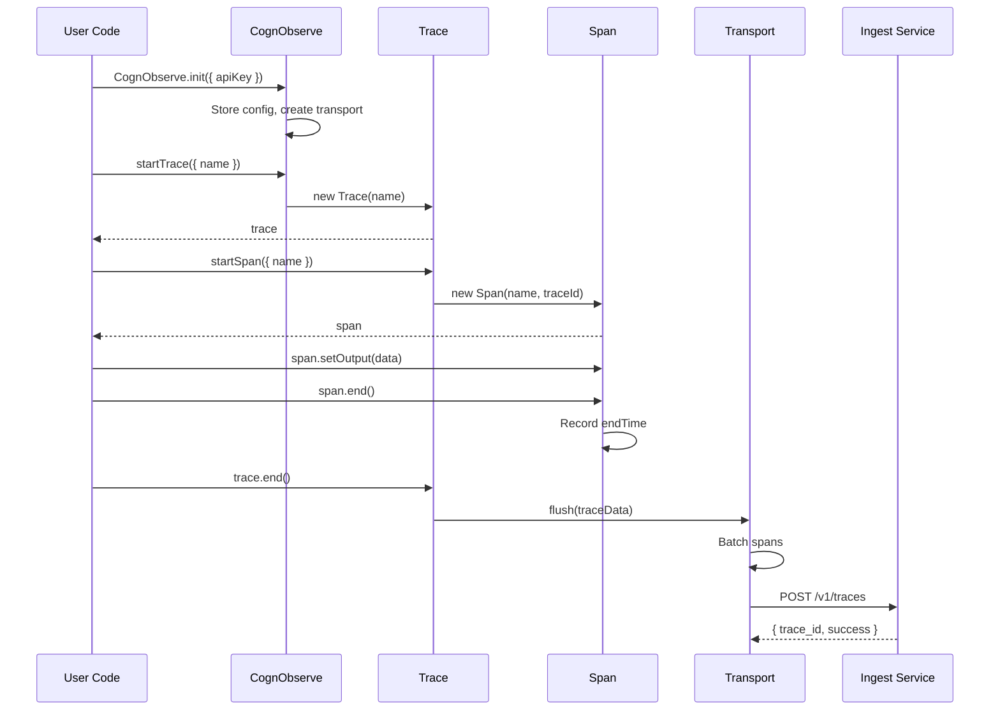
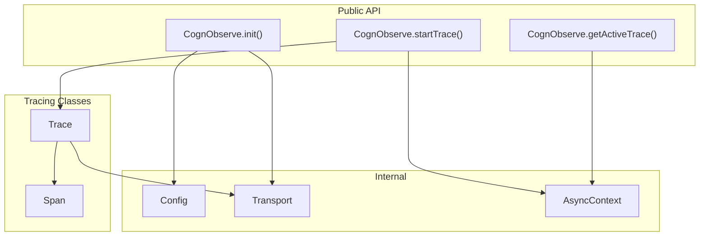

# Sprint 1: Core SDK - Package, Init, Manual Tracing

**Issue:** #74
**Points:** 10
**Dependencies:** None (Foundation sprint)

---

## 1. Overview

Build the foundation TypeScript SDK: npm package setup, initialization, and manual tracing API.

### Deliverables

| Component | Type | Priority |
|-----------|------|----------|
| Package setup (ESM + CJS) | Config | P0 |
| `CognObserve.init()` | Core | P0 |
| `startTrace()` / `trace.end()` | Core | P0 |
| `startSpan()` / `span.end()` | Core | P0 |
| HTTP transport with batching | Core | P1 |
| Async context propagation | Core | P1 |

---

## 2. Architecture

### 2.1 Package Structure

```
packages/sdk/
├── package.json
├── tsconfig.json
├── tsup.config.ts
├── src/
│   ├── index.ts              # Public exports
│   ├── cognobserve.ts        # Main class (singleton)
│   ├── config.ts             # Configuration types & defaults
│   ├── client.ts             # Low-level HTTP client
│   ├── transport.ts          # Batching & retry logic
│   ├── trace.ts              # Trace class
│   ├── span.ts               # Span class
│   ├── context.ts            # AsyncLocalStorage context
│   ├── types.ts              # Type definitions
│   └── utils/
│       ├── id.ts             # ID generation
│       └── time.ts           # Time utilities
└── tests/
    ├── cognobserve.test.ts
    ├── trace.test.ts
    ├── span.test.ts
    └── transport.test.ts
```

### 2.2 Data Flow



### 2.3 Component Architecture



---

## 3. Package Configuration

### 3.1 package.json

```json
{
  "name": "@cognobserve/sdk",
  "version": "0.1.0",
  "description": "CognObserve SDK for TypeScript - AI Observability",
  "type": "module",
  "main": "./dist/index.cjs",
  "module": "./dist/index.js",
  "types": "./dist/index.d.ts",
  "exports": {
    ".": {
      "import": {
        "types": "./dist/index.d.ts",
        "default": "./dist/index.js"
      },
      "require": {
        "types": "./dist/index.d.cts",
        "default": "./dist/index.cjs"
      }
    },
    "./integrations": {
      "import": {
        "types": "./dist/integrations/index.d.ts",
        "default": "./dist/integrations/index.js"
      },
      "require": {
        "types": "./dist/integrations/index.d.cts",
        "default": "./dist/integrations/index.cjs"
      }
    }
  },
  "files": [
    "dist",
    "README.md"
  ],
  "scripts": {
    "build": "tsup",
    "dev": "tsup --watch",
    "test": "vitest",
    "test:coverage": "vitest --coverage",
    "lint": "eslint src/",
    "typecheck": "tsc --noEmit",
    "prepublishOnly": "pnpm build"
  },
  "keywords": [
    "observability",
    "tracing",
    "llm",
    "ai",
    "openai",
    "anthropic",
    "monitoring"
  ],
  "author": "CognObserve",
  "license": "MIT",
  "repository": {
    "type": "git",
    "url": "https://github.com/cognobserve/cognobserve.git",
    "directory": "packages/sdk"
  },
  "engines": {
    "node": ">=18.0.0"
  },
  "peerDependencies": {
    "openai": "^4.0.0",
    "anthropic": "^0.20.0"
  },
  "peerDependenciesMeta": {
    "openai": {
      "optional": true
    },
    "anthropic": {
      "optional": true
    }
  },
  "devDependencies": {
    "@types/node": "^20.0.0",
    "tsup": "^8.0.0",
    "typescript": "^5.7.0",
    "vitest": "^2.0.0"
  }
}
```

### 3.2 tsup.config.ts

```typescript
import { defineConfig } from 'tsup';

export default defineConfig({
  entry: {
    index: 'src/index.ts',
    'integrations/index': 'src/integrations/index.ts',
  },
  format: ['esm', 'cjs'],
  dts: true,
  clean: true,
  splitting: false,
  sourcemap: true,
  minify: false,
  treeshake: true,
  external: ['openai', '@anthropic-ai/sdk'],
});
```

### 3.3 tsconfig.json

```json
{
  "extends": "@cognobserve/typescript-config/base.json",
  "compilerOptions": {
    "outDir": "./dist",
    "rootDir": "./src",
    "declaration": true,
    "declarationMap": true,
    "lib": ["ES2022"],
    "target": "ES2022",
    "module": "ESNext",
    "moduleResolution": "bundler"
  },
  "include": ["src/**/*"],
  "exclude": ["node_modules", "dist", "tests"]
}
```

---

## 4. Type Definitions

### 4.1 Core Types

**File:** `src/types.ts`

```typescript
// Span levels matching proto definition
export type SpanLevel = 'DEBUG' | 'DEFAULT' | 'WARNING' | 'ERROR';

// Token usage for LLM calls
export interface TokenUsage {
  promptTokens?: number;
  completionTokens?: number;
  totalTokens?: number;
}

// Configuration options
export interface CognObserveConfig {
  apiKey: string;
  endpoint?: string;
  debug?: boolean;
  disabled?: boolean;
  flushInterval?: number;   // ms, default 5000
  maxBatchSize?: number;    // default 10
  maxRetries?: number;      // default 3
}

// Resolved config with defaults
export interface ResolvedConfig {
  apiKey: string;
  endpoint: string;
  debug: boolean;
  disabled: boolean;
  flushInterval: number;
  maxBatchSize: number;
  maxRetries: number;
}

// Trace options
export interface TraceOptions {
  name: string;
  id?: string;
  metadata?: Record<string, unknown>;
}

// Span options
export interface SpanOptions {
  name: string;
  id?: string;
  parentSpanId?: string;
  input?: Record<string, unknown>;
  metadata?: Record<string, unknown>;
}

// Span end options
export interface SpanEndOptions {
  output?: Record<string, unknown>;
  level?: SpanLevel;
  statusMessage?: string;
}

// Internal span data for transport
export interface SpanData {
  id: string;
  traceId: string;
  parentSpanId: string | null;
  name: string;
  startTime: Date;
  endTime: Date | null;
  input: Record<string, unknown> | null;
  output: Record<string, unknown> | null;
  metadata: Record<string, unknown> | null;
  model: string | null;
  modelParameters: Record<string, unknown> | null;
  usage: TokenUsage | null;
  level: SpanLevel;
  statusMessage: string | null;
}

// Internal trace data for transport
export interface TraceData {
  id: string;
  name: string;
  timestamp: Date;
  metadata: Record<string, unknown> | null;
  spans: SpanData[];
}

// Transport request matching ingest API
export interface IngestRequest {
  trace_id?: string;
  name: string;
  metadata?: Record<string, unknown>;
  spans: IngestSpan[];
}

export interface IngestSpan {
  span_id?: string;
  parent_span_id?: string;
  name: string;
  start_time: string;
  end_time?: string;
  input?: Record<string, unknown>;
  output?: Record<string, unknown>;
  metadata?: Record<string, unknown>;
  model?: string;
  model_parameters?: Record<string, unknown>;
  usage?: {
    prompt_tokens?: number;
    completion_tokens?: number;
    total_tokens?: number;
  };
  level?: SpanLevel;
  status_message?: string;
}

export interface IngestResponse {
  trace_id: string;
  span_ids: string[];
  success: boolean;
}
```

---

## 5. Core Implementation

### 5.1 Configuration

**File:** `src/config.ts`

```typescript
import type { CognObserveConfig, ResolvedConfig } from './types';

const DEFAULT_ENDPOINT = 'https://ingest.cognobserve.com';
const DEFAULT_FLUSH_INTERVAL = 5000;
const DEFAULT_MAX_BATCH_SIZE = 10;
const DEFAULT_MAX_RETRIES = 3;

export function resolveConfig(config: CognObserveConfig): ResolvedConfig {
  const apiKey = config.apiKey || process.env.COGNOBSERVE_API_KEY;

  if (!apiKey && !config.disabled) {
    console.warn(
      '[CognObserve] No API key provided. Set apiKey in config or COGNOBSERVE_API_KEY env var.'
    );
  }

  return {
    apiKey: apiKey || '',
    endpoint: config.endpoint || process.env.COGNOBSERVE_ENDPOINT || DEFAULT_ENDPOINT,
    debug: config.debug ?? process.env.COGNOBSERVE_DEBUG === 'true',
    disabled: config.disabled ?? process.env.COGNOBSERVE_DISABLED === 'true',
    flushInterval: config.flushInterval ?? DEFAULT_FLUSH_INTERVAL,
    maxBatchSize: config.maxBatchSize ?? DEFAULT_MAX_BATCH_SIZE,
    maxRetries: config.maxRetries ?? DEFAULT_MAX_RETRIES,
  };
}

export function validateConfig(config: ResolvedConfig): void {
  if (!config.disabled && !config.apiKey) {
    throw new Error('[CognObserve] API key is required when SDK is enabled');
  }

  if (!config.endpoint.startsWith('http://') && !config.endpoint.startsWith('https://')) {
    throw new Error('[CognObserve] Endpoint must be a valid URL');
  }
}
```

### 5.2 ID Generation

**File:** `src/utils/id.ts`

```typescript
// Generate a random hex ID (32 chars = 16 bytes)
export function generateId(): string {
  const bytes = new Uint8Array(16);
  crypto.getRandomValues(bytes);
  return Array.from(bytes)
    .map((b) => b.toString(16).padStart(2, '0'))
    .join('');
}
```

### 5.3 Span Class

**File:** `src/span.ts`

```typescript
import { generateId } from './utils/id';
import type { SpanOptions, SpanEndOptions, SpanData, SpanLevel, TokenUsage } from './types';

export class Span {
  readonly id: string;
  readonly traceId: string;
  readonly parentSpanId: string | null;
  readonly name: string;
  readonly startTime: Date;

  private _endTime: Date | null = null;
  private _input: Record<string, unknown> | null = null;
  private _output: Record<string, unknown> | null = null;
  private _metadata: Record<string, unknown> | null = null;
  private _model: string | null = null;
  private _modelParameters: Record<string, unknown> | null = null;
  private _usage: TokenUsage | null = null;
  private _level: SpanLevel = 'DEFAULT';
  private _statusMessage: string | null = null;
  private _ended = false;

  constructor(traceId: string, options: SpanOptions) {
    this.id = options.id ?? generateId();
    this.traceId = traceId;
    this.parentSpanId = options.parentSpanId ?? null;
    this.name = options.name;
    this.startTime = new Date();
    this._input = options.input ?? null;
    this._metadata = options.metadata ?? null;
  }

  get isEnded(): boolean {
    return this._ended;
  }

  get duration(): number | null {
    if (!this._endTime) return null;
    return this._endTime.getTime() - this.startTime.getTime();
  }

  // Fluent setters
  setInput(input: Record<string, unknown>): this {
    this._input = input;
    return this;
  }

  setOutput(output: Record<string, unknown>): this {
    this._output = output;
    return this;
  }

  setMetadata(metadata: Record<string, unknown>): this {
    this._metadata = { ...this._metadata, ...metadata };
    return this;
  }

  setModel(model: string, parameters?: Record<string, unknown>): this {
    this._model = model;
    if (parameters) {
      this._modelParameters = parameters;
    }
    return this;
  }

  setUsage(usage: TokenUsage): this {
    this._usage = usage;
    return this;
  }

  setLevel(level: SpanLevel): this {
    this._level = level;
    return this;
  }

  setError(message: string): this {
    this._level = 'ERROR';
    this._statusMessage = message;
    return this;
  }

  end(options?: SpanEndOptions): void {
    if (this._ended) {
      console.warn(`[CognObserve] Span "${this.name}" already ended`);
      return;
    }

    this._endTime = new Date();
    this._ended = true;

    if (options?.output) {
      this._output = options.output;
    }
    if (options?.level) {
      this._level = options.level;
    }
    if (options?.statusMessage) {
      this._statusMessage = options.statusMessage;
    }
  }

  // Export data for transport
  toData(): SpanData {
    return {
      id: this.id,
      traceId: this.traceId,
      parentSpanId: this.parentSpanId,
      name: this.name,
      startTime: this.startTime,
      endTime: this._endTime,
      input: this._input,
      output: this._output,
      metadata: this._metadata,
      model: this._model,
      modelParameters: this._modelParameters,
      usage: this._usage,
      level: this._level,
      statusMessage: this._statusMessage,
    };
  }
}
```

### 5.4 Trace Class

**File:** `src/trace.ts`

```typescript
import { Span } from './span';
import { generateId } from './utils/id';
import type { TraceOptions, SpanOptions, TraceData } from './types';

export class Trace {
  readonly id: string;
  readonly name: string;
  readonly timestamp: Date;
  readonly metadata: Record<string, unknown> | null;

  private _spans: Map<string, Span> = new Map();
  private _activeSpan: Span | null = null;
  private _ended = false;
  private _onEnd: ((data: TraceData) => void) | null = null;

  constructor(options: TraceOptions, onEnd?: (data: TraceData) => void) {
    this.id = options.id ?? generateId();
    this.name = options.name;
    this.timestamp = new Date();
    this.metadata = options.metadata ?? null;
    this._onEnd = onEnd ?? null;
  }

  get isEnded(): boolean {
    return this._ended;
  }

  get spanCount(): number {
    return this._spans.size;
  }

  get activeSpan(): Span | null {
    return this._activeSpan;
  }

  startSpan(options: SpanOptions): Span {
    if (this._ended) {
      throw new Error(`[CognObserve] Cannot start span on ended trace "${this.name}"`);
    }

    // Auto-set parent to current active span if not specified
    const parentSpanId = options.parentSpanId ?? this._activeSpan?.id ?? null;

    const span = new Span(this.id, {
      ...options,
      parentSpanId,
    });

    this._spans.set(span.id, span);
    this._activeSpan = span;

    return span;
  }

  getSpan(spanId: string): Span | undefined {
    return this._spans.get(spanId);
  }

  // Set active span manually (for nested contexts)
  setActiveSpan(span: Span | null): void {
    this._activeSpan = span;
  }

  end(): void {
    if (this._ended) {
      console.warn(`[CognObserve] Trace "${this.name}" already ended`);
      return;
    }

    // End any spans that weren't ended
    for (const span of this._spans.values()) {
      if (!span.isEnded) {
        console.warn(`[CognObserve] Auto-ending span "${span.name}" on trace end`);
        span.end();
      }
    }

    this._ended = true;

    // Trigger flush
    if (this._onEnd) {
      this._onEnd(this.toData());
    }
  }

  toData(): TraceData {
    return {
      id: this.id,
      name: this.name,
      timestamp: this.timestamp,
      metadata: this.metadata,
      spans: Array.from(this._spans.values()).map((s) => s.toData()),
    };
  }
}
```

### 5.5 Async Context

**File:** `src/context.ts`

```typescript
import { AsyncLocalStorage } from 'node:async_hooks';
import type { Trace } from './trace';
import type { Span } from './span';

interface TracingContext {
  trace: Trace;
  span: Span | null;
}

// AsyncLocalStorage for automatic context propagation
const asyncContext = new AsyncLocalStorage<TracingContext>();

export function runWithContext<T>(context: TracingContext, fn: () => T): T {
  return asyncContext.run(context, fn);
}

export function getActiveContext(): TracingContext | undefined {
  return asyncContext.getStore();
}

export function getActiveTrace(): Trace | undefined {
  return asyncContext.getStore()?.trace;
}

export function getActiveSpan(): Span | undefined {
  return asyncContext.getStore()?.span ?? undefined;
}

export function setActiveSpan(span: Span | null): void {
  const context = asyncContext.getStore();
  if (context) {
    context.span = span;
  }
}
```

### 5.6 HTTP Transport

**File:** `src/transport.ts`

```typescript
import type { ResolvedConfig, TraceData, IngestRequest, IngestResponse } from './types';

export class Transport {
  private config: ResolvedConfig;
  private queue: TraceData[] = [];
  private flushTimer: ReturnType<typeof setTimeout> | null = null;
  private isFlushing = false;

  constructor(config: ResolvedConfig) {
    this.config = config;
    this.startFlushTimer();
  }

  private startFlushTimer(): void {
    if (this.config.disabled) return;

    this.flushTimer = setInterval(() => {
      this.flush().catch((err) => {
        if (this.config.debug) {
          console.error('[CognObserve] Flush error:', err);
        }
      });
    }, this.config.flushInterval);

    // Don't prevent process exit
    if (this.flushTimer.unref) {
      this.flushTimer.unref();
    }
  }

  enqueue(trace: TraceData): void {
    if (this.config.disabled) return;

    this.queue.push(trace);

    if (this.queue.length >= this.config.maxBatchSize) {
      this.flush().catch((err) => {
        if (this.config.debug) {
          console.error('[CognObserve] Flush error:', err);
        }
      });
    }
  }

  async flush(): Promise<void> {
    if (this.config.disabled || this.queue.length === 0 || this.isFlushing) {
      return;
    }

    this.isFlushing = true;
    const traces = this.queue.splice(0, this.config.maxBatchSize);

    try {
      await Promise.all(traces.map((trace) => this.sendTrace(trace)));
    } finally {
      this.isFlushing = false;
    }
  }

  private async sendTrace(trace: TraceData): Promise<IngestResponse> {
    const payload = this.formatPayload(trace);

    let lastError: Error | null = null;

    for (let attempt = 0; attempt < this.config.maxRetries; attempt++) {
      try {
        const response = await fetch(`${this.config.endpoint}/v1/traces`, {
          method: 'POST',
          headers: {
            'Content-Type': 'application/json',
            Authorization: `Bearer ${this.config.apiKey}`,
          },
          body: JSON.stringify(payload),
        });

        if (!response.ok) {
          const errorText = await response.text();
          throw new Error(`HTTP ${response.status}: ${errorText}`);
        }

        const result = (await response.json()) as IngestResponse;

        if (this.config.debug) {
          console.log(`[CognObserve] Sent trace ${trace.id} with ${trace.spans.length} spans`);
        }

        return result;
      } catch (err) {
        lastError = err as Error;

        if (this.config.debug) {
          console.warn(`[CognObserve] Retry ${attempt + 1}/${this.config.maxRetries}:`, err);
        }

        // Exponential backoff
        if (attempt < this.config.maxRetries - 1) {
          await this.sleep(Math.pow(2, attempt) * 100);
        }
      }
    }

    throw lastError;
  }

  private formatPayload(trace: TraceData): IngestRequest {
    return {
      trace_id: trace.id,
      name: trace.name,
      metadata: trace.metadata ?? undefined,
      spans: trace.spans.map((span) => ({
        span_id: span.id,
        parent_span_id: span.parentSpanId ?? undefined,
        name: span.name,
        start_time: span.startTime.toISOString(),
        end_time: span.endTime?.toISOString(),
        input: span.input ?? undefined,
        output: span.output ?? undefined,
        metadata: span.metadata ?? undefined,
        model: span.model ?? undefined,
        model_parameters: span.modelParameters ?? undefined,
        usage: span.usage
          ? {
              prompt_tokens: span.usage.promptTokens,
              completion_tokens: span.usage.completionTokens,
              total_tokens: span.usage.totalTokens,
            }
          : undefined,
        level: span.level,
        status_message: span.statusMessage ?? undefined,
      })),
    };
  }

  private sleep(ms: number): Promise<void> {
    return new Promise((resolve) => setTimeout(resolve, ms));
  }

  async shutdown(): Promise<void> {
    if (this.flushTimer) {
      clearInterval(this.flushTimer);
      this.flushTimer = null;
    }

    await this.flush();
  }
}
```

### 5.7 Main CognObserve Class

**File:** `src/cognobserve.ts`

```typescript
import { Trace } from './trace';
import { Transport } from './transport';
import { resolveConfig, validateConfig } from './config';
import { runWithContext, getActiveTrace, getActiveSpan } from './context';
import type { CognObserveConfig, ResolvedConfig, TraceOptions, TraceData } from './types';

class CognObserveClient {
  private config: ResolvedConfig | null = null;
  private transport: Transport | null = null;
  private initialized = false;

  init(config: CognObserveConfig): void {
    if (this.initialized) {
      console.warn('[CognObserve] Already initialized. Call shutdown() first to re-initialize.');
      return;
    }

    this.config = resolveConfig(config);
    validateConfig(this.config);

    this.transport = new Transport(this.config);
    this.initialized = true;

    if (this.config.debug) {
      console.log('[CognObserve] Initialized', {
        endpoint: this.config.endpoint,
        disabled: this.config.disabled,
      });
    }

    // Register shutdown handler
    this.registerShutdownHandler();
  }

  private registerShutdownHandler(): void {
    const shutdown = async () => {
      await this.shutdown();
    };

    process.on('beforeExit', shutdown);
    process.on('SIGINT', shutdown);
    process.on('SIGTERM', shutdown);
  }

  private ensureInitialized(): void {
    if (!this.initialized) {
      throw new Error('[CognObserve] SDK not initialized. Call CognObserve.init() first.');
    }
  }

  startTrace(options: TraceOptions): Trace {
    this.ensureInitialized();

    const handleEnd = (data: TraceData) => {
      this.transport!.enqueue(data);
    };

    const trace = new Trace(options, handleEnd);

    if (this.config!.debug) {
      console.log(`[CognObserve] Started trace "${options.name}" (${trace.id})`);
    }

    return trace;
  }

  // Run a function within a trace context
  trace<T>(options: TraceOptions, fn: (trace: Trace) => T): T {
    const trace = this.startTrace(options);

    try {
      const result = runWithContext({ trace, span: null }, () => fn(trace));

      // Handle async functions
      if (result instanceof Promise) {
        return result
          .then((res) => {
            trace.end();
            return res;
          })
          .catch((err) => {
            trace.end();
            throw err;
          }) as T;
      }

      trace.end();
      return result;
    } catch (err) {
      trace.end();
      throw err;
    }
  }

  // Get the currently active trace (from async context)
  getActiveTrace(): Trace | undefined {
    return getActiveTrace();
  }

  // Get the currently active span (from async context)
  getActiveSpan() {
    return getActiveSpan();
  }

  async flush(): Promise<void> {
    if (!this.transport) return;
    await this.transport.flush();
  }

  async shutdown(): Promise<void> {
    if (!this.transport) return;

    await this.transport.shutdown();
    this.transport = null;
    this.config = null;
    this.initialized = false;

    if (this.config?.debug) {
      console.log('[CognObserve] Shutdown complete');
    }
  }

  get isInitialized(): boolean {
    return this.initialized;
  }

  get isDisabled(): boolean {
    return this.config?.disabled ?? false;
  }
}

// Export singleton instance
export const CognObserve = new CognObserveClient();
```

### 5.8 Public Exports

**File:** `src/index.ts`

```typescript
// Main client
export { CognObserve } from './cognobserve';

// Classes (for advanced usage)
export { Trace } from './trace';
export { Span } from './span';

// Types
export type {
  CognObserveConfig,
  TraceOptions,
  SpanOptions,
  SpanEndOptions,
  SpanLevel,
  TokenUsage,
} from './types';

// Context utilities
export { getActiveTrace, getActiveSpan, runWithContext } from './context';
```

---

## 6. Usage Examples

### 6.1 Basic Initialization

```typescript
import { CognObserve } from '@cognobserve/sdk';

// Initialize with API key
CognObserve.init({
  apiKey: 'co_your_api_key',
  // Optional configuration
  endpoint: 'https://ingest.cognobserve.com',
  debug: true,
});
```

### 6.2 Manual Tracing

```typescript
import { CognObserve } from '@cognobserve/sdk';

// Start a trace
const trace = CognObserve.startTrace({ name: 'process-user-request' });

// Start a span
const span = trace.startSpan({ name: 'fetch-user-data' });
span.setInput({ userId: '123' });

// ... do work ...
const userData = await fetchUser('123');

span.setOutput({ user: userData });
span.end();

// Nested span (auto-parented to previous span)
const llmSpan = trace.startSpan({ name: 'generate-response' });
llmSpan.setModel('gpt-4');
llmSpan.setInput({ prompt: 'Hello' });

// ... call LLM ...

llmSpan.setOutput({ response: 'Hi there!' });
llmSpan.setUsage({
  promptTokens: 10,
  completionTokens: 5,
  totalTokens: 15,
});
llmSpan.end();

// End trace (sends to server)
trace.end();
```

### 6.3 Using trace() Helper

```typescript
import { CognObserve } from '@cognobserve/sdk';

// Automatically manages trace lifecycle
const result = await CognObserve.trace(
  { name: 'chat-completion' },
  async (trace) => {
    const span = trace.startSpan({ name: 'openai-call' });

    try {
      const response = await openai.chat.completions.create({
        model: 'gpt-4',
        messages: [{ role: 'user', content: 'Hello' }],
      });

      span.setOutput({ response: response.choices[0].message });
      span.end();

      return response;
    } catch (err) {
      span.setError(err.message);
      span.end();
      throw err;
    }
  }
);
```

---

## 7. Testing

### 7.1 Test Structure

```
packages/sdk/tests/
├── cognobserve.test.ts     # Init, singleton behavior
├── trace.test.ts           # Trace lifecycle
├── span.test.ts            # Span methods
├── transport.test.ts       # HTTP transport, batching
└── context.test.ts         # Async context
```

### 7.2 Test Checklist

**Unit Tests:**
- [ ] `CognObserve.init()` sets config correctly
- [ ] `CognObserve.init()` validates API key
- [ ] `CognObserve.init()` reads environment variables
- [ ] `Trace.startSpan()` creates spans with correct parent
- [ ] `Span.end()` sets endTime
- [ ] `Span.setError()` sets level to ERROR
- [ ] `Transport.enqueue()` batches traces
- [ ] `Transport.flush()` sends HTTP requests
- [ ] `Transport` retries on failure
- [ ] Async context propagates correctly

**Integration Tests:**
- [ ] Full trace lifecycle sends to mock server
- [ ] Multiple traces batch correctly
- [ ] Shutdown flushes pending traces

---

## 8. Definition of Done

- [ ] Package builds with ESM + CJS outputs
- [ ] TypeScript types included in dist
- [ ] `CognObserve.init()` works with API key
- [ ] `CognObserve.init()` reads env vars
- [ ] `startTrace()` creates trace with ID
- [ ] `trace.startSpan()` creates nested spans
- [ ] `span.end()` / `trace.end()` complete lifecycle
- [ ] Traces sent to ingest service
- [ ] Retry logic on network failure
- [ ] Batching with configurable interval
- [ ] `shutdown()` flushes pending data
- [ ] All unit tests passing
- [ ] Package size < 30KB (before integrations)

---

## 9. File Checklist

```
packages/sdk/
├── [ ] package.json
├── [ ] tsconfig.json
├── [ ] tsup.config.ts
├── [ ] src/
│   ├── [ ] index.ts
│   ├── [ ] cognobserve.ts
│   ├── [ ] config.ts
│   ├── [ ] trace.ts
│   ├── [ ] span.ts
│   ├── [ ] transport.ts
│   ├── [ ] context.ts
│   ├── [ ] types.ts
│   └── [ ] utils/
│       ├── [ ] id.ts
│       └── [ ] time.ts
└── tests/
    ├── [ ] cognobserve.test.ts
    ├── [ ] trace.test.ts
    ├── [ ] span.test.ts
    └── [ ] transport.test.ts
```
