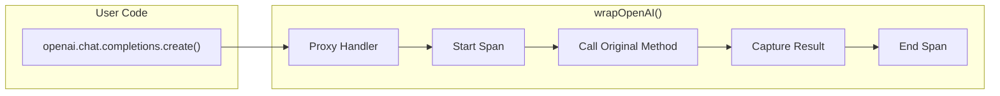
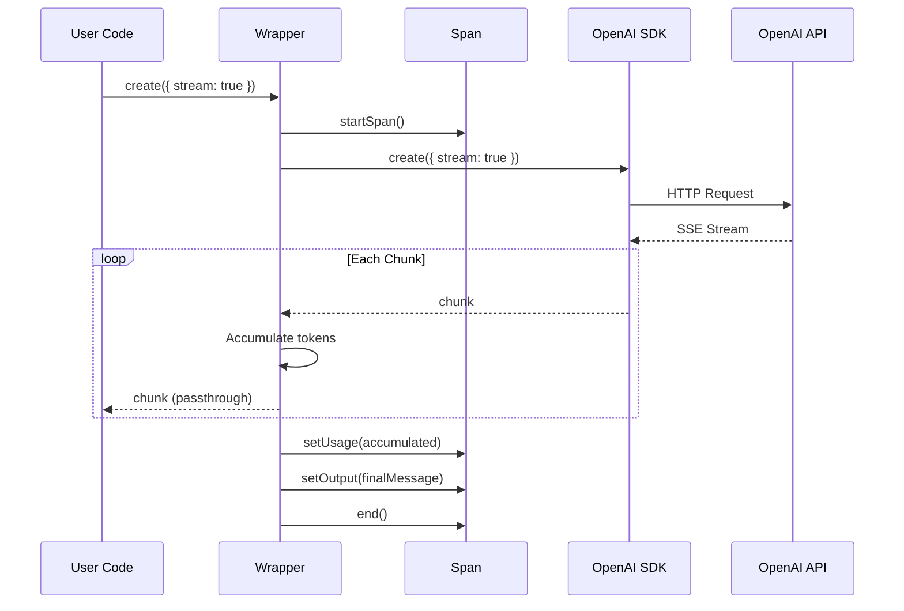

# Sprint 2: Auto-Instrumentation - OpenAI, Anthropic, Docs

**Issue:** #75
**Points:** 11
**Dependencies:** Sprint 1 (#74) - Core SDK

---

## 1. Overview

Add automatic instrumentation for OpenAI and Anthropic SDKs, plus documentation and examples.

### Deliverables

| Component | Type | Priority |
|-----------|------|----------|
| `wrapOpenAI()` - Chat completions | Integration | P0 |
| `wrapOpenAI()` - Streaming support | Integration | P0 |
| `wrapAnthropic()` - Messages | Integration | P0 |
| `wrapAnthropic()` - Streaming support | Integration | P0 |
| README documentation | Docs | P1 |
| Usage examples | Docs | P1 |

---

## 2. Architecture

### 2.1 Wrapper Design Philosophy



**Key Principles:**
1. **Non-invasive** - Original client behavior preserved
2. **Type-safe** - Return types match original SDK
3. **Streaming support** - Handle streaming responses correctly
4. **Error preservation** - Errors re-thrown after capture
5. **Minimal overhead** - No performance impact on hot paths

### 2.2 Streaming Architecture



### 2.3 Component Structure

```
packages/sdk/src/
├── integrations/
│   ├── index.ts           # Public exports
│   ├── openai.ts          # OpenAI wrapper
│   ├── anthropic.ts       # Anthropic wrapper
│   └── types.ts           # Integration types
└── utils/
    ├── streaming.ts       # Stream utilities
    └── proxy.ts           # Proxy helpers
```

---

## 3. OpenAI Integration

### 3.1 Supported Methods

| Method | Traced | Streaming |
|--------|--------|-----------|
| `chat.completions.create` | Yes | Yes |
| `completions.create` | Yes | Yes |
| `embeddings.create` | Yes | No |
| `images.generate` | Yes | No |

### 3.2 Type Definitions

**File:** `src/integrations/types.ts`

```typescript
import type OpenAI from 'openai';
import type Anthropic from '@anthropic-ai/sdk';

// Wrapped client maintains original types
export type WrappedOpenAI = OpenAI;
export type WrappedAnthropic = Anthropic;

// Wrapper options
export interface WrapperOptions {
  /**
   * Custom trace name prefix
   * @default 'openai' or 'anthropic'
   */
  tracePrefix?: string;

  /**
   * Whether to capture input messages
   * @default true
   */
  captureInput?: boolean;

  /**
   * Whether to capture output content
   * @default true
   */
  captureOutput?: boolean;

  /**
   * Whether to create a new trace for each call
   * If false, uses the current active trace
   * @default false
   */
  createTrace?: boolean;
}

// Internal: Extracted data from OpenAI response
export interface OpenAISpanData {
  model: string;
  messages: unknown[];
  response: unknown;
  usage: {
    promptTokens: number;
    completionTokens: number;
    totalTokens: number;
  } | null;
  finishReason: string | null;
}

// Internal: Extracted data from Anthropic response
export interface AnthropicSpanData {
  model: string;
  messages: unknown[];
  response: unknown;
  usage: {
    promptTokens: number;
    completionTokens: number;
    totalTokens: number;
  } | null;
  stopReason: string | null;
}
```

### 3.3 OpenAI Wrapper Implementation

**File:** `src/integrations/openai.ts`

```typescript
import type OpenAI from 'openai';
import { CognObserve } from '../cognobserve';
import { getActiveTrace } from '../context';
import type { Trace } from '../trace';
import type { WrapperOptions } from './types';

const DEFAULT_OPTIONS: Required<WrapperOptions> = {
  tracePrefix: 'openai',
  captureInput: true,
  captureOutput: true,
  createTrace: false,
};

/**
 * Wrap an OpenAI client for automatic tracing
 *
 * @example
 * ```typescript
 * import OpenAI from 'openai';
 * import { wrapOpenAI } from '@cognobserve/sdk/integrations';
 *
 * const openai = wrapOpenAI(new OpenAI());
 *
 * // All calls are now traced
 * const response = await openai.chat.completions.create({
 *   model: 'gpt-4',
 *   messages: [{ role: 'user', content: 'Hello!' }],
 * });
 * ```
 */
export function wrapOpenAI<T extends OpenAI>(
  client: T,
  options: WrapperOptions = {}
): T {
  const opts = { ...DEFAULT_OPTIONS, ...options };

  // Wrap chat.completions.create
  const originalChatCreate = client.chat.completions.create.bind(
    client.chat.completions
  );

  client.chat.completions.create = async function (
    params: OpenAI.ChatCompletionCreateParams,
    requestOptions?: OpenAI.RequestOptions
  ) {
    // Get or create trace
    let trace: Trace | undefined = getActiveTrace();
    let shouldEndTrace = false;

    if (!trace && opts.createTrace) {
      trace = CognObserve.startTrace({
        name: `${opts.tracePrefix}-chat`,
      });
      shouldEndTrace = true;
    }

    // If no trace context and not creating, just call original
    if (!trace) {
      return originalChatCreate(params, requestOptions);
    }

    const spanName = `${opts.tracePrefix}.chat.completions.create`;
    const span = trace.startSpan({ name: spanName });

    // Capture input
    if (opts.captureInput) {
      span.setInput({
        model: params.model,
        messages: params.messages,
        temperature: params.temperature,
        max_tokens: params.max_tokens,
        ...(params.tools && { tools: params.tools }),
        ...(params.functions && { functions: params.functions }),
      });
    }

    span.setModel(params.model, {
      temperature: params.temperature,
      max_tokens: params.max_tokens,
      top_p: params.top_p,
      frequency_penalty: params.frequency_penalty,
      presence_penalty: params.presence_penalty,
    });

    try {
      // Handle streaming
      if (params.stream) {
        const stream = await originalChatCreate(
          params as OpenAI.ChatCompletionCreateParamsStreaming,
          requestOptions
        );

        return wrapStream(stream, span, opts, shouldEndTrace ? trace : null);
      }

      // Non-streaming
      const response = await originalChatCreate(
        params as OpenAI.ChatCompletionCreateParamsNonStreaming,
        requestOptions
      );

      // Capture output
      if (opts.captureOutput) {
        span.setOutput({
          id: response.id,
          choices: response.choices,
          finish_reason: response.choices[0]?.finish_reason,
        });
      }

      // Capture usage
      if (response.usage) {
        span.setUsage({
          promptTokens: response.usage.prompt_tokens,
          completionTokens: response.usage.completion_tokens,
          totalTokens: response.usage.total_tokens,
        });
      }

      span.end();

      if (shouldEndTrace && trace) {
        trace.end();
      }

      return response;
    } catch (error) {
      span.setError(error instanceof Error ? error.message : String(error));
      span.end();

      if (shouldEndTrace && trace) {
        trace.end();
      }

      throw error;
    }
  } as typeof client.chat.completions.create;

  // Wrap embeddings.create
  const originalEmbeddingsCreate = client.embeddings.create.bind(
    client.embeddings
  );

  client.embeddings.create = async function (
    params: OpenAI.EmbeddingCreateParams,
    requestOptions?: OpenAI.RequestOptions
  ) {
    let trace: Trace | undefined = getActiveTrace();
    let shouldEndTrace = false;

    if (!trace && opts.createTrace) {
      trace = CognObserve.startTrace({
        name: `${opts.tracePrefix}-embedding`,
      });
      shouldEndTrace = true;
    }

    if (!trace) {
      return originalEmbeddingsCreate(params, requestOptions);
    }

    const span = trace.startSpan({
      name: `${opts.tracePrefix}.embeddings.create`,
    });

    span.setModel(params.model);

    if (opts.captureInput) {
      span.setInput({
        model: params.model,
        input:
          typeof params.input === 'string'
            ? params.input.slice(0, 1000) // Truncate long inputs
            : `[${Array.isArray(params.input) ? params.input.length : 1} items]`,
      });
    }

    try {
      const response = await originalEmbeddingsCreate(params, requestOptions);

      if (response.usage) {
        span.setUsage({
          promptTokens: response.usage.prompt_tokens,
          totalTokens: response.usage.total_tokens,
        });
      }

      if (opts.captureOutput) {
        span.setOutput({
          embedding_count: response.data.length,
          dimensions: response.data[0]?.embedding.length,
        });
      }

      span.end();

      if (shouldEndTrace && trace) {
        trace.end();
      }

      return response;
    } catch (error) {
      span.setError(error instanceof Error ? error.message : String(error));
      span.end();

      if (shouldEndTrace && trace) {
        trace.end();
      }

      throw error;
    }
  } as typeof client.embeddings.create;

  return client;
}

/**
 * Wrap a streaming response to capture usage and content
 */
async function* wrapStream(
  stream: AsyncIterable<OpenAI.ChatCompletionChunk>,
  span: import('../span').Span,
  opts: Required<WrapperOptions>,
  trace: Trace | null
): AsyncIterable<OpenAI.ChatCompletionChunk> {
  const chunks: OpenAI.ChatCompletionChunk[] = [];
  let promptTokens = 0;
  let completionTokens = 0;

  try {
    for await (const chunk of stream) {
      chunks.push(chunk);

      // Accumulate usage if present (some providers include per-chunk usage)
      if (chunk.usage) {
        promptTokens = chunk.usage.prompt_tokens ?? promptTokens;
        completionTokens = chunk.usage.completion_tokens ?? completionTokens;
      }

      yield chunk;
    }

    // Reconstruct final message from chunks
    const finalContent = chunks
      .map((c) => c.choices[0]?.delta?.content ?? '')
      .join('');

    const finishReason = chunks[chunks.length - 1]?.choices[0]?.finish_reason;

    if (opts.captureOutput) {
      span.setOutput({
        content: finalContent,
        finish_reason: finishReason,
        chunk_count: chunks.length,
      });
    }

    // Set usage (estimate if not provided)
    if (promptTokens > 0 || completionTokens > 0) {
      span.setUsage({
        promptTokens,
        completionTokens,
        totalTokens: promptTokens + completionTokens,
      });
    }

    span.end();

    if (trace) {
      trace.end();
    }
  } catch (error) {
    span.setError(error instanceof Error ? error.message : String(error));
    span.end();

    if (trace) {
      trace.end();
    }

    throw error;
  }
}
```

---

## 4. Anthropic Integration

### 4.1 Supported Methods

| Method | Traced | Streaming |
|--------|--------|-----------|
| `messages.create` | Yes | Yes |
| `messages.stream` | Yes | Yes |

### 4.2 Anthropic Wrapper Implementation

**File:** `src/integrations/anthropic.ts`

```typescript
import type Anthropic from '@anthropic-ai/sdk';
import { CognObserve } from '../cognobserve';
import { getActiveTrace } from '../context';
import type { Trace } from '../trace';
import type { WrapperOptions } from './types';

const DEFAULT_OPTIONS: Required<WrapperOptions> = {
  tracePrefix: 'anthropic',
  captureInput: true,
  captureOutput: true,
  createTrace: false,
};

/**
 * Wrap an Anthropic client for automatic tracing
 *
 * @example
 * ```typescript
 * import Anthropic from '@anthropic-ai/sdk';
 * import { wrapAnthropic } from '@cognobserve/sdk/integrations';
 *
 * const anthropic = wrapAnthropic(new Anthropic());
 *
 * // All calls are now traced
 * const response = await anthropic.messages.create({
 *   model: 'claude-3-5-sonnet-20241022',
 *   max_tokens: 1024,
 *   messages: [{ role: 'user', content: 'Hello!' }],
 * });
 * ```
 */
export function wrapAnthropic<T extends Anthropic>(
  client: T,
  options: WrapperOptions = {}
): T {
  const opts = { ...DEFAULT_OPTIONS, ...options };

  // Wrap messages.create
  const originalCreate = client.messages.create.bind(client.messages);

  client.messages.create = async function (
    params: Anthropic.MessageCreateParams,
    requestOptions?: Anthropic.RequestOptions
  ) {
    let trace: Trace | undefined = getActiveTrace();
    let shouldEndTrace = false;

    if (!trace && opts.createTrace) {
      trace = CognObserve.startTrace({
        name: `${opts.tracePrefix}-messages`,
      });
      shouldEndTrace = true;
    }

    if (!trace) {
      return originalCreate(params, requestOptions);
    }

    const spanName = `${opts.tracePrefix}.messages.create`;
    const span = trace.startSpan({ name: spanName });

    // Capture input
    if (opts.captureInput) {
      span.setInput({
        model: params.model,
        messages: params.messages,
        system: params.system,
        max_tokens: params.max_tokens,
        ...(params.tools && { tools: params.tools }),
      });
    }

    span.setModel(params.model, {
      max_tokens: params.max_tokens,
      temperature: params.temperature,
      top_p: params.top_p,
      top_k: params.top_k,
    });

    try {
      // Handle streaming
      if (params.stream) {
        const stream = await originalCreate(
          params as Anthropic.MessageCreateParamsStreaming,
          requestOptions
        );

        return wrapAnthropicStream(
          stream as AsyncIterable<Anthropic.MessageStreamEvent>,
          span,
          opts,
          shouldEndTrace ? trace : null
        );
      }

      // Non-streaming
      const response = await originalCreate(
        params as Anthropic.MessageCreateParamsNonStreaming,
        requestOptions
      );

      // Capture output
      if (opts.captureOutput) {
        span.setOutput({
          id: response.id,
          content: response.content,
          stop_reason: response.stop_reason,
          model: response.model,
        });
      }

      // Capture usage
      if (response.usage) {
        span.setUsage({
          promptTokens: response.usage.input_tokens,
          completionTokens: response.usage.output_tokens,
          totalTokens:
            response.usage.input_tokens + response.usage.output_tokens,
        });
      }

      span.end();

      if (shouldEndTrace && trace) {
        trace.end();
      }

      return response;
    } catch (error) {
      span.setError(error instanceof Error ? error.message : String(error));
      span.end();

      if (shouldEndTrace && trace) {
        trace.end();
      }

      throw error;
    }
  } as typeof client.messages.create;

  // Wrap messages.stream (convenience method)
  if ('stream' in client.messages) {
    const originalStream = (
      client.messages as { stream: Function }
    ).stream.bind(client.messages);

    (client.messages as { stream: Function }).stream = function (
      params: Anthropic.MessageCreateParamsNonStreaming,
      requestOptions?: Anthropic.RequestOptions
    ) {
      // messages.stream returns a MessageStream helper
      // We need to wrap the underlying stream
      const messageStream = originalStream(params, requestOptions);

      let trace: Trace | undefined = getActiveTrace();
      let shouldEndTrace = false;

      if (!trace && opts.createTrace) {
        trace = CognObserve.startTrace({
          name: `${opts.tracePrefix}-messages-stream`,
        });
        shouldEndTrace = true;
      }

      if (!trace) {
        return messageStream;
      }

      const span = trace.startSpan({
        name: `${opts.tracePrefix}.messages.stream`,
      });

      if (opts.captureInput) {
        span.setInput({
          model: params.model,
          messages: params.messages,
          system: params.system,
          max_tokens: params.max_tokens,
        });
      }

      span.setModel(params.model);

      // Hook into the finalMessage promise
      messageStream.finalMessage().then(
        (message: Anthropic.Message) => {
          if (opts.captureOutput) {
            span.setOutput({
              id: message.id,
              content: message.content,
              stop_reason: message.stop_reason,
            });
          }

          if (message.usage) {
            span.setUsage({
              promptTokens: message.usage.input_tokens,
              completionTokens: message.usage.output_tokens,
              totalTokens:
                message.usage.input_tokens + message.usage.output_tokens,
            });
          }

          span.end();

          if (shouldEndTrace && trace) {
            trace.end();
          }
        },
        (error: Error) => {
          span.setError(error.message);
          span.end();

          if (shouldEndTrace && trace) {
            trace.end();
          }
        }
      );

      return messageStream;
    };
  }

  return client;
}

/**
 * Wrap Anthropic streaming response
 */
async function* wrapAnthropicStream(
  stream: AsyncIterable<Anthropic.MessageStreamEvent>,
  span: import('../span').Span,
  opts: Required<WrapperOptions>,
  trace: Trace | null
): AsyncIterable<Anthropic.MessageStreamEvent> {
  let inputTokens = 0;
  let outputTokens = 0;
  const contentBlocks: string[] = [];
  let stopReason: string | null = null;

  try {
    for await (const event of stream) {
      // Track usage from message_start
      if (event.type === 'message_start' && event.message.usage) {
        inputTokens = event.message.usage.input_tokens;
      }

      // Track content
      if (event.type === 'content_block_delta') {
        if (event.delta.type === 'text_delta') {
          contentBlocks.push(event.delta.text);
        }
      }

      // Track final usage from message_delta
      if (event.type === 'message_delta') {
        if (event.usage) {
          outputTokens = event.usage.output_tokens;
        }
        stopReason = event.delta.stop_reason ?? stopReason;
      }

      yield event;
    }

    if (opts.captureOutput) {
      span.setOutput({
        content: contentBlocks.join(''),
        stop_reason: stopReason,
      });
    }

    span.setUsage({
      promptTokens: inputTokens,
      completionTokens: outputTokens,
      totalTokens: inputTokens + outputTokens,
    });

    span.end();

    if (trace) {
      trace.end();
    }
  } catch (error) {
    span.setError(error instanceof Error ? error.message : String(error));
    span.end();

    if (trace) {
      trace.end();
    }

    throw error;
  }
}
```

### 4.3 Integration Exports

**File:** `src/integrations/index.ts`

```typescript
export { wrapOpenAI } from './openai';
export { wrapAnthropic } from './anthropic';
export type { WrapperOptions } from './types';
```

---

## 5. Documentation

### 5.1 README.md

**File:** `packages/sdk/README.md`

```markdown
# @cognobserve/sdk

Official TypeScript SDK for [CognObserve](https://cognobserve.com) - AI Platform Monitoring & Observability.

## Installation

```bash
npm install @cognobserve/sdk
# or
pnpm add @cognobserve/sdk
# or
yarn add @cognobserve/sdk
```

## Quick Start

### 1. Initialize the SDK

```typescript
import { CognObserve } from '@cognobserve/sdk';

CognObserve.init({
  apiKey: process.env.COGNOBSERVE_API_KEY,
});
```

### 2. Auto-Instrument OpenAI

```typescript
import OpenAI from 'openai';
import { wrapOpenAI } from '@cognobserve/sdk/integrations';

const openai = wrapOpenAI(new OpenAI());

// All calls are now automatically traced
const response = await openai.chat.completions.create({
  model: 'gpt-4',
  messages: [{ role: 'user', content: 'Hello!' }],
});
```

### 3. Auto-Instrument Anthropic

```typescript
import Anthropic from '@anthropic-ai/sdk';
import { wrapAnthropic } from '@cognobserve/sdk/integrations';

const anthropic = wrapAnthropic(new Anthropic());

// All calls are now automatically traced
const response = await anthropic.messages.create({
  model: 'claude-3-5-sonnet-20241022',
  max_tokens: 1024,
  messages: [{ role: 'user', content: 'Hello!' }],
});
```

## Manual Tracing

For custom instrumentation:

```typescript
import { CognObserve } from '@cognobserve/sdk';

// Start a trace
const trace = CognObserve.startTrace({ name: 'my-operation' });

// Create spans for individual operations
const span = trace.startSpan({ name: 'database-query' });
span.setInput({ query: 'SELECT * FROM users' });

// ... do work ...

span.setOutput({ rowCount: 10 });
span.end();

// End the trace (sends to CognObserve)
trace.end();
```

## Using with Async Context

The SDK automatically propagates trace context through async operations:

```typescript
import { CognObserve, getActiveTrace } from '@cognobserve/sdk';

async function processRequest() {
  // This will be parented to the active trace
  const trace = getActiveTrace();
  if (trace) {
    const span = trace.startSpan({ name: 'inner-operation' });
    // ...
    span.end();
  }
}

// Wrap your handler
await CognObserve.trace({ name: 'request-handler' }, async (trace) => {
  await processRequest(); // Spans created here are children of request-handler
});
```

## Configuration

```typescript
CognObserve.init({
  // Required
  apiKey: 'co_...',

  // Optional
  endpoint: 'https://ingest.cognobserve.com', // Custom endpoint
  debug: false,                                // Enable debug logging
  disabled: false,                             // Disable SDK entirely
  flushInterval: 5000,                         // Batch flush interval (ms)
  maxBatchSize: 10,                            // Max traces per batch
  maxRetries: 3,                               // Retry attempts on failure
});
```

### Environment Variables

| Variable | Description |
|----------|-------------|
| `COGNOBSERVE_API_KEY` | API key (fallback if not in config) |
| `COGNOBSERVE_ENDPOINT` | Custom ingest endpoint |
| `COGNOBSERVE_DEBUG` | Enable debug mode (`true`/`false`) |
| `COGNOBSERVE_DISABLED` | Disable SDK (`true`/`false`) |

## Wrapper Options

Both `wrapOpenAI` and `wrapAnthropic` accept options:

```typescript
const openai = wrapOpenAI(new OpenAI(), {
  tracePrefix: 'my-app',     // Custom span name prefix
  captureInput: true,         // Capture input messages
  captureOutput: true,        // Capture output content
  createTrace: false,         // Create new trace if none active
});
```

## Streaming Support

Both OpenAI and Anthropic streaming responses are fully supported:

```typescript
const stream = await openai.chat.completions.create({
  model: 'gpt-4',
  messages: [{ role: 'user', content: 'Hello!' }],
  stream: true,
});

for await (const chunk of stream) {
  process.stdout.write(chunk.choices[0]?.delta?.content || '');
}
// Span is automatically ended with accumulated usage data
```

## Graceful Shutdown

The SDK registers shutdown handlers automatically. For manual control:

```typescript
// Flush pending traces
await CognObserve.flush();

// Full shutdown
await CognObserve.shutdown();
```

## TypeScript

Full TypeScript support with exported types:

```typescript
import type {
  CognObserveConfig,
  TraceOptions,
  SpanOptions,
  SpanLevel,
  TokenUsage,
} from '@cognobserve/sdk';
```

## Requirements

- Node.js 18+
- OpenAI SDK v4+ (optional peer dependency)
- Anthropic SDK v0.20+ (optional peer dependency)

## License

MIT
```

---

## 6. Examples

### 6.1 Basic Example

**File:** `packages/sdk/examples/basic.ts`

```typescript
import { CognObserve } from '@cognobserve/sdk';

// Initialize
CognObserve.init({
  apiKey: process.env.COGNOBSERVE_API_KEY!,
  debug: true,
});

async function main() {
  // Manual tracing
  const trace = CognObserve.startTrace({
    name: 'example-trace',
    metadata: { environment: 'development' },
  });

  const span1 = trace.startSpan({ name: 'step-1' });
  span1.setInput({ data: 'hello' });
  await new Promise((r) => setTimeout(r, 100));
  span1.setOutput({ result: 'world' });
  span1.end();

  const span2 = trace.startSpan({ name: 'step-2' });
  span2.setModel('gpt-4', { temperature: 0.7 });
  span2.setUsage({
    promptTokens: 10,
    completionTokens: 20,
    totalTokens: 30,
  });
  span2.end();

  trace.end();

  // Wait for flush
  await CognObserve.flush();
  console.log('Done!');
}

main().catch(console.error);
```

### 6.2 OpenAI Example

**File:** `packages/sdk/examples/openai.ts`

```typescript
import OpenAI from 'openai';
import { CognObserve } from '@cognobserve/sdk';
import { wrapOpenAI } from '@cognobserve/sdk/integrations';

// Initialize CognObserve
CognObserve.init({
  apiKey: process.env.COGNOBSERVE_API_KEY!,
  debug: true,
});

// Wrap OpenAI client
const openai = wrapOpenAI(new OpenAI(), {
  createTrace: true, // Auto-create traces
});

async function main() {
  // Non-streaming
  console.log('Non-streaming request...');
  const response = await openai.chat.completions.create({
    model: 'gpt-4',
    messages: [
      { role: 'system', content: 'You are a helpful assistant.' },
      { role: 'user', content: 'What is 2 + 2?' },
    ],
  });
  console.log('Response:', response.choices[0].message.content);

  // Streaming
  console.log('\nStreaming request...');
  const stream = await openai.chat.completions.create({
    model: 'gpt-4',
    messages: [{ role: 'user', content: 'Count from 1 to 5.' }],
    stream: true,
  });

  for await (const chunk of stream) {
    process.stdout.write(chunk.choices[0]?.delta?.content || '');
  }
  console.log('\n');

  // Embeddings
  console.log('Embedding request...');
  const embedding = await openai.embeddings.create({
    model: 'text-embedding-3-small',
    input: 'Hello, world!',
  });
  console.log('Embedding dimensions:', embedding.data[0].embedding.length);

  await CognObserve.shutdown();
}

main().catch(console.error);
```

### 6.3 Anthropic Example

**File:** `packages/sdk/examples/anthropic.ts`

```typescript
import Anthropic from '@anthropic-ai/sdk';
import { CognObserve } from '@cognobserve/sdk';
import { wrapAnthropic } from '@cognobserve/sdk/integrations';

// Initialize CognObserve
CognObserve.init({
  apiKey: process.env.COGNOBSERVE_API_KEY!,
  debug: true,
});

// Wrap Anthropic client
const anthropic = wrapAnthropic(new Anthropic(), {
  createTrace: true,
});

async function main() {
  // Non-streaming
  console.log('Non-streaming request...');
  const response = await anthropic.messages.create({
    model: 'claude-3-5-sonnet-20241022',
    max_tokens: 100,
    messages: [{ role: 'user', content: 'What is the capital of France?' }],
  });
  console.log(
    'Response:',
    response.content[0].type === 'text' ? response.content[0].text : ''
  );

  // Streaming
  console.log('\nStreaming request...');
  const stream = await anthropic.messages.create({
    model: 'claude-3-5-sonnet-20241022',
    max_tokens: 100,
    messages: [{ role: 'user', content: 'Count from 1 to 5.' }],
    stream: true,
  });

  for await (const event of stream) {
    if (
      event.type === 'content_block_delta' &&
      event.delta.type === 'text_delta'
    ) {
      process.stdout.write(event.delta.text);
    }
  }
  console.log('\n');

  await CognObserve.shutdown();
}

main().catch(console.error);
```

### 6.4 Combined Usage Example

**File:** `packages/sdk/examples/combined.ts`

```typescript
import OpenAI from 'openai';
import Anthropic from '@anthropic-ai/sdk';
import { CognObserve } from '@cognobserve/sdk';
import { wrapOpenAI, wrapAnthropic } from '@cognobserve/sdk/integrations';

CognObserve.init({
  apiKey: process.env.COGNOBSERVE_API_KEY!,
});

const openai = wrapOpenAI(new OpenAI());
const anthropic = wrapAnthropic(new Anthropic());

async function analyzeWithBothModels(prompt: string) {
  // Create a parent trace for the combined operation
  const trace = CognObserve.startTrace({
    name: 'multi-model-analysis',
    metadata: { prompt },
  });

  try {
    // Get OpenAI response
    const openaiSpan = trace.startSpan({ name: 'openai-analysis' });
    const openaiResponse = await openai.chat.completions.create({
      model: 'gpt-4',
      messages: [{ role: 'user', content: prompt }],
    });
    openaiSpan.end();

    // Get Anthropic response
    const anthropicSpan = trace.startSpan({ name: 'anthropic-analysis' });
    const anthropicResponse = await anthropic.messages.create({
      model: 'claude-3-5-sonnet-20241022',
      max_tokens: 1024,
      messages: [{ role: 'user', content: prompt }],
    });
    anthropicSpan.end();

    // Compare results
    const compareSpan = trace.startSpan({ name: 'compare-results' });
    const result = {
      openai: openaiResponse.choices[0].message.content,
      anthropic:
        anthropicResponse.content[0].type === 'text'
          ? anthropicResponse.content[0].text
          : '',
    };
    compareSpan.setOutput(result);
    compareSpan.end();

    trace.end();
    return result;
  } catch (error) {
    trace.end();
    throw error;
  }
}

analyzeWithBothModels('Explain quantum computing in one sentence.')
  .then(console.log)
  .finally(() => CognObserve.shutdown());
```

---

## 7. Testing

### 7.1 Test Structure

```
packages/sdk/tests/
├── integrations/
│   ├── openai.test.ts       # OpenAI wrapper tests
│   ├── anthropic.test.ts    # Anthropic wrapper tests
│   └── streaming.test.ts    # Streaming tests
└── mocks/
    ├── openai.ts            # OpenAI mock client
    └── anthropic.ts         # Anthropic mock client
```

### 7.2 Test Checklist

**OpenAI Integration:**
- [ ] `wrapOpenAI` returns typed client
- [ ] `chat.completions.create` creates span
- [ ] Span captures model and parameters
- [ ] Span captures input messages (when enabled)
- [ ] Span captures output (when enabled)
- [ ] Span captures usage tokens
- [ ] Streaming accumulates chunks correctly
- [ ] Streaming captures final usage
- [ ] Errors are captured with ERROR level
- [ ] `embeddings.create` traced correctly
- [ ] Works without active trace (createTrace: false)
- [ ] Creates trace when createTrace: true

**Anthropic Integration:**
- [ ] `wrapAnthropic` returns typed client
- [ ] `messages.create` creates span
- [ ] Span captures model and parameters
- [ ] Span captures input messages
- [ ] Span captures output
- [ ] Span captures usage tokens
- [ ] Streaming handles message_start event
- [ ] Streaming handles content_block_delta
- [ ] Streaming handles message_delta (usage)
- [ ] Errors are captured
- [ ] `messages.stream` helper works

---

## 8. Definition of Done

- [ ] `wrapOpenAI` wraps all listed methods
- [ ] `wrapAnthropic` wraps all listed methods
- [ ] Streaming responses fully supported
- [ ] Token usage captured for all calls
- [ ] Input/output capture configurable
- [ ] Errors captured with stack traces
- [ ] README with quick start guide
- [ ] Example files for each integration
- [ ] All integration tests passing
- [ ] Published to npm
- [ ] Package size < 50KB total

---

## 9. File Checklist

```
packages/sdk/
├── src/
│   ├── integrations/
│   │   ├── [ ] index.ts
│   │   ├── [ ] openai.ts
│   │   ├── [ ] anthropic.ts
│   │   └── [ ] types.ts
│   └── utils/
│       └── [ ] streaming.ts
├── [ ] README.md
├── examples/
│   ├── [ ] basic.ts
│   ├── [ ] openai.ts
│   ├── [ ] anthropic.ts
│   └── [ ] combined.ts
└── tests/
    └── integrations/
        ├── [ ] openai.test.ts
        └── [ ] anthropic.test.ts
```
