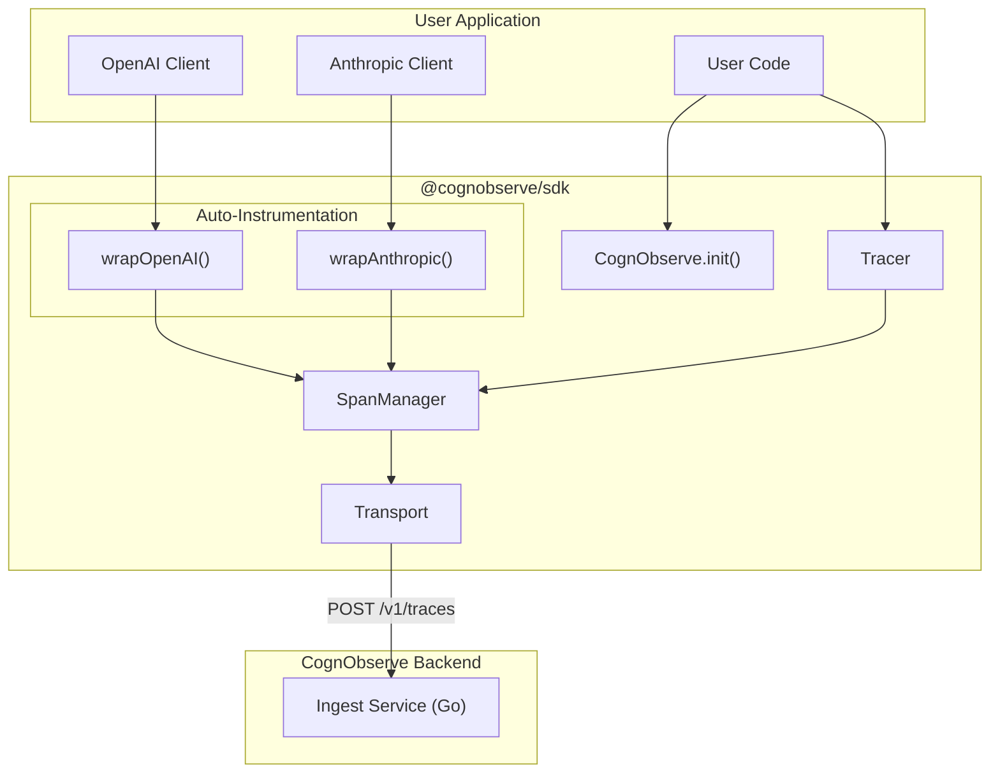
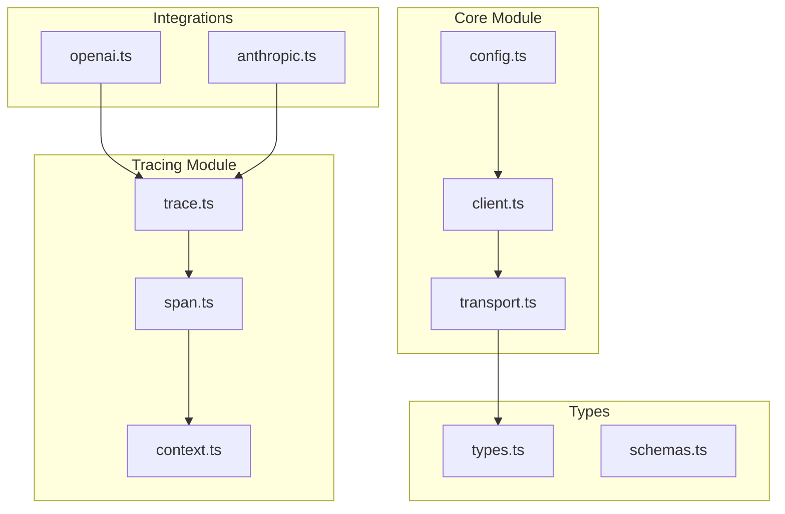
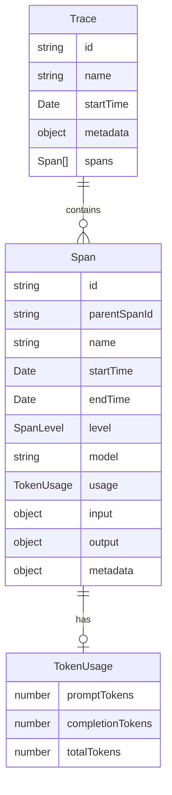

# TypeScript SDK - Engineering Specs

**EPIC:** TypeScript SDK
**Package:** `@cognobserve/sdk`

---

## Sprint Breakdown

| Sprint | Issue | Spec | Focus | Points |
|--------|-------|------|-------|--------|
| 1 | #74 | [SPRINT_1_CORE_SDK_SPEC.md](./74_SPRINT_1_CORE_SDK_SPEC.md) | Package + Init + Manual Tracing | 10 |
| 2 | #75 | [SPRINT_2_AUTO_INSTRUMENTATION_SPEC.md](./75_SPRINT_2_AUTO_INSTRUMENTATION_SPEC.md) | OpenAI/Anthropic Wrappers + Docs | 11 |

**Total: 21 points**

---

## Architecture Overview



---

## API Design Philosophy

### 1. Simple Initialization
```typescript
import { CognObserve } from '@cognobserve/sdk';

CognObserve.init({ apiKey: 'co_...' });
```

### 2. Context-Based Tracing
```typescript
const trace = CognObserve.startTrace({ name: 'chat-completion' });
const span = trace.startSpan({ name: 'openai-call' });
// ... work
span.end();
trace.end();
```

### 3. Automatic Instrumentation
```typescript
import { wrapOpenAI } from '@cognobserve/sdk';

const openai = wrapOpenAI(new OpenAI());
// All calls automatically traced
await openai.chat.completions.create({ ... });
```

---

## Component Hierarchy



---

## Data Models



---

## Key Files by Sprint

### Sprint 1: Core SDK
```
packages/sdk/
├── package.json              # Package config
├── tsconfig.json             # TypeScript config
├── tsup.config.ts            # Build config (ESM + CJS)
├── src/
│   ├── index.ts              # Public exports
│   ├── cognobserve.ts        # Main CognObserve class
│   ├── config.ts             # Configuration
│   ├── client.ts             # HTTP client
│   ├── transport.ts          # Batching & sending
│   ├── trace.ts              # Trace class
│   ├── span.ts               # Span class
│   ├── context.ts            # Async context tracking
│   └── types.ts              # Type definitions
```

### Sprint 2: Auto-Instrumentation
```
packages/sdk/
├── src/
│   ├── integrations/
│   │   ├── index.ts          # Integration exports
│   │   ├── openai.ts         # OpenAI wrapper
│   │   └── anthropic.ts      # Anthropic wrapper
│   └── utils/
│       ├── streaming.ts      # Stream handling
│       └── tokens.ts         # Token counting
├── README.md                 # Documentation
├── examples/
│   ├── basic.ts              # Basic usage
│   ├── openai.ts             # OpenAI example
│   └── anthropic.ts          # Anthropic example
```

---

## Ingest API Contract

The SDK sends traces to the Go ingest service:

**Endpoint:** `POST /v1/traces`

**Headers:**
- `Authorization: Bearer <api_key>`
- `Content-Type: application/json`

**Request Body:**
```typescript
interface IngestTraceRequest {
  trace_id?: string;          // Optional, server generates if not provided
  name: string;
  metadata?: Record<string, unknown>;
  spans: IngestSpan[];
}

interface IngestSpan {
  span_id?: string;           // Optional
  parent_span_id?: string;
  name: string;
  start_time: string;         // ISO 8601
  end_time?: string;          // ISO 8601
  input?: Record<string, unknown>;
  output?: Record<string, unknown>;
  metadata?: Record<string, unknown>;
  model?: string;
  model_parameters?: Record<string, unknown>;
  usage?: {
    prompt_tokens?: number;
    completion_tokens?: number;
    total_tokens?: number;
  };
  level?: 'DEBUG' | 'DEFAULT' | 'WARNING' | 'ERROR';
  status_message?: string;
}
```

**Response:**
```typescript
interface IngestTraceResponse {
  trace_id: string;
  span_ids: string[];
  success: boolean;
}
```

---

## Quick Reference

### Span Levels
| Level | Usage |
|-------|-------|
| DEBUG | Development/debugging info |
| DEFAULT | Normal operations |
| WARNING | Non-critical issues |
| ERROR | Failed operations |

### Environment Variables
| Variable | Description | Default |
|----------|-------------|---------|
| `COGNOBSERVE_API_KEY` | API key for authentication | - |
| `COGNOBSERVE_ENDPOINT` | Ingest service URL | `https://ingest.cognobserve.com` |
| `COGNOBSERVE_DEBUG` | Enable debug logging | `false` |
| `COGNOBSERVE_DISABLED` | Disable SDK entirely | `false` |

### Supported Runtimes
- Node.js 18+
- Deno (via npm specifier)
- Bun
- Edge runtimes (Vercel Edge, Cloudflare Workers)

---

## Definition of Done (Full SDK)

- [ ] Published to npm as `@cognobserve/sdk`
- [ ] ESM and CJS builds working
- [ ] TypeScript types included
- [ ] Manual tracing API working
- [ ] OpenAI auto-instrumentation
- [ ] Anthropic auto-instrumentation
- [ ] Streaming responses supported
- [ ] README with examples
- [ ] < 50KB package size
- [ ] Zero runtime dependencies (except peer deps)
