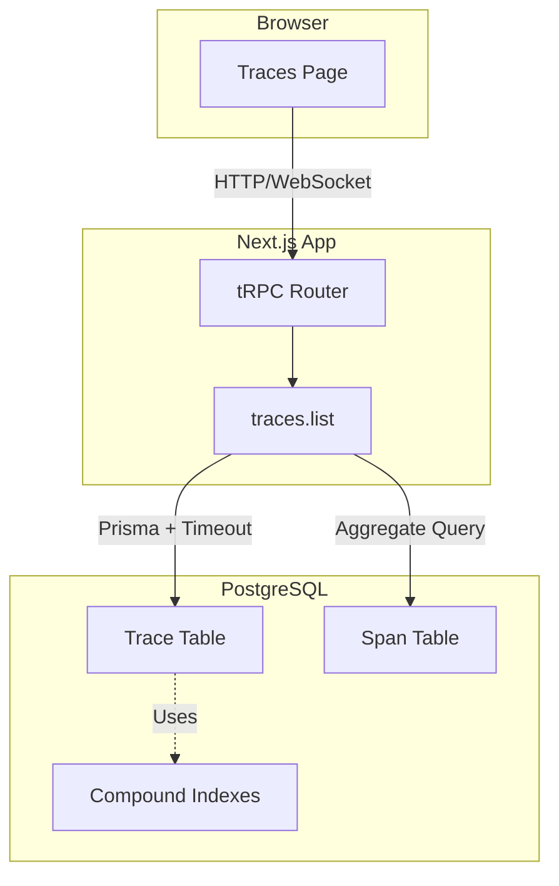
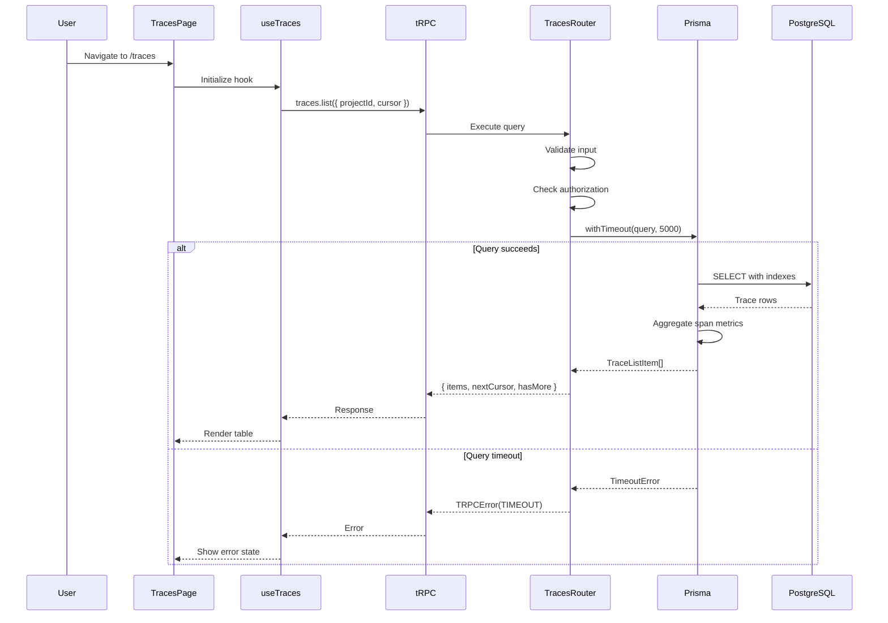
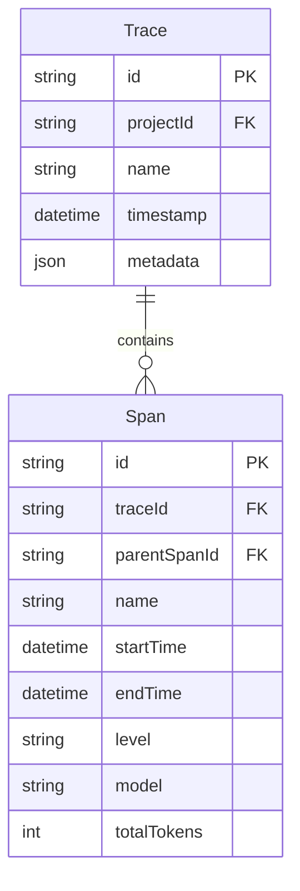
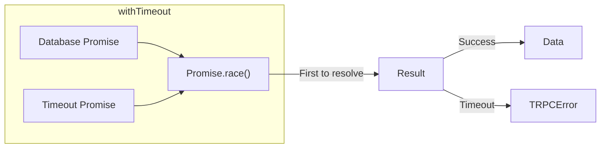
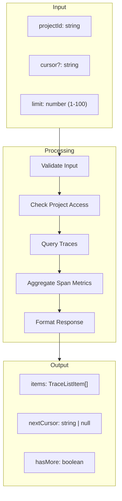
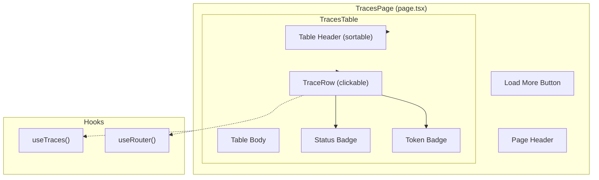

# Sprint 1: Infrastructure + Traces List Page

**Issue:** #70
**Points:** 8
**Dependencies:** None (Foundation sprint)

---

## 1. Overview

Build the foundation for trace visualization: database indexes, query utilities, and the traces list page.

### Deliverables

| Component | Type | Priority |
|-----------|------|----------|
| Database indexes | Migration | P0 |
| Query timeout utility | Library | P0 |
| Error response schema | Library | P0 |
| Traces list API enhancements | API | P1 |
| Traces list page | UI | P1 |

---

## 2. Architecture

### 2.1 System Context



### 2.2 Data Flow



---

## 3. Database Design

### 3.1 Index Strategy



### 3.2 Required Indexes

| Table | Index | Columns | Purpose |
|-------|-------|---------|---------|
| Trace | `idx_trace_project_timestamp` | `(projectId, timestamp DESC)` | List query ordering |
| Trace | `idx_trace_project_id` | `(projectId, id)` | Cursor pagination |
| Span | `idx_span_trace_starttime` | `(traceId, startTime)` | Waterfall ordering |

### 3.3 Migration SQL

```sql
-- Migration: add_trace_visualization_indexes

-- Compound index for trace list query (most common query)
-- Enables efficient: WHERE projectId = ? ORDER BY timestamp DESC
CREATE INDEX CONCURRENTLY IF NOT EXISTS "idx_trace_project_timestamp"
ON "Trace" ("projectId", "timestamp" DESC);

-- Cursor pagination index
-- Enables efficient: WHERE projectId = ? AND id > ? ORDER BY id
CREATE INDEX CONCURRENTLY IF NOT EXISTS "idx_trace_project_id"
ON "Trace" ("projectId", "id");

-- Span ordering for waterfall view
-- Enables efficient: WHERE traceId = ? ORDER BY startTime
CREATE INDEX CONCURRENTLY IF NOT EXISTS "idx_span_trace_starttime"
ON "Span" ("traceId", "startTime");
```

### 3.4 Prisma Schema Update

```prisma
model Trace {
  id        String   @id @default(cuid())
  projectId String
  project   Project  @relation(fields: [projectId], references: [id], onDelete: Cascade)
  name      String
  timestamp DateTime @default(now())
  metadata  Json?
  spans     Span[]

  @@index([projectId, timestamp(sort: Desc)])  // NEW
  @@index([projectId, id])                     // NEW
  @@index([projectId])                         // Keep existing
  @@index([timestamp])                         // Keep existing
}

model Span {
  // ... existing fields

  @@index([traceId, startTime])  // NEW
  @@index([traceId])             // Keep existing
  @@index([parentSpanId])        // Keep existing
  @@index([startTime])           // Keep existing
}
```

---

## 4. Query Utilities

### 4.1 Timeout Wrapper



### 4.2 Implementation

**File:** `packages/api/src/lib/query-utils.ts`

```typescript
import { TRPCError } from '@trpc/server';

export const QUERY_TIMEOUTS = {
  LIST: 5_000,      // 5 seconds - trace list
  DETAIL: 10_000,   // 10 seconds - trace with all spans
  SPAN: 3_000,      // 3 seconds - single span detail
} as const;

export type QueryTimeoutKey = keyof typeof QUERY_TIMEOUTS;

export class QueryTimeoutError extends TRPCError {
  constructor(context: string, timeoutMs: number) {
    super({
      code: 'TIMEOUT',
      message: `Query timed out: ${context} (${timeoutMs}ms)`,
    });
  }
}

export async function withTimeout<T>(
  promise: Promise<T>,
  timeoutMs: number,
  context: string
): Promise<T> {
  let timeoutId: NodeJS.Timeout;

  const timeoutPromise = new Promise<never>((_, reject) => {
    timeoutId = setTimeout(() => {
      reject(new QueryTimeoutError(context, timeoutMs));
    }, timeoutMs);
  });

  try {
    const result = await Promise.race([promise, timeoutPromise]);
    clearTimeout(timeoutId!);
    return result;
  } catch (error) {
    clearTimeout(timeoutId!);
    throw error;
  }
}

// Convenience function for common query types
export function withQueryTimeout<T>(
  promise: Promise<T>,
  type: QueryTimeoutKey,
  context?: string
): Promise<T> {
  return withTimeout(
    promise,
    QUERY_TIMEOUTS[type],
    context ?? type.toLowerCase()
  );
}
```

### 4.3 Error Response Schema

**File:** `packages/api/src/lib/errors.ts`

```typescript
import { TRPCError } from '@trpc/server';

export const ERROR_CODES = {
  // Trace-specific errors
  TRACE_NOT_FOUND: { code: 'NOT_FOUND', message: 'Trace not found' },
  SPAN_NOT_FOUND: { code: 'NOT_FOUND', message: 'Span not found' },
  INVALID_CURSOR: { code: 'BAD_REQUEST', message: 'Invalid pagination cursor' },
  QUERY_TIMEOUT: { code: 'TIMEOUT', message: 'Query timed out' },

  // General errors
  UNAUTHORIZED: { code: 'UNAUTHORIZED', message: 'Authentication required' },
  FORBIDDEN: { code: 'FORBIDDEN', message: 'Access denied' },
  VALIDATION_ERROR: { code: 'BAD_REQUEST', message: 'Validation failed' },
} as const;

export function createTraceError(
  key: keyof typeof ERROR_CODES,
  details?: Record<string, unknown>
): TRPCError {
  const { code, message } = ERROR_CODES[key];
  return new TRPCError({
    code: code as any,
    message,
    cause: details,
  });
}

// Type-safe error checker
export function isTraceNotFound(error: unknown): boolean {
  return error instanceof TRPCError && error.code === 'NOT_FOUND';
}
```

---

## 5. API Design

### 5.1 Enhanced `traces.list` Endpoint



### 5.2 API Contract

```typescript
// Input Schema
const listTracesInput = z.object({
  workspaceSlug: z.string(),
  projectId: z.string().cuid(),
  limit: z.number().min(1).max(100).default(50),
  cursor: z.string().max(100).optional(),
});

// Output Schema
const TraceListItemSchema = z.object({
  id: z.string(),
  name: z.string(),
  timestamp: z.string().datetime(),

  // Aggregated from spans
  spanCount: z.number(),
  duration: z.number().nullable(),        // Total duration in ms
  totalTokens: z.number().nullable(),     // Sum of all span tokens

  // Error flags (computed)
  hasErrors: z.boolean(),                 // Any span with level=ERROR
  hasWarnings: z.boolean(),               // Any span with level=WARNING

  // Model info
  primaryModel: z.string().nullable(),    // Most common model in spans
});

const listTracesOutput = z.object({
  items: z.array(TraceListItemSchema),
  nextCursor: z.string().nullable(),
  hasMore: z.boolean(),
});
```

### 5.3 Implementation

**File:** `packages/api/src/routers/traces.ts`

```typescript
import { withQueryTimeout, QUERY_TIMEOUTS } from '../lib/query-utils';
import { createTraceError } from '../lib/errors';

export const tracesRouter = router({
  list: workspaceProcedure
    .input(listTracesInput)
    .output(listTracesOutput)
    .query(async ({ ctx, input }) => {
      const { projectId, limit, cursor } = input;

      // Build cursor condition
      const cursorCondition = cursor
        ? { id: { gt: cursor } }
        : {};

      // Query with timeout
      const traces = await withQueryTimeout(
        ctx.prisma.trace.findMany({
          where: {
            projectId,
            ...cursorCondition,
          },
          orderBy: [
            { timestamp: 'desc' },
            { id: 'asc' },
          ],
          take: limit + 1, // Fetch one extra for hasMore
          include: {
            spans: {
              select: {
                id: true,
                startTime: true,
                endTime: true,
                level: true,
                model: true,
                totalTokens: true,
              },
            },
          },
        }),
        QUERY_TIMEOUTS.LIST,
        'traces.list'
      );

      // Check if there are more results
      const hasMore = traces.length > limit;
      const items = hasMore ? traces.slice(0, -1) : traces;

      // Transform to list items with aggregations
      const traceItems = items.map((trace) => {
        const spans = trace.spans;
        const hasErrors = spans.some(s => s.level === 'ERROR');
        const hasWarnings = spans.some(s => s.level === 'WARNING');

        // Calculate duration
        const startTimes = spans.map(s => new Date(s.startTime).getTime());
        const endTimes = spans
          .filter(s => s.endTime)
          .map(s => new Date(s.endTime!).getTime());

        const duration = startTimes.length && endTimes.length
          ? Math.max(...endTimes) - Math.min(...startTimes)
          : null;

        // Sum tokens
        const totalTokens = spans.reduce(
          (sum, s) => sum + (s.totalTokens ?? 0),
          0
        ) || null;

        // Find primary model (most common)
        const modelCounts = spans
          .filter(s => s.model)
          .reduce((acc, s) => {
            acc[s.model!] = (acc[s.model!] || 0) + 1;
            return acc;
          }, {} as Record<string, number>);

        const primaryModel = Object.entries(modelCounts)
          .sort((a, b) => b[1] - a[1])[0]?.[0] ?? null;

        return {
          id: trace.id,
          name: trace.name,
          timestamp: trace.timestamp.toISOString(),
          spanCount: spans.length,
          duration,
          totalTokens,
          hasErrors,
          hasWarnings,
          primaryModel,
        };
      });

      return {
        items: traceItems,
        nextCursor: hasMore ? items[items.length - 1].id : null,
        hasMore,
      };
    }),
});
```

---

## 6. UI Components

### 6.1 Component Tree



### 6.2 Page Component

**File:** `apps/web/src/app/workspace/[workspaceSlug]/projects/[projectId]/traces/page.tsx`

```typescript
import { TracesTable } from '@/components/traces/traces-table';

interface TracesPageProps {
  params: Promise<{
    workspaceSlug: string;
    projectId: string;
  }>;
}

export default async function TracesPage({ params }: TracesPageProps) {
  const { workspaceSlug, projectId } = await params;

  return (
    <div className="flex flex-col gap-6 p-6">
      <div className="flex items-center justify-between">
        <div>
          <h1 className="text-2xl font-semibold">Traces</h1>
          <p className="text-muted-foreground">
            View and debug trace executions
          </p>
        </div>
      </div>

      <TracesTable
        workspaceSlug={workspaceSlug}
        projectId={projectId}
      />
    </div>
  );
}
```

### 6.3 Traces Table Component

**File:** `apps/web/src/components/traces/traces-table.tsx`

```typescript
'use client';

import { useTraces } from '@/hooks/traces/use-traces';
import { useRouter } from 'next/navigation';
import {
  Table,
  TableBody,
  TableCell,
  TableHead,
  TableHeader,
  TableRow,
} from '@/components/ui/table';
import { Button } from '@/components/ui/button';
import { Badge } from '@/components/ui/badge';
import { Skeleton } from '@/components/ui/skeleton';
import { AlertCircle, AlertTriangle } from 'lucide-react';
import { formatDistanceToNow } from 'date-fns';

interface TracesTableProps {
  workspaceSlug: string;
  projectId: string;
}

export function TracesTable({ workspaceSlug, projectId }: TracesTableProps) {
  const router = useRouter();
  const {
    traces,
    isLoading,
    hasMore,
    loadMore,
    isLoadingMore
  } = useTraces({ workspaceSlug, projectId });

  const handleRowClick = (traceId: string) => {
    router.push(
      `/workspace/${workspaceSlug}/projects/${projectId}/traces/${traceId}`
    );
  };

  const formatDuration = (ms: number | null) => {
    if (ms === null) return '-';
    if (ms < 1000) return `${ms}ms`;
    return `${(ms / 1000).toFixed(2)}s`;
  };

  if (isLoading) {
    return <TracesTableSkeleton />;
  }

  if (traces.length === 0) {
    return <TracesEmptyState />;
  }

  return (
    <div className="space-y-4">
      <Table>
        <TableHeader>
          <TableRow>
            <TableHead className="w-[300px]">Name</TableHead>
            <TableHead>Time</TableHead>
            <TableHead className="text-center">Spans</TableHead>
            <TableHead className="text-right">Duration</TableHead>
            <TableHead className="text-right">Tokens</TableHead>
            <TableHead className="text-center">Status</TableHead>
          </TableRow>
        </TableHeader>
        <TableBody>
          {traces.map((trace) => (
            <TableRow
              key={trace.id}
              className="cursor-pointer hover:bg-muted/50"
              onClick={() => handleRowClick(trace.id)}
            >
              <TableCell className="font-medium">
                <div className="flex items-center gap-2">
                  {trace.name}
                  {trace.primaryModel && (
                    <Badge variant="outline" className="text-xs">
                      {trace.primaryModel}
                    </Badge>
                  )}
                </div>
              </TableCell>
              <TableCell className="text-muted-foreground">
                {formatDistanceToNow(new Date(trace.timestamp), {
                  addSuffix: true
                })}
              </TableCell>
              <TableCell className="text-center">
                {trace.spanCount}
              </TableCell>
              <TableCell className="text-right font-mono">
                {formatDuration(trace.duration)}
              </TableCell>
              <TableCell className="text-right font-mono">
                {trace.totalTokens?.toLocaleString() ?? '-'}
              </TableCell>
              <TableCell className="text-center">
                <div className="flex items-center justify-center gap-1">
                  {trace.hasErrors && (
                    <AlertCircle className="h-4 w-4 text-destructive" />
                  )}
                  {trace.hasWarnings && !trace.hasErrors && (
                    <AlertTriangle className="h-4 w-4 text-yellow-500" />
                  )}
                  {!trace.hasErrors && !trace.hasWarnings && (
                    <span className="h-2 w-2 rounded-full bg-green-500" />
                  )}
                </div>
              </TableCell>
            </TableRow>
          ))}
        </TableBody>
      </Table>

      {hasMore && (
        <div className="flex justify-center">
          <Button
            variant="outline"
            onClick={loadMore}
            disabled={isLoadingMore}
          >
            {isLoadingMore ? 'Loading...' : 'Load More'}
          </Button>
        </div>
      )}
    </div>
  );
}

function TracesTableSkeleton() {
  return (
    <div className="space-y-3">
      {Array.from({ length: 5 }).map((_, i) => (
        <Skeleton key={i} className="h-12 w-full" />
      ))}
    </div>
  );
}

function TracesEmptyState() {
  return (
    <div className="flex flex-col items-center justify-center py-12 text-center">
      <p className="text-lg font-medium">No traces yet</p>
      <p className="text-muted-foreground">
        Traces will appear here once your application sends data.
      </p>
    </div>
  );
}
```

### 6.4 useTraces Hook

**File:** `apps/web/src/hooks/traces/use-traces.ts`

```typescript
'use client';

import { api } from '@/lib/api';
import { useState, useCallback } from 'react';

interface UseTracesOptions {
  workspaceSlug: string;
  projectId: string;
  limit?: number;
}

export function useTraces({
  workspaceSlug,
  projectId,
  limit = 50
}: UseTracesOptions) {
  const [cursor, setCursor] = useState<string | undefined>();

  const { data, isLoading, error } = api.traces.list.useQuery({
    workspaceSlug,
    projectId,
    limit,
    cursor,
  });

  const [allTraces, setAllTraces] = useState<typeof data.items>([]);
  const [isLoadingMore, setIsLoadingMore] = useState(false);

  // Merge new data with existing
  const traces = cursor ? allTraces : (data?.items ?? []);

  const loadMore = useCallback(async () => {
    if (!data?.nextCursor) return;

    setIsLoadingMore(true);
    setAllTraces(prev => [...prev, ...data.items]);
    setCursor(data.nextCursor);
    setIsLoadingMore(false);
  }, [data]);

  return {
    traces,
    isLoading,
    error,
    hasMore: data?.hasMore ?? false,
    loadMore,
    isLoadingMore,
  };
}
```

---

## 7. File Structure

```
packages/
├── api/
│   └── src/
│       ├── lib/
│       │   ├── query-utils.ts          # NEW: Timeout wrapper
│       │   └── errors.ts               # NEW: Error codes
│       └── routers/
│           └── traces.ts               # MODIFY: Add aggregations
│
├── db/
│   └── prisma/
│       ├── schema.prisma               # MODIFY: Add indexes
│       └── migrations/
│           └── XXXXXX_add_trace_indexes/
│               └── migration.sql       # NEW: Index migration
│
apps/
└── web/
    └── src/
        ├── app/
        │   └── workspace/
        │       └── [workspaceSlug]/
        │           └── projects/
        │               └── [projectId]/
        │                   └── traces/
        │                       └── page.tsx    # NEW: Traces page
        │
        ├── components/
        │   └── traces/
        │       └── traces-table.tsx            # NEW: Table component
        │
        └── hooks/
            └── traces/
                └── use-traces.ts               # NEW: Data hook
```

---

## 8. Testing Checklist

### Unit Tests
- [ ] `withTimeout` returns result before timeout
- [ ] `withTimeout` throws `QueryTimeoutError` after timeout
- [ ] Trace list aggregations calculate correctly
- [ ] Cursor pagination returns correct items

### Integration Tests
- [ ] `traces.list` returns paginated results
- [ ] `traces.list` respects project authorization
- [ ] Index migration runs without locking tables

### Component Tests
- [ ] `TracesTable` renders loading skeleton
- [ ] `TracesTable` renders empty state
- [ ] `TracesTable` renders trace rows correctly
- [ ] Row click navigates to detail page
- [ ] Load more button fetches next page

---

## 9. Definition of Done

- [ ] Database indexes created and verified with EXPLAIN ANALYZE
- [ ] Query timeout utility with tests
- [ ] Error response schema defined
- [ ] `traces.list` returns all new fields
- [ ] Traces page accessible at correct URL
- [ ] Table displays all columns
- [ ] Error/warning indicators visible
- [ ] Pagination works
- [ ] Navigation from project sidebar
- [ ] All tests passing
