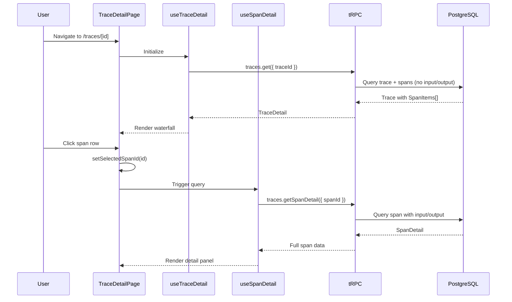

# Sprint 2: Waterfall View + Span Detail Panel

**Issue:** #71
**Points:** 13
**Dependencies:** Sprint 1 (#70)

---

## 1. Overview

Build the core trace visualization: waterfall timeline showing span hierarchy and a detail panel for inspecting individual spans.

### Deliverables

| Component | Type | Priority |
|-----------|------|----------|
| Waterfall visualization | UI Component | P1 |
| Span hierarchy calculation | Library | P1 |
| Timeline header | UI Component | P1 |
| Span detail panel | UI Component | P1 |
| JSON viewer | UI Component | P1 |
| `getSpanDetail` endpoint | API | P1 |

---

## 2. Architecture

### 2.1 Trace Detail Page Layout


### 2.2 Component Architecture


### 2.3 Data Flow



---

## 3. Waterfall Calculation

### 3.1 Data Transformation Pipeline


### 3.2 Type Definitions

**File:** `apps/web/src/lib/traces/types.ts`

```typescript
export type SpanType = 'LLM' | 'LOG' | 'FUNCTION' | 'HTTP' | 'DB' | 'CUSTOM';
export type SpanLevel = 'DEBUG' | 'DEFAULT' | 'WARNING' | 'ERROR';

// API response shape (no input/output)
export interface SpanItem {
  id: string;
  name: string;
  parentSpanId: string | null;
  startTime: string;
  endTime: string | null;
  duration: number | null;
  offsetFromTraceStart: number;
  type: SpanType;
  model: string | null;
  promptTokens: number | null;
  completionTokens: number | null;
  totalTokens: number | null;
  level: SpanLevel;
  statusMessage: string | null;
}

// Computed for waterfall rendering
export interface WaterfallSpan extends SpanItem {
  depth: number;              // Hierarchy level (0 = root)
  percentStart: number;       // 0-100% of trace duration
  percentWidth: number;       // 0-100% of trace duration
  children: WaterfallSpan[];  // Child spans
  isCollapsed: boolean;       // UI state
  isVisible: boolean;         // Based on parent collapse
}
```

### 3.3 Span Tree Builder

**File:** `apps/web/src/lib/traces/span-tree.ts`

```typescript
import { SpanItem, WaterfallSpan } from './types';

export function buildSpanTree(
  spans: SpanItem[],
  traceDuration: number
): WaterfallSpan[] {
  // Create lookup map
  const spanMap = new Map<string, WaterfallSpan>();

  // First pass: convert to WaterfallSpan
  for (const span of spans) {
    const percentStart = (span.offsetFromTraceStart / traceDuration) * 100;
    const percentWidth = span.duration
      ? Math.max((span.duration / traceDuration) * 100, 0.5) // Min 0.5%
      : 0.5;

    spanMap.set(span.id, {
      ...span,
      depth: 0,
      percentStart,
      percentWidth,
      children: [],
      isCollapsed: false,
      isVisible: true,
    });
  }

  // Second pass: build hierarchy
  const roots: WaterfallSpan[] = [];

  for (const span of spans) {
    const node = spanMap.get(span.id)!;

    if (span.parentSpanId && spanMap.has(span.parentSpanId)) {
      const parent = spanMap.get(span.parentSpanId)!;
      node.depth = parent.depth + 1;
      parent.children.push(node);
    } else {
      roots.push(node);
    }
  }

  // Sort children by start time
  const sortChildren = (node: WaterfallSpan) => {
    node.children.sort((a, b) => a.offsetFromTraceStart - b.offsetFromTraceStart);
    node.children.forEach(sortChildren);
  };
  roots.forEach(sortChildren);

  return roots;
}

// Flatten tree to array for rendering (DFS order)
export function flattenSpanTree(
  roots: WaterfallSpan[],
  collapsedIds: Set<string>
): WaterfallSpan[] {
  const result: WaterfallSpan[] = [];

  const traverse = (node: WaterfallSpan, parentCollapsed: boolean) => {
    const isCollapsed = collapsedIds.has(node.id);
    const isVisible = !parentCollapsed;

    result.push({
      ...node,
      isCollapsed,
      isVisible,
    });

    for (const child of node.children) {
      traverse(child, isCollapsed || parentCollapsed);
    }
  };

  roots
    .sort((a, b) => a.offsetFromTraceStart - b.offsetFromTraceStart)
    .forEach(root => traverse(root, false));

  return result;
}
```

### 3.4 Type Inference

**File:** `apps/web/src/lib/traces/infer-span-type.ts`

```typescript
import { SpanType, SpanItem } from './types';

export function inferSpanType(span: Partial<SpanItem>): SpanType {
  // Explicit type takes precedence
  if (span.type) return span.type;

  // Infer from fields
  if (span.model) return 'LLM';

  // Check metadata for type hints
  const metadata = span.metadata as Record<string, unknown> | undefined;
  if (metadata?.httpMethod || metadata?.statusCode) return 'HTTP';
  if (metadata?.query || metadata?.sql) return 'DB';

  // Level-based inference
  if (span.level === 'DEBUG' && !span.model) return 'LOG';

  return 'CUSTOM';
}
```

---

## 4. Type Configuration

### 4.1 Span Type Icons & Colors

```mermaid
flowchart LR
    subgraph SpanTypes
        LLM["LLM<br/>✨ Purple"]
        LOG["LOG<br/>📄 Gray"]
        FUNC["FUNCTION<br/>⚡ Blue"]
        HTTP["HTTP<br/>🌐 Green"]
        DB["DB<br/>🗄️ Orange"]
        CUSTOM["CUSTOM<br/>📦 Slate"]
    end
```



**File:** `apps/web/src/components/traces/span-type-config.ts`

```typescript
import {
  Sparkles,
  FileText,
  Code,
  Globe,
  Database,
  Box,
  type LucideIcon,
} from 'lucide-react';
import { SpanType, SpanLevel } from '@/lib/traces/types';

interface SpanTypeConfig {
  icon: LucideIcon;
  color: string;
  bgColor: string;
  label: string;
}

export const SPAN_TYPE_CONFIG: Record<SpanType, SpanTypeConfig> = {
  LLM: {
    icon: Sparkles,
    color: 'text-purple-500',
    bgColor: 'bg-purple-100 dark:bg-purple-900/30',
    label: 'LLM',
  },
  LOG: {
    icon: FileText,
    color: 'text-gray-500',
    bgColor: 'bg-gray-100 dark:bg-gray-800',
    label: 'Log',
  },
  FUNCTION: {
    icon: Code,
    color: 'text-blue-500',
    bgColor: 'bg-blue-100 dark:bg-blue-900/30',
    label: 'Function',
  },
  HTTP: {
    icon: Globe,
    color: 'text-green-500',
    bgColor: 'bg-green-100 dark:bg-green-900/30',
    label: 'HTTP',
  },
  DB: {
    icon: Database,
    color: 'text-orange-500',
    bgColor: 'bg-orange-100 dark:bg-orange-900/30',
    label: 'Database',
  },
  CUSTOM: {
    icon: Box,
    color: 'text-slate-500',
    bgColor: 'bg-slate-100 dark:bg-slate-800',
    label: 'Custom',
  },
};

export const SPAN_LEVEL_COLORS: Record<SpanLevel, string> = {
  DEBUG: 'bg-gray-300 dark:bg-gray-600',
  DEFAULT: 'bg-blue-500 dark:bg-blue-600',
  WARNING: 'bg-yellow-500 dark:bg-yellow-600',
  ERROR: 'bg-red-500 dark:bg-red-600',
};

export const SPAN_LEVEL_BORDER: Record<SpanLevel, string> = {
  DEBUG: 'border-gray-400',
  DEFAULT: 'border-blue-600',
  WARNING: 'border-yellow-600',
  ERROR: 'border-red-600',
};
```

---

## 5. UI Components

### 5.1 Waterfall Constants

**File:** `apps/web/src/components/traces/waterfall-constants.ts`

```typescript
export const WATERFALL = {
  ROW_HEIGHT: 44,           // px per row
  INDENT_PER_LEVEL: 24,     // px indent per depth
  BAR_HEIGHT: 28,           // px height of timeline bar
  MIN_BAR_WIDTH: 4,         // px minimum visible width
  TIMELINE_PADDING: 16,     // px padding on timeline edges
  NAME_COLUMN_WIDTH: 300,   // px width of name column
} as const;

export const TIME_SCALE_INTERVALS = [
  { threshold: 100, interval: 10, format: (ms: number) => `${ms}ms` },
  { threshold: 1000, interval: 100, format: (ms: number) => `${ms}ms` },
  { threshold: 5000, interval: 500, format: (ms: number) => `${ms}ms` },
  { threshold: 10000, interval: 1000, format: (ms: number) => `${ms / 1000}s` },
  { threshold: 60000, interval: 5000, format: (ms: number) => `${ms / 1000}s` },
  { threshold: Infinity, interval: 10000, format: (ms: number) => `${ms / 1000}s` },
];

export function getTimeScaleConfig(durationMs: number) {
  return TIME_SCALE_INTERVALS.find(i => durationMs <= i.threshold)!;
}
```

### 5.2 Timeline Header

**File:** `apps/web/src/components/traces/trace-timeline-header.tsx`

```typescript
'use client';

import { getTimeScaleConfig, WATERFALL } from './waterfall-constants';

interface TimelineHeaderProps {
  durationMs: number;
}

export function TimelineHeader({ durationMs }: TimelineHeaderProps) {
  const config = getTimeScaleConfig(durationMs);
  const markers: { position: number; label: string }[] = [];

  for (let ms = 0; ms <= durationMs; ms += config.interval) {
    markers.push({
      position: (ms / durationMs) * 100,
      label: config.format(ms),
    });
  }

  return (
    <div
      className="relative h-8 border-b bg-muted/30"
      style={{ marginLeft: WATERFALL.NAME_COLUMN_WIDTH }}
    >
      {markers.map((marker, i) => (
        <div
          key={i}
          className="absolute top-0 h-full border-l border-muted-foreground/20"
          style={{ left: `${marker.position}%` }}
        >
          <span className="absolute -top-0.5 left-1 text-xs text-muted-foreground">
            {marker.label}
          </span>
        </div>
      ))}
    </div>
  );
}
```

### 5.3 Waterfall Component

**File:** `apps/web/src/components/traces/trace-waterfall.tsx`

```typescript
'use client';

import { useState, useMemo, useCallback } from 'react';
import { WaterfallRow } from './trace-waterfall-row';
import { TimelineHeader } from './trace-timeline-header';
import { buildSpanTree, flattenSpanTree } from '@/lib/traces/span-tree';
import { SpanItem, WaterfallSpan } from '@/lib/traces/types';

interface TraceWaterfallProps {
  spans: SpanItem[];
  traceDuration: number;
  selectedSpanId: string | null;
  onSpanSelect: (spanId: string) => void;
}

export function TraceWaterfall({
  spans,
  traceDuration,
  selectedSpanId,
  onSpanSelect,
}: TraceWaterfallProps) {
  const [collapsedIds, setCollapsedIds] = useState<Set<string>>(new Set());

  // Build tree and flatten
  const flatSpans = useMemo(() => {
    const roots = buildSpanTree(spans, traceDuration);
    return flattenSpanTree(roots, collapsedIds);
  }, [spans, traceDuration, collapsedIds]);

  // Visible spans only
  const visibleSpans = useMemo(
    () => flatSpans.filter(s => s.isVisible),
    [flatSpans]
  );

  const handleToggleCollapse = useCallback((spanId: string) => {
    setCollapsedIds(prev => {
      const next = new Set(prev);
      if (next.has(spanId)) {
        next.delete(spanId);
      } else {
        next.add(spanId);
      }
      return next;
    });
  }, []);

  return (
    <div className="flex flex-col border rounded-lg overflow-hidden">
      <TimelineHeader durationMs={traceDuration} />

      <div className="overflow-auto max-h-[600px]">
        {visibleSpans.map(span => (
          <WaterfallRow
            key={span.id}
            span={span}
            isSelected={span.id === selectedSpanId}
            hasChildren={span.children.length > 0}
            onSelect={() => onSpanSelect(span.id)}
            onToggleCollapse={() => handleToggleCollapse(span.id)}
          />
        ))}
      </div>
    </div>
  );
}
```

### 5.4 Waterfall Row

**File:** `apps/web/src/components/traces/trace-waterfall-row.tsx`

```typescript
'use client';

import { cn } from '@/lib/utils';
import { ChevronRight, ChevronDown } from 'lucide-react';
import { WaterfallSpan } from '@/lib/traces/types';
import {
  SPAN_TYPE_CONFIG,
  SPAN_LEVEL_COLORS,
  SPAN_LEVEL_BORDER,
} from './span-type-config';
import { WATERFALL } from './waterfall-constants';

interface WaterfallRowProps {
  span: WaterfallSpan;
  isSelected: boolean;
  hasChildren: boolean;
  onSelect: () => void;
  onToggleCollapse: () => void;
}

export function WaterfallRow({
  span,
  isSelected,
  hasChildren,
  onSelect,
  onToggleCollapse,
}: WaterfallRowProps) {
  const typeConfig = SPAN_TYPE_CONFIG[span.type];
  const TypeIcon = typeConfig.icon;

  const formatDuration = (ms: number | null) => {
    if (ms === null) return '';
    if (ms < 1000) return `${ms}ms`;
    return `${(ms / 1000).toFixed(2)}s`;
  };

  const handleCollapseClick = (e: React.MouseEvent) => {
    e.stopPropagation();
    onToggleCollapse();
  };

  return (
    <div
      id={`span-${span.id}`}
      className={cn(
        'flex items-center cursor-pointer hover:bg-muted/50 border-b',
        isSelected && 'bg-muted',
        span.level === 'ERROR' && 'bg-red-50 dark:bg-red-950/20'
      )}
      style={{ height: WATERFALL.ROW_HEIGHT }}
      onClick={onSelect}
    >
      {/* Name column */}
      <div
        className="flex items-center gap-2 shrink-0 px-2"
        style={{
          width: WATERFALL.NAME_COLUMN_WIDTH,
          paddingLeft: span.depth * WATERFALL.INDENT_PER_LEVEL + 8,
        }}
      >
        {/* Collapse toggle */}
        {hasChildren ? (
          <button
            onClick={handleCollapseClick}
            className="p-0.5 hover:bg-muted rounded"
          >
            {span.isCollapsed ? (
              <ChevronRight className="h-4 w-4" />
            ) : (
              <ChevronDown className="h-4 w-4" />
            )}
          </button>
        ) : (
          <span className="w-5" />
        )}

        {/* Type icon */}
        <TypeIcon className={cn('h-4 w-4', typeConfig.color)} />

        {/* Span name */}
        <span className="truncate text-sm font-medium">{span.name}</span>
      </div>

      {/* Timeline bar column */}
      <div className="flex-1 relative h-full px-4">
        <div
          className={cn(
            'absolute top-1/2 -translate-y-1/2 rounded',
            SPAN_LEVEL_COLORS[span.level],
            'border-l-4',
            SPAN_LEVEL_BORDER[span.level]
          )}
          style={{
            left: `${span.percentStart}%`,
            width: `${Math.max(span.percentWidth, 0.5)}%`,
            height: WATERFALL.BAR_HEIGHT,
            minWidth: WATERFALL.MIN_BAR_WIDTH,
          }}
        >
          {/* Duration label */}
          <span className="absolute right-2 top-1/2 -translate-y-1/2 text-xs text-white font-mono">
            {formatDuration(span.duration)}
          </span>
        </div>
      </div>

      {/* Token badge (LLM only) */}
      {span.totalTokens && (
        <div className="shrink-0 px-2 text-xs text-muted-foreground font-mono">
          {span.totalTokens.toLocaleString()} tok
        </div>
      )}
    </div>
  );
}
```

---

## 6. Span Detail Panel

### 6.1 API Endpoint

**File:** `packages/api/src/routers/traces.ts` (addition)

```typescript
// Add to existing traces router

getSpanDetail: workspaceProcedure
  .input(z.object({
    workspaceSlug: z.string(),
    projectId: z.string().cuid(),
    traceId: z.string().cuid(),
    spanId: z.string(),
  }))
  .query(async ({ ctx, input }) => {
    const { projectId, traceId, spanId } = input;

    const span = await withQueryTimeout(
      ctx.prisma.span.findFirst({
        where: {
          id: spanId,
          traceId,
          trace: { projectId },
        },
      }),
      QUERY_TIMEOUTS.SPAN,
      'traces.getSpanDetail'
    );

    if (!span) {
      throw createTraceError('SPAN_NOT_FOUND');
    }

    return {
      id: span.id,
      name: span.name,
      parentSpanId: span.parentSpanId,
      startTime: span.startTime.toISOString(),
      endTime: span.endTime?.toISOString() ?? null,
      duration: span.endTime
        ? span.endTime.getTime() - span.startTime.getTime()
        : null,

      // Full content (lazy loaded)
      input: span.input,
      output: span.output,
      metadata: span.metadata,
      modelParameters: span.modelParameters,

      // Metrics
      type: inferSpanType(span),
      model: span.model,
      promptTokens: span.promptTokens,
      completionTokens: span.completionTokens,
      totalTokens: span.totalTokens,
      level: span.level,
      statusMessage: span.statusMessage,
    };
  }),
```

### 6.2 useSpanDetail Hook

**File:** `apps/web/src/hooks/traces/use-span-detail.ts`

```typescript
'use client';

import { api } from '@/lib/api';

interface UseSpanDetailOptions {
  workspaceSlug: string;
  projectId: string;
  traceId: string;
  spanId: string | null;
}

export function useSpanDetail({
  workspaceSlug,
  projectId,
  traceId,
  spanId,
}: UseSpanDetailOptions) {
  const { data, isLoading, error } = api.traces.getSpanDetail.useQuery(
    {
      workspaceSlug,
      projectId,
      traceId,
      spanId: spanId!,
    },
    {
      enabled: !!spanId,
      staleTime: Infinity, // Span data is immutable
    }
  );

  return {
    span: data ?? null,
    isLoading: !!spanId && isLoading,
    error,
  };
}
```

### 6.3 Span Detail Panel Component

**File:** `apps/web/src/components/traces/span-detail-panel.tsx`

```typescript
'use client';

import { X, Copy, Check } from 'lucide-react';
import { useState } from 'react';
import { Button } from '@/components/ui/button';
import { Badge } from '@/components/ui/badge';
import { Skeleton } from '@/components/ui/skeleton';
import { SpanJsonViewer } from './span-json-viewer';
import { SPAN_TYPE_CONFIG, SPAN_LEVEL_COLORS } from './span-type-config';
import { cn } from '@/lib/utils';

interface SpanDetailPanelProps {
  span: SpanDetail | null;
  isLoading: boolean;
  onClose: () => void;
}

export function SpanDetailPanel({
  span,
  isLoading,
  onClose,
}: SpanDetailPanelProps) {
  if (!span && !isLoading) {
    return (
      <div className="flex items-center justify-center h-full text-muted-foreground">
        Select a span to view details
      </div>
    );
  }

  if (isLoading) {
    return <SpanDetailSkeleton />;
  }

  const typeConfig = SPAN_TYPE_CONFIG[span!.type];
  const TypeIcon = typeConfig.icon;

  return (
    <div className="flex flex-col h-full border-l">
      {/* Header */}
      <div className="flex items-center justify-between p-4 border-b">
        <div className="flex items-center gap-2">
          <TypeIcon className={cn('h-5 w-5', typeConfig.color)} />
          <span className="font-semibold truncate">{span!.name}</span>
        </div>
        <Button variant="ghost" size="icon" onClick={onClose}>
          <X className="h-4 w-4" />
        </Button>
      </div>

      {/* Content */}
      <div className="flex-1 overflow-auto p-4 space-y-6">
        {/* Badges */}
        <div className="flex flex-wrap gap-2">
          <Badge className={cn(SPAN_LEVEL_COLORS[span!.level], 'text-white')}>
            {span!.level}
          </Badge>
          <Badge variant="outline" className={typeConfig.bgColor}>
            {typeConfig.label}
          </Badge>
          {span!.model && (
            <Badge variant="secondary">{span!.model}</Badge>
          )}
        </div>

        {/* Status Message (if error) */}
        {span!.statusMessage && (
          <div className={cn(
            'p-3 rounded-lg',
            span!.level === 'ERROR'
              ? 'bg-red-100 dark:bg-red-900/30 border border-red-200'
              : 'bg-yellow-100 dark:bg-yellow-900/30 border border-yellow-200'
          )}>
            <p className="text-sm">{span!.statusMessage}</p>
          </div>
        )}

        {/* Timing */}
        <Section title="Timing">
          <InfoRow label="Start" value={formatTime(span!.startTime)} />
          {span!.endTime && (
            <InfoRow label="End" value={formatTime(span!.endTime)} />
          )}
          <InfoRow
            label="Duration"
            value={span!.duration ? `${span!.duration}ms` : 'Running...'}
          />
        </Section>

        {/* Tokens (LLM only) */}
        {span!.type === 'LLM' && span!.totalTokens && (
          <Section title="Token Usage">
            <InfoRow label="Prompt" value={span!.promptTokens?.toLocaleString()} />
            <InfoRow label="Completion" value={span!.completionTokens?.toLocaleString()} />
            <InfoRow label="Total" value={span!.totalTokens.toLocaleString()} mono />
          </Section>
        )}

        {/* Input */}
        {span!.input && (
          <CollapsibleSection title="Input" defaultOpen>
            <SpanJsonViewer data={span!.input} />
          </CollapsibleSection>
        )}

        {/* Output */}
        {span!.output && (
          <CollapsibleSection title="Output" defaultOpen>
            <SpanJsonViewer data={span!.output} />
          </CollapsibleSection>
        )}

        {/* Model Parameters (LLM) */}
        {span!.modelParameters && (
          <CollapsibleSection title="Model Parameters">
            <SpanJsonViewer data={span!.modelParameters} />
          </CollapsibleSection>
        )}

        {/* Metadata */}
        {span!.metadata && (
          <CollapsibleSection title="Metadata">
            <SpanJsonViewer data={span!.metadata} />
          </CollapsibleSection>
        )}
      </div>
    </div>
  );
}

// Helper components
function Section({ title, children }: { title: string; children: React.ReactNode }) {
  return (
    <div>
      <h4 className="text-sm font-medium mb-2">{title}</h4>
      <div className="space-y-1">{children}</div>
    </div>
  );
}

function InfoRow({
  label,
  value,
  mono = false
}: {
  label: string;
  value: string | number | undefined | null;
  mono?: boolean;
}) {
  return (
    <div className="flex justify-between text-sm">
      <span className="text-muted-foreground">{label}</span>
      <span className={mono ? 'font-mono' : ''}>{value ?? '-'}</span>
    </div>
  );
}

function CollapsibleSection({
  title,
  defaultOpen = false,
  children,
}: {
  title: string;
  defaultOpen?: boolean;
  children: React.ReactNode;
}) {
  const [isOpen, setIsOpen] = useState(defaultOpen);

  return (
    <div>
      <button
        className="flex items-center gap-2 text-sm font-medium mb-2"
        onClick={() => setIsOpen(!isOpen)}
      >
        <span>{isOpen ? '▼' : '▶'}</span>
        {title}
      </button>
      {isOpen && children}
    </div>
  );
}

function formatTime(iso: string) {
  return new Date(iso).toLocaleTimeString('en-US', {
    hour12: false,
    hour: '2-digit',
    minute: '2-digit',
    second: '2-digit',
    fractionalSecondDigits: 3,
  });
}

function SpanDetailSkeleton() {
  return (
    <div className="p-4 space-y-4">
      <Skeleton className="h-8 w-48" />
      <Skeleton className="h-4 w-32" />
      <Skeleton className="h-24 w-full" />
      <Skeleton className="h-48 w-full" />
    </div>
  );
}
```

### 6.4 JSON Viewer Component

**File:** `apps/web/src/components/traces/span-json-viewer.tsx`

```typescript
'use client';

import { useState } from 'react';
import { Check, Copy } from 'lucide-react';
import { Button } from '@/components/ui/button';
import { cn } from '@/lib/utils';

interface SpanJsonViewerProps {
  data: unknown;
  maxHeight?: number;
}

export function SpanJsonViewer({
  data,
  maxHeight = 300,
}: SpanJsonViewerProps) {
  const [copied, setCopied] = useState(false);

  const jsonString = JSON.stringify(data, null, 2);

  const handleCopy = async () => {
    await navigator.clipboard.writeText(jsonString);
    setCopied(true);
    setTimeout(() => setCopied(false), 2000);
  };

  return (
    <div className="relative group">
      <Button
        variant="ghost"
        size="icon"
        className="absolute top-2 right-2 opacity-0 group-hover:opacity-100 transition-opacity"
        onClick={handleCopy}
      >
        {copied ? (
          <Check className="h-4 w-4 text-green-500" />
        ) : (
          <Copy className="h-4 w-4" />
        )}
      </Button>

      <pre
        className={cn(
          'p-4 rounded-lg bg-muted overflow-auto text-xs font-mono',
          'whitespace-pre-wrap break-words'
        )}
        style={{ maxHeight }}
      >
        <code>{jsonString}</code>
      </pre>
    </div>
  );
}
```

---

## 7. Trace Detail Page

**File:** `apps/web/src/app/workspace/[workspaceSlug]/projects/[projectId]/traces/[traceId]/page.tsx`

```typescript
'use client';

import { useState } from 'react';
import { useTraceDetail } from '@/hooks/traces/use-trace-detail';
import { useSpanDetail } from '@/hooks/traces/use-span-detail';
import { TraceWaterfall } from '@/components/traces/trace-waterfall';
import { SpanDetailPanel } from '@/components/traces/span-detail-panel';
import { Skeleton } from '@/components/ui/skeleton';
import { ArrowLeft } from 'lucide-react';
import Link from 'next/link';

interface TraceDetailPageProps {
  params: Promise<{
    workspaceSlug: string;
    projectId: string;
    traceId: string;
  }>;
}

export default function TraceDetailPage({ params }: TraceDetailPageProps) {
  const { workspaceSlug, projectId, traceId } = use(params);
  const [selectedSpanId, setSelectedSpanId] = useState<string | null>(null);

  const { trace, isLoading: traceLoading } = useTraceDetail({
    workspaceSlug,
    projectId,
    traceId,
  });

  const { span: selectedSpan, isLoading: spanLoading } = useSpanDetail({
    workspaceSlug,
    projectId,
    traceId,
    spanId: selectedSpanId,
  });

  if (traceLoading) {
    return <TraceDetailSkeleton />;
  }

  if (!trace) {
    return <div>Trace not found</div>;
  }

  return (
    <div className="flex flex-col h-full">
      {/* Header */}
      <div className="p-4 border-b">
        <Link
          href={`/workspace/${workspaceSlug}/projects/${projectId}/traces`}
          className="flex items-center gap-2 text-sm text-muted-foreground hover:text-foreground mb-2"
        >
          <ArrowLeft className="h-4 w-4" />
          Back to traces
        </Link>
        <h1 className="text-xl font-semibold">{trace.name}</h1>
        <p className="text-sm text-muted-foreground">
          {trace.spanCount} spans · {trace.duration}ms · {trace.totalTokens} tokens
        </p>
      </div>

      {/* Main content */}
      <div className="flex flex-1 overflow-hidden">
        {/* Waterfall (60%) */}
        <div className="flex-1 overflow-auto p-4">
          <TraceWaterfall
            spans={trace.spans}
            traceDuration={trace.duration ?? 1000}
            selectedSpanId={selectedSpanId}
            onSpanSelect={setSelectedSpanId}
          />
        </div>

        {/* Detail panel (40%) */}
        <div className="w-[400px] shrink-0">
          <SpanDetailPanel
            span={selectedSpan}
            isLoading={spanLoading}
            onClose={() => setSelectedSpanId(null)}
          />
        </div>
      </div>
    </div>
  );
}

function TraceDetailSkeleton() {
  return (
    <div className="p-4 space-y-4">
      <Skeleton className="h-8 w-64" />
      <Skeleton className="h-[400px] w-full" />
    </div>
  );
}
```

---

## 8. File Structure

```
apps/web/src/
├── app/workspace/[ws]/projects/[pid]/traces/
│   └── [traceId]/
│       └── page.tsx                    # NEW: Detail page
│
├── components/traces/
│   ├── trace-waterfall.tsx             # NEW: Main waterfall
│   ├── trace-waterfall-row.tsx         # NEW: Single row
│   ├── trace-timeline-header.tsx       # NEW: Time scale
│   ├── span-detail-panel.tsx           # NEW: Detail panel
│   ├── span-json-viewer.tsx            # NEW: JSON viewer
│   ├── span-type-config.ts             # NEW: Type icons/colors
│   └── waterfall-constants.ts          # NEW: Layout constants
│
├── hooks/traces/
│   ├── use-trace-detail.ts             # NEW: Trace query
│   └── use-span-detail.ts              # NEW: Span query (lazy)
│
└── lib/traces/
    ├── types.ts                        # NEW: Type definitions
    ├── span-tree.ts                    # NEW: Tree builder
    └── infer-span-type.ts              # NEW: Type inference

packages/api/src/routers/
└── traces.ts                           # MODIFY: Add getSpanDetail
```

---

## 9. Testing Checklist

### Unit Tests
- [ ] `buildSpanTree` creates correct hierarchy
- [ ] `flattenSpanTree` returns DFS order
- [ ] `flattenSpanTree` respects collapsed state
- [ ] `inferSpanType` returns correct types
- [ ] Time scale intervals calculated correctly

### Component Tests
- [ ] `TraceWaterfall` renders all spans
- [ ] `WaterfallRow` click triggers selection
- [ ] `WaterfallRow` collapse button works
- [ ] `SpanDetailPanel` shows loading state
- [ ] `SpanDetailPanel` renders all sections
- [ ] `SpanJsonViewer` copy button works

### Integration Tests
- [ ] Navigate to trace detail loads data
- [ ] Selecting span triggers lazy load
- [ ] Back navigation works

### Performance Tests
- [ ] Render 100 spans in <500ms
- [ ] Collapse/expand is instant

---

## 10. Definition of Done

- [ ] Waterfall shows all spans with hierarchy
- [ ] Timeline header with time markers
- [ ] Color coding by level and type
- [ ] Click span loads detail panel
- [ ] Collapse/expand children works
- [ ] Input/output lazy loaded
- [ ] JSON viewer with copy
- [ ] All tests passing
- [ ] Renders 100 spans in <500ms
