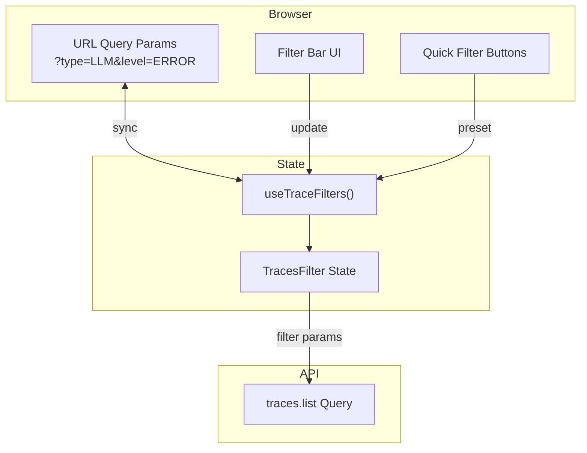
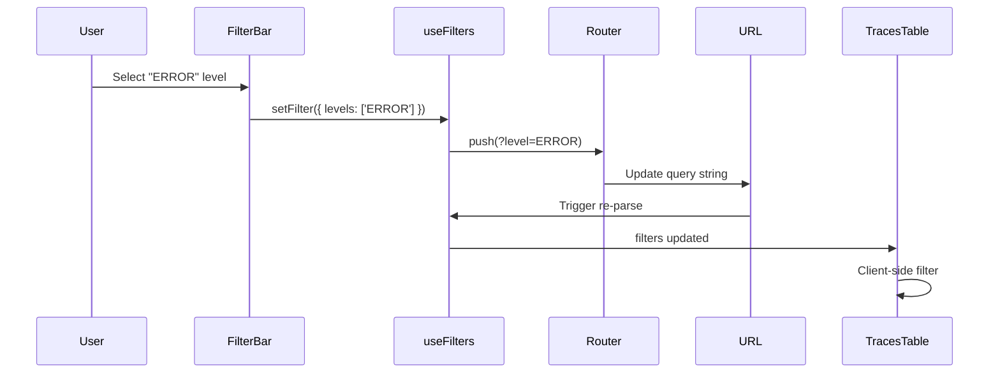
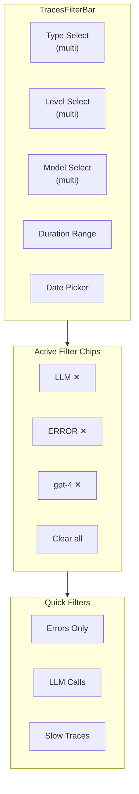
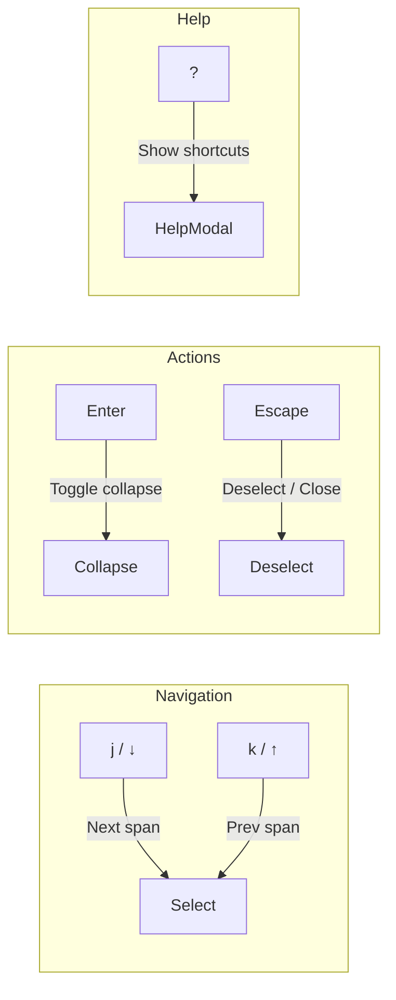

# Sprint 3: Filtering + Polish

**Issue:** #72
**Points:** 8
**Dependencies:** Sprint 2 (#71)

---

## 1. Overview

Add filtering capabilities with URL sync for shareability, plus UX polish like jump-to-error and keyboard navigation.

### Deliverables

| Component | Type | Priority |
|-----------|------|----------|
| Filter bar | UI Component | P2 |
| URL sync hook | Library | P2 |
| Quick filters | UI Component | P2 |
| Jump to first error | Feature | P2 |
| Keyboard navigation | Feature | P2 |

---

## 2. Architecture

### 2.1 Filter State Flow



### 2.2 Filter Data Flow



---

## 3. Filter Schema

### 3.1 Type Definitions

**File:** `apps/web/src/lib/traces/filter-types.ts`

```typescript
import { z } from 'zod';
import { SpanType, SpanLevel } from './types';

// Zod schema for URL parsing
export const TracesFilterSchema = z.object({
  // Span type filter (multi-select)
  types: z.array(z.enum(['LLM', 'LOG', 'FUNCTION', 'HTTP', 'DB', 'CUSTOM'])).optional(),

  // Level filter (multi-select)
  levels: z.array(z.enum(['DEBUG', 'DEFAULT', 'WARNING', 'ERROR'])).optional(),

  // Model filter (multi-select, LLM-specific)
  models: z.array(z.string()).optional(),

  // Duration range (ms)
  minDuration: z.number().min(0).optional(),
  maxDuration: z.number().min(0).optional(),

  // Date range
  from: z.string().datetime().optional(),
  to: z.string().datetime().optional(),
});

export type TracesFilter = z.infer<typeof TracesFilterSchema>;

// URL param keys
export const FILTER_PARAM_KEYS = {
  types: 'type',
  levels: 'level',
  models: 'model',
  minDuration: 'minDuration',
  maxDuration: 'maxDuration',
  from: 'from',
  to: 'to',
} as const;
```

### 3.2 Quick Filter Presets

```typescript
export const QUICK_FILTERS: { label: string; filter: Partial<TracesFilter> }[] = [
  {
    label: 'Errors Only',
    filter: { levels: ['ERROR'] },
  },
  {
    label: 'LLM Calls',
    filter: { types: ['LLM'] },
  },
  {
    label: 'HTTP Requests',
    filter: { types: ['HTTP'] },
  },
  {
    label: 'Database Queries',
    filter: { types: ['DB'] },
  },
  {
    label: 'Slow Traces (>5s)',
    filter: { minDuration: 5000 },
  },
  {
    label: 'LLM Errors',
    filter: { types: ['LLM'], levels: ['ERROR'] },
  },
];
```

---

## 4. URL Sync Hook

### 4.1 Hook Implementation

**File:** `apps/web/src/hooks/traces/use-trace-filters.ts`

```typescript
'use client';

import { useSearchParams, useRouter, usePathname } from 'next/navigation';
import { useCallback, useMemo } from 'react';
import { TracesFilter, FILTER_PARAM_KEYS } from '@/lib/traces/filter-types';

export function useTraceFilters() {
  const searchParams = useSearchParams();
  const router = useRouter();
  const pathname = usePathname();

  // Parse filters from URL
  const filters = useMemo((): TracesFilter => {
    const parseArray = (key: string) => {
      const value = searchParams.get(key);
      return value ? value.split(',').filter(Boolean) : undefined;
    };

    const parseNumber = (key: string) => {
      const value = searchParams.get(key);
      return value ? parseInt(value, 10) : undefined;
    };

    return {
      types: parseArray(FILTER_PARAM_KEYS.types) as TracesFilter['types'],
      levels: parseArray(FILTER_PARAM_KEYS.levels) as TracesFilter['levels'],
      models: parseArray(FILTER_PARAM_KEYS.models),
      minDuration: parseNumber(FILTER_PARAM_KEYS.minDuration),
      maxDuration: parseNumber(FILTER_PARAM_KEYS.maxDuration),
      from: searchParams.get(FILTER_PARAM_KEYS.from) ?? undefined,
      to: searchParams.get(FILTER_PARAM_KEYS.to) ?? undefined,
    };
  }, [searchParams]);

  // Update URL with new filters
  const setFilters = useCallback((newFilters: Partial<TracesFilter>) => {
    const params = new URLSearchParams(searchParams.toString());

    // Merge with existing filters
    const merged = { ...filters, ...newFilters };

    // Update each param
    Object.entries(FILTER_PARAM_KEYS).forEach(([filterKey, paramKey]) => {
      const value = merged[filterKey as keyof TracesFilter];

      if (Array.isArray(value) && value.length > 0) {
        params.set(paramKey, value.join(','));
      } else if (typeof value === 'number') {
        params.set(paramKey, value.toString());
      } else if (typeof value === 'string') {
        params.set(paramKey, value);
      } else {
        params.delete(paramKey);
      }
    });

    router.push(`${pathname}?${params.toString()}`);
  }, [searchParams, filters, router, pathname]);

  // Clear all filters
  const clearFilters = useCallback(() => {
    router.push(pathname);
  }, [router, pathname]);

  // Check if any filters are active
  const hasActiveFilters = useMemo(() => {
    return Object.values(filters).some(v =>
      Array.isArray(v) ? v.length > 0 : v !== undefined
    );
  }, [filters]);

  // Get active filter count
  const activeFilterCount = useMemo(() => {
    return Object.values(filters).filter(v =>
      Array.isArray(v) ? v.length > 0 : v !== undefined
    ).length;
  }, [filters]);

  return {
    filters,
    setFilters,
    clearFilters,
    hasActiveFilters,
    activeFilterCount,
  };
}
```

### 4.2 Client-Side Filter Function

**File:** `apps/web/src/lib/traces/filter-traces.ts`

```typescript
import { TracesFilter } from './filter-types';
import { TraceListItem } from './types';

export function filterTraces(
  traces: TraceListItem[],
  filters: TracesFilter
): TraceListItem[] {
  return traces.filter(trace => {
    // Type filter (any span has matching type)
    if (filters.types?.length) {
      // Note: For client-side, we'd need type info on trace
      // This is simplified - in reality we filter on trace summary
    }

    // Level filter
    if (filters.levels?.length) {
      const hasMatchingLevel =
        (filters.levels.includes('ERROR') && trace.hasErrors) ||
        (filters.levels.includes('WARNING') && trace.hasWarnings) ||
        filters.levels.includes('DEFAULT') ||
        filters.levels.includes('DEBUG');

      if (!hasMatchingLevel) return false;
    }

    // Model filter
    if (filters.models?.length) {
      if (!trace.primaryModel || !filters.models.includes(trace.primaryModel)) {
        return false;
      }
    }

    // Duration filters
    if (filters.minDuration !== undefined) {
      if (!trace.duration || trace.duration < filters.minDuration) {
        return false;
      }
    }
    if (filters.maxDuration !== undefined) {
      if (!trace.duration || trace.duration > filters.maxDuration) {
        return false;
      }
    }

    // Date range
    if (filters.from) {
      const traceTime = new Date(trace.timestamp).getTime();
      const fromTime = new Date(filters.from).getTime();
      if (traceTime < fromTime) return false;
    }
    if (filters.to) {
      const traceTime = new Date(trace.timestamp).getTime();
      const toTime = new Date(filters.to).getTime();
      if (traceTime > toTime) return false;
    }

    return true;
  });
}
```

---

## 5. UI Components

### 5.1 Filter Bar Component Structure



### 5.2 Filter Bar Implementation

**File:** `apps/web/src/components/traces/traces-filter-bar.tsx`

```typescript
'use client';

import { useTraceFilters } from '@/hooks/traces/use-trace-filters';
import { QUICK_FILTERS } from '@/lib/traces/filter-types';
import { Button } from '@/components/ui/button';
import { Badge } from '@/components/ui/badge';
import {
  Select,
  SelectContent,
  SelectItem,
  SelectTrigger,
  SelectValue,
} from '@/components/ui/select';
import {
  DropdownMenu,
  DropdownMenuCheckboxItem,
  DropdownMenuContent,
  DropdownMenuTrigger,
} from '@/components/ui/dropdown-menu';
import { X, Filter, ChevronDown } from 'lucide-react';
import { SpanType, SpanLevel } from '@/lib/traces/types';
import { SPAN_TYPE_CONFIG } from './span-type-config';

const ALL_TYPES: SpanType[] = ['LLM', 'LOG', 'FUNCTION', 'HTTP', 'DB', 'CUSTOM'];
const ALL_LEVELS: SpanLevel[] = ['ERROR', 'WARNING', 'DEFAULT', 'DEBUG'];

interface TracesFilterBarProps {
  availableModels?: string[];
}

export function TracesFilterBar({ availableModels = [] }: TracesFilterBarProps) {
  const {
    filters,
    setFilters,
    clearFilters,
    hasActiveFilters,
  } = useTraceFilters();

  const handleTypeToggle = (type: SpanType, checked: boolean) => {
    const current = filters.types ?? [];
    const updated = checked
      ? [...current, type]
      : current.filter(t => t !== type);
    setFilters({ types: updated.length ? updated : undefined });
  };

  const handleLevelToggle = (level: SpanLevel, checked: boolean) => {
    const current = filters.levels ?? [];
    const updated = checked
      ? [...current, level]
      : current.filter(l => l !== level);
    setFilters({ levels: updated.length ? updated : undefined });
  };

  const handleModelToggle = (model: string, checked: boolean) => {
    const current = filters.models ?? [];
    const updated = checked
      ? [...current, model]
      : current.filter(m => m !== model);
    setFilters({ models: updated.length ? updated : undefined });
  };

  const handleQuickFilter = (preset: typeof QUICK_FILTERS[0]) => {
    setFilters(preset.filter);
  };

  const removeFilter = (key: keyof typeof filters, value?: string) => {
    if (Array.isArray(filters[key]) && value) {
      const updated = (filters[key] as string[]).filter(v => v !== value);
      setFilters({ [key]: updated.length ? updated : undefined });
    } else {
      setFilters({ [key]: undefined });
    }
  };

  return (
    <div className="space-y-3">
      {/* Filter Controls */}
      <div className="flex flex-wrap items-center gap-2">
        <Filter className="h-4 w-4 text-muted-foreground" />

        {/* Type Filter */}
        <DropdownMenu>
          <DropdownMenuTrigger asChild>
            <Button variant="outline" size="sm">
              Type
              {filters.types?.length ? ` (${filters.types.length})` : ''}
              <ChevronDown className="ml-1 h-3 w-3" />
            </Button>
          </DropdownMenuTrigger>
          <DropdownMenuContent>
            {ALL_TYPES.map(type => {
              const config = SPAN_TYPE_CONFIG[type];
              return (
                <DropdownMenuCheckboxItem
                  key={type}
                  checked={filters.types?.includes(type) ?? false}
                  onCheckedChange={checked => handleTypeToggle(type, checked)}
                >
                  <config.icon className={`mr-2 h-4 w-4 ${config.color}`} />
                  {config.label}
                </DropdownMenuCheckboxItem>
              );
            })}
          </DropdownMenuContent>
        </DropdownMenu>

        {/* Level Filter */}
        <DropdownMenu>
          <DropdownMenuTrigger asChild>
            <Button variant="outline" size="sm">
              Level
              {filters.levels?.length ? ` (${filters.levels.length})` : ''}
              <ChevronDown className="ml-1 h-3 w-3" />
            </Button>
          </DropdownMenuTrigger>
          <DropdownMenuContent>
            {ALL_LEVELS.map(level => (
              <DropdownMenuCheckboxItem
                key={level}
                checked={filters.levels?.includes(level) ?? false}
                onCheckedChange={checked => handleLevelToggle(level, checked)}
              >
                {level}
              </DropdownMenuCheckboxItem>
            ))}
          </DropdownMenuContent>
        </DropdownMenu>

        {/* Model Filter */}
        {availableModels.length > 0 && (
          <DropdownMenu>
            <DropdownMenuTrigger asChild>
              <Button variant="outline" size="sm">
                Model
                {filters.models?.length ? ` (${filters.models.length})` : ''}
                <ChevronDown className="ml-1 h-3 w-3" />
              </Button>
            </DropdownMenuTrigger>
            <DropdownMenuContent>
              {availableModels.map(model => (
                <DropdownMenuCheckboxItem
                  key={model}
                  checked={filters.models?.includes(model) ?? false}
                  onCheckedChange={checked => handleModelToggle(model, checked)}
                >
                  {model}
                </DropdownMenuCheckboxItem>
              ))}
            </DropdownMenuContent>
          </DropdownMenu>
        )}

        {/* Duration Filter */}
        <DurationFilterPopover
          minDuration={filters.minDuration}
          maxDuration={filters.maxDuration}
          onChange={(min, max) => setFilters({ minDuration: min, maxDuration: max })}
        />
      </div>

      {/* Active Filter Chips */}
      {hasActiveFilters && (
        <div className="flex flex-wrap items-center gap-2">
          <span className="text-sm text-muted-foreground">Active:</span>

          {filters.types?.map(type => (
            <Badge key={type} variant="secondary" className="gap-1">
              {SPAN_TYPE_CONFIG[type].label}
              <X
                className="h-3 w-3 cursor-pointer"
                onClick={() => removeFilter('types', type)}
              />
            </Badge>
          ))}

          {filters.levels?.map(level => (
            <Badge key={level} variant="secondary" className="gap-1">
              {level}
              <X
                className="h-3 w-3 cursor-pointer"
                onClick={() => removeFilter('levels', level)}
              />
            </Badge>
          ))}

          {filters.models?.map(model => (
            <Badge key={model} variant="secondary" className="gap-1">
              {model}
              <X
                className="h-3 w-3 cursor-pointer"
                onClick={() => removeFilter('models', model)}
              />
            </Badge>
          ))}

          {filters.minDuration !== undefined && (
            <Badge variant="secondary" className="gap-1">
              &gt;{filters.minDuration}ms
              <X
                className="h-3 w-3 cursor-pointer"
                onClick={() => removeFilter('minDuration')}
              />
            </Badge>
          )}

          <Button
            variant="ghost"
            size="sm"
            className="text-xs"
            onClick={clearFilters}
          >
            Clear all
          </Button>
        </div>
      )}

      {/* Quick Filters */}
      <div className="flex flex-wrap items-center gap-2">
        <span className="text-sm text-muted-foreground">Quick:</span>
        {QUICK_FILTERS.map((preset, i) => (
          <Button
            key={i}
            variant="ghost"
            size="sm"
            className="text-xs"
            onClick={() => handleQuickFilter(preset)}
          >
            {preset.label}
          </Button>
        ))}
      </div>
    </div>
  );
}

// Duration filter popover (simplified)
function DurationFilterPopover({
  minDuration,
  maxDuration,
  onChange,
}: {
  minDuration?: number;
  maxDuration?: number;
  onChange: (min?: number, max?: number) => void;
}) {
  // Implementation with input fields...
  return (
    <Button variant="outline" size="sm">
      Duration
      {(minDuration || maxDuration) && ' (1)'}
      <ChevronDown className="ml-1 h-3 w-3" />
    </Button>
  );
}
```

---

## 6. Jump to First Error

### 6.1 Implementation

**File:** `apps/web/src/hooks/traces/use-scroll-to-error.ts`

```typescript
'use client';

import { useEffect, useRef } from 'react';
import { SpanItem } from '@/lib/traces/types';

export function useScrollToFirstError(
  spans: SpanItem[],
  enabled: boolean = true
) {
  const hasScrolled = useRef(false);

  useEffect(() => {
    if (!enabled || hasScrolled.current || spans.length === 0) return;

    const firstError = spans.find(s => s.level === 'ERROR');
    if (!firstError) return;

    // Slight delay to ensure DOM is ready
    const timeoutId = setTimeout(() => {
      const element = document.getElementById(`span-${firstError.id}`);
      if (element) {
        element.scrollIntoView({ behavior: 'smooth', block: 'center' });

        // Add highlight animation
        element.classList.add('animate-pulse-once');
        setTimeout(() => {
          element.classList.remove('animate-pulse-once');
        }, 2000);

        hasScrolled.current = true;
      }
    }, 100);

    return () => clearTimeout(timeoutId);
  }, [spans, enabled]);

  // Reset on navigation
  useEffect(() => {
    return () => {
      hasScrolled.current = false;
    };
  }, []);
}
```

### 6.2 CSS Animation

**Add to:** `apps/web/src/app/globals.css`

```css
@keyframes pulse-once {
  0%, 100% {
    background-color: transparent;
  }
  50% {
    background-color: hsl(var(--destructive) / 0.2);
  }
}

.animate-pulse-once {
  animation: pulse-once 0.5s ease-in-out 2;
}
```

---

## 7. Keyboard Navigation

### 7.1 Keyboard Map



### 7.2 Implementation

**File:** `apps/web/src/hooks/traces/use-waterfall-keyboard.ts`

```typescript
'use client';

import { useEffect, useCallback } from 'react';
import { WaterfallSpan } from '@/lib/traces/types';

interface UseWaterfallKeyboardOptions {
  spans: WaterfallSpan[];
  selectedSpanId: string | null;
  onSelect: (spanId: string | null) => void;
  onToggleCollapse: (spanId: string) => void;
  enabled?: boolean;
}

export function useWaterfallKeyboard({
  spans,
  selectedSpanId,
  onSelect,
  onToggleCollapse,
  enabled = true,
}: UseWaterfallKeyboardOptions) {
  const handleKeyDown = useCallback((e: KeyboardEvent) => {
    // Ignore if typing in input
    if (
      e.target instanceof HTMLInputElement ||
      e.target instanceof HTMLTextAreaElement
    ) {
      return;
    }

    const visibleSpans = spans.filter(s => s.isVisible);
    const currentIndex = selectedSpanId
      ? visibleSpans.findIndex(s => s.id === selectedSpanId)
      : -1;

    switch (e.key) {
      case 'j':
      case 'ArrowDown': {
        e.preventDefault();
        const nextIndex = Math.min(currentIndex + 1, visibleSpans.length - 1);
        if (nextIndex >= 0) {
          onSelect(visibleSpans[nextIndex].id);
          scrollToSpan(visibleSpans[nextIndex].id);
        }
        break;
      }

      case 'k':
      case 'ArrowUp': {
        e.preventDefault();
        const prevIndex = Math.max(currentIndex - 1, 0);
        if (currentIndex > 0) {
          onSelect(visibleSpans[prevIndex].id);
          scrollToSpan(visibleSpans[prevIndex].id);
        }
        break;
      }

      case 'Enter': {
        e.preventDefault();
        if (selectedSpanId) {
          const span = spans.find(s => s.id === selectedSpanId);
          if (span?.children.length) {
            onToggleCollapse(selectedSpanId);
          }
        }
        break;
      }

      case 'Escape': {
        e.preventDefault();
        onSelect(null);
        break;
      }

      case '?': {
        e.preventDefault();
        // Show help modal - handled by parent
        document.dispatchEvent(new CustomEvent('show-keyboard-help'));
        break;
      }
    }
  }, [spans, selectedSpanId, onSelect, onToggleCollapse]);

  useEffect(() => {
    if (!enabled) return;

    window.addEventListener('keydown', handleKeyDown);
    return () => window.removeEventListener('keydown', handleKeyDown);
  }, [enabled, handleKeyDown]);
}

function scrollToSpan(spanId: string) {
  const element = document.getElementById(`span-${spanId}`);
  if (element) {
    element.scrollIntoView({ behavior: 'smooth', block: 'nearest' });
  }
}
```

### 7.3 Keyboard Help Modal

**File:** `apps/web/src/components/traces/keyboard-help-modal.tsx`

```typescript
'use client';

import { useEffect, useState } from 'react';
import {
  Dialog,
  DialogContent,
  DialogHeader,
  DialogTitle,
} from '@/components/ui/dialog';

export function KeyboardHelpModal() {
  const [open, setOpen] = useState(false);

  useEffect(() => {
    const handler = () => setOpen(true);
    document.addEventListener('show-keyboard-help', handler);
    return () => document.removeEventListener('show-keyboard-help', handler);
  }, []);

  const shortcuts = [
    { keys: ['j', '↓'], description: 'Select next span' },
    { keys: ['k', '↑'], description: 'Select previous span' },
    { keys: ['Enter'], description: 'Expand/collapse children' },
    { keys: ['Escape'], description: 'Deselect span' },
    { keys: ['?'], description: 'Show this help' },
  ];

  return (
    <Dialog open={open} onOpenChange={setOpen}>
      <DialogContent>
        <DialogHeader>
          <DialogTitle>Keyboard Shortcuts</DialogTitle>
        </DialogHeader>
        <div className="space-y-2">
          {shortcuts.map((shortcut, i) => (
            <div key={i} className="flex justify-between">
              <span className="text-muted-foreground">
                {shortcut.description}
              </span>
              <div className="flex gap-1">
                {shortcut.keys.map(key => (
                  <kbd
                    key={key}
                    className="px-2 py-1 bg-muted rounded text-sm font-mono"
                  >
                    {key}
                  </kbd>
                ))}
              </div>
            </div>
          ))}
        </div>
      </DialogContent>
    </Dialog>
  );
}
```

---

## 8. Updated Traces Page

**File:** `apps/web/src/app/workspace/[ws]/projects/[pid]/traces/page.tsx` (updated)

```typescript
import { TracesTable } from '@/components/traces/traces-table';
import { TracesFilterBar } from '@/components/traces/traces-filter-bar';

interface TracesPageProps {
  params: Promise<{
    workspaceSlug: string;
    projectId: string;
  }>;
}

export default async function TracesPage({ params }: TracesPageProps) {
  const { workspaceSlug, projectId } = await params;

  return (
    <div className="flex flex-col gap-6 p-6">
      <div className="flex items-center justify-between">
        <div>
          <h1 className="text-2xl font-semibold">Traces</h1>
          <p className="text-muted-foreground">
            View and debug trace executions
          </p>
        </div>
      </div>

      {/* Filter Bar */}
      <TracesFilterBar />

      {/* Traces Table */}
      <TracesTable
        workspaceSlug={workspaceSlug}
        projectId={projectId}
      />
    </div>
  );
}
```

---

## 9. File Structure

```
apps/web/src/
├── app/workspace/[ws]/projects/[pid]/traces/
│   └── page.tsx                        # MODIFY: Add FilterBar
│
├── components/traces/
│   ├── traces-filter-bar.tsx           # NEW: Filter controls
│   └── keyboard-help-modal.tsx         # NEW: Help dialog
│
├── hooks/traces/
│   ├── use-trace-filters.ts            # NEW: URL sync
│   ├── use-scroll-to-error.ts          # NEW: Auto-scroll
│   └── use-waterfall-keyboard.ts       # NEW: Keyboard nav
│
└── lib/traces/
    ├── filter-types.ts                 # NEW: Filter schema
    └── filter-traces.ts                # NEW: Filter function
```

---

## 10. Testing Checklist

### Unit Tests
- [ ] `useTraceFilters` parses URL correctly
- [ ] `useTraceFilters` updates URL on change
- [ ] `filterTraces` filters by level
- [ ] `filterTraces` filters by type
- [ ] `filterTraces` filters by duration
- [ ] Quick filter presets apply correctly

### Component Tests
- [ ] Filter dropdowns toggle correctly
- [ ] Active chips display and remove
- [ ] Clear all removes all filters
- [ ] Quick filter buttons work

### Integration Tests
- [ ] URL changes reflect in filters
- [ ] Shared URL restores filters
- [ ] Jump to error scrolls correctly
- [ ] Keyboard navigation works

### E2E Tests
- [ ] Filter → URL → Refresh → Filters restored
- [ ] Share link with filters works
- [ ] Error trace auto-scrolls on load

---

## 11. Definition of Done

- [ ] Type, Level, Model filters work
- [ ] Duration range filter works
- [ ] URL sync for all filters
- [ ] Active filter chips with remove
- [ ] Quick filter presets
- [ ] Jump to first error on page load
- [ ] Keyboard navigation (j/k/Enter/Escape)
- [ ] Help modal with `?` key
- [ ] All tests passing
