# Backlog: Performance Optimizations

**Issue:** #73
**Points:** 5
**Dependencies:** Sprint 3 (#72)
**Trigger:** When performance issues observed

---

## 1. Overview

Performance optimizations to handle scale: virtualization for large traces, server-side filtering for many traces, and bundle optimization.

### Triggers (When to Implement)

| Trigger | Symptom | Solution |
|---------|---------|----------|
| >100 spans per trace | Waterfall feels laggy | Virtualization |
| >500 traces per project | List page slow | Server-side filtering |
| >100KB bundle | Initial load slow | Code splitting |

### Deliverables

| Component | Type | Trigger |
|-----------|------|---------|
| Virtualized waterfall | UI Optimization | >100 spans |
| Server-side filtering | API/DB | >500 traces |
| Code splitting | Build Config | Bundle >100KB |

---

## 2. Virtualization

### 2.1 Problem

Rendering 500+ DOM nodes for span rows causes:
- Slow initial render (>500ms)
- Janky scrolling
- High memory usage

### 2.2 Solution: Virtual List

```mermaid
flowchart TB
    subgraph Traditional["Traditional Rendering"]
        AllRows["Render ALL 500 rows"]
        DOM1["500 DOM nodes"]
    end

    subgraph Virtualized["Virtualized Rendering"]
        VisibleRows["Render only visible<br/>~15-20 rows"]
        DOM2["~25 DOM nodes<br/>(visible + overscan)"]
    end

    AllRows -->|"DOM"| DOM1
    VisibleRows -->|"DOM"| DOM2

    DOM1 -->|"Performance"| Slow["Slow 🐌"]
    DOM2 -->|"Performance"| Fast["Fast ⚡"]
```



### 2.3 Implementation

**File:** `apps/web/src/components/traces/virtualized-waterfall.tsx`

```typescript
'use client';

import { useRef } from 'react';
import { useVirtualizer } from '@tanstack/react-virtual';
import { WaterfallRow } from './trace-waterfall-row';
import { WaterfallSpan } from '@/lib/traces/types';
import { WATERFALL } from './waterfall-constants';

interface VirtualizedWaterfallProps {
  spans: WaterfallSpan[];
  selectedSpanId: string | null;
  onSpanSelect: (spanId: string) => void;
  onToggleCollapse: (spanId: string) => void;
}

export function VirtualizedWaterfall({
  spans,
  selectedSpanId,
  onSpanSelect,
  onToggleCollapse,
}: VirtualizedWaterfallProps) {
  const parentRef = useRef<HTMLDivElement>(null);

  const virtualizer = useVirtualizer({
    count: spans.length,
    getScrollElement: () => parentRef.current,
    estimateSize: () => WATERFALL.ROW_HEIGHT,
    overscan: 10, // Render 10 extra rows above/below viewport
  });

  const virtualRows = virtualizer.getVirtualItems();

  return (
    <div
      ref={parentRef}
      className="overflow-auto"
      style={{ height: '600px' }}
    >
      <div
        style={{
          height: `${virtualizer.getTotalSize()}px`,
          width: '100%',
          position: 'relative',
        }}
      >
        {virtualRows.map((virtualRow) => {
          const span = spans[virtualRow.index];
          return (
            <div
              key={span.id}
              style={{
                position: 'absolute',
                top: 0,
                left: 0,
                width: '100%',
                height: `${virtualRow.size}px`,
                transform: `translateY(${virtualRow.start}px)`,
              }}
            >
              <WaterfallRow
                span={span}
                isSelected={span.id === selectedSpanId}
                hasChildren={span.children.length > 0}
                onSelect={() => onSpanSelect(span.id)}
                onToggleCollapse={() => onToggleCollapse(span.id)}
              />
            </div>
          );
        })}
      </div>
    </div>
  );
}
```

### 2.4 Auto-Switch Logic

**File:** `apps/web/src/components/traces/trace-waterfall.tsx` (updated)

```typescript
import { VirtualizedWaterfall } from './virtualized-waterfall';

const VIRTUALIZATION_THRESHOLD = 100;

export function TraceWaterfall({
  spans,
  traceDuration,
  selectedSpanId,
  onSpanSelect,
}: TraceWaterfallProps) {
  // ... existing code ...

  const visibleSpans = useMemo(
    () => flatSpans.filter(s => s.isVisible),
    [flatSpans]
  );

  // Auto-switch to virtualized for large traces
  const useVirtualization = visibleSpans.length > VIRTUALIZATION_THRESHOLD;

  return (
    <div className="flex flex-col border rounded-lg overflow-hidden">
      <TimelineHeader durationMs={traceDuration} />

      {useVirtualization ? (
        <VirtualizedWaterfall
          spans={visibleSpans}
          selectedSpanId={selectedSpanId}
          onSpanSelect={onSpanSelect}
          onToggleCollapse={handleToggleCollapse}
        />
      ) : (
        <div className="overflow-auto max-h-[600px]">
          {visibleSpans.map(span => (
            <WaterfallRow
              key={span.id}
              span={span}
              isSelected={span.id === selectedSpanId}
              hasChildren={span.children.length > 0}
              onSelect={() => onSpanSelect(span.id)}
              onToggleCollapse={() => handleToggleCollapse(span.id)}
            />
          ))}
        </div>
      )}
    </div>
  );
}
```

### 2.5 Performance Comparison


---

## 3. Server-Side Filtering

### 3.1 Problem

Client-side filtering doesn't scale:
- Fetching 1000+ traces wastes bandwidth
- Filtering in browser is slow
- Memory pressure on client

### 3.2 Solution: Database Filtering

```mermaid
flowchart LR
    subgraph Client["Client-Side (Current)"]
        Fetch1["Fetch ALL traces"]
        Filter1["Filter in browser"]
    end

    subgraph Server["Server-Side (Optimized)"]
        Fetch2["Fetch only matching"]
        Filter2["Database WHERE clause"]
    end

    Client -->|"1000 traces"| Slow["Slow 🐌"]
    Server -->|"50 traces"| Fast["Fast ⚡"]
```



### 3.3 Enhanced API

**File:** `packages/api/src/routers/traces.ts` (enhanced)

```typescript
const listTracesInput = z.object({
  workspaceSlug: z.string(),
  projectId: z.string().cuid(),
  limit: z.number().min(1).max(100).default(50),
  cursor: z.string().max(100).optional(),

  // Server-side filters (new)
  filters: z.object({
    levels: z.array(z.enum(['DEBUG', 'DEFAULT', 'WARNING', 'ERROR'])).optional(),
    types: z.array(z.enum(['LLM', 'LOG', 'FUNCTION', 'HTTP', 'DB', 'CUSTOM'])).optional(),
    models: z.array(z.string()).optional(),
    minDuration: z.number().min(0).optional(),
    maxDuration: z.number().min(0).optional(),
    from: z.string().datetime().optional(),
    to: z.string().datetime().optional(),
  }).optional(),
});

// In the query handler
list: workspaceProcedure
  .input(listTracesInput)
  .query(async ({ ctx, input }) => {
    const { projectId, limit, cursor, filters } = input;

    // Build WHERE clause
    const where: Prisma.TraceWhereInput = {
      projectId,
      ...(cursor && { id: { gt: cursor } }),
      ...(filters?.from && { timestamp: { gte: new Date(filters.from) } }),
      ...(filters?.to && { timestamp: { lte: new Date(filters.to) } }),
    };

    // Level filter requires subquery on spans
    if (filters?.levels?.length) {
      where.spans = {
        some: {
          level: { in: filters.levels },
        },
      };
    }

    // Model filter
    if (filters?.models?.length) {
      where.spans = {
        ...where.spans,
        some: {
          ...where.spans?.some,
          model: { in: filters.models },
        },
      };
    }

    // Duration filter requires computed field
    // For now, we filter after fetching
    // Future: Add durationMs column to Trace table

    const traces = await withQueryTimeout(
      ctx.prisma.trace.findMany({
        where,
        orderBy: [{ timestamp: 'desc' }, { id: 'asc' }],
        take: limit + 1,
        include: {
          spans: {
            select: {
              id: true,
              startTime: true,
              endTime: true,
              level: true,
              model: true,
              totalTokens: true,
            },
          },
        },
      }),
      QUERY_TIMEOUTS.LIST,
      'traces.list'
    );

    // Post-filter for duration (until we add column)
    let filteredTraces = traces;
    if (filters?.minDuration || filters?.maxDuration) {
      filteredTraces = traces.filter(trace => {
        const duration = calculateTraceDuration(trace.spans);
        if (filters.minDuration && duration < filters.minDuration) return false;
        if (filters.maxDuration && duration > filters.maxDuration) return false;
        return true;
      });
    }

    // ... rest of transformation
  }),
```

### 3.4 Additional Indexes

```prisma
model Span {
  // Add when server-side filtering needed
  @@index([level])                    // Filter by level
  @@index([model])                    // Filter by model
  @@index([traceId, level])           // Combined for trace + level
}

model Trace {
  // Future: Denormalized duration for fast filtering
  durationMs Int?                     // Computed on ingest

  @@index([projectId, timestamp, durationMs])  // Duration filter
}
```

### 3.5 Migration Path


---

## 4. Bundle Optimization

### 4.1 Current Bundle Analysis


### 4.2 Code Splitting Strategy

**File:** `apps/web/src/app/workspace/[ws]/projects/[pid]/traces/[traceId]/page.tsx`

```typescript
import dynamic from 'next/dynamic';
import { Skeleton } from '@/components/ui/skeleton';

// Lazy load heavy components
const TraceWaterfall = dynamic(
  () => import('@/components/traces/trace-waterfall').then(m => m.TraceWaterfall),
  {
    loading: () => <Skeleton className="h-[400px]" />,
    ssr: false, // Waterfall needs browser APIs
  }
);

const SpanDetailPanel = dynamic(
  () => import('@/components/traces/span-detail-panel').then(m => m.SpanDetailPanel),
  {
    loading: () => <Skeleton className="h-full" />,
  }
);

const SpanJsonViewer = dynamic(
  () => import('@/components/traces/span-json-viewer').then(m => m.SpanJsonViewer),
  {
    loading: () => <Skeleton className="h-[200px]" />,
  }
);
```

### 4.3 Lightweight JSON Viewer

Replace heavy JSON viewer with lightweight alternative:

```typescript
// Option 1: react-json-view-lite (5KB vs 50KB)
import { JsonView, darkStyles, defaultStyles } from 'react-json-view-lite';
import 'react-json-view-lite/dist/index.css';

// Option 2: Custom minimal viewer
function LightJsonViewer({ data }: { data: unknown }) {
  const json = JSON.stringify(data, null, 2);

  return (
    <pre className="p-4 bg-muted rounded-lg overflow-auto text-xs">
      <code>{json}</code>
    </pre>
  );
}
```

### 4.4 Bundle Targets

| Metric | Current | Target |
|--------|---------|--------|
| Traces list page | ~80KB | <50KB |
| Trace detail page | ~150KB | <80KB |
| JSON viewer | ~50KB | <10KB |
| Total trace bundle | ~200KB | <100KB |

---

## 5. Monitoring & Metrics

### 5.1 Performance Metrics to Track

```typescript
// Track in your analytics/monitoring
interface TraceVizMetrics {
  // Render performance
  waterfallRenderTime: number;      // Time to render waterfall
  spanCount: number;                 // Number of spans in trace

  // API performance
  listQueryTime: number;             // traces.list latency
  detailQueryTime: number;           // traces.get latency

  // User experience
  timeToInteractive: number;         // Page usable
  filterApplyTime: number;           // Filter response time
}

// Log metrics
function logTraceMetrics(metrics: Partial<TraceVizMetrics>) {
  console.log('[TraceViz]', metrics);
  // Send to analytics service
}
```

### 5.2 Performance Thresholds

| Metric | Good | Warning | Critical |
|--------|------|---------|----------|
| Waterfall render | <200ms | 200-500ms | >500ms |
| List query | <100ms | 100-200ms | >200ms |
| Detail query | <200ms | 200-500ms | >500ms |
| Filter apply | <100ms | 100-300ms | >300ms |

---

## 6. Implementation Order


---

## 7. File Structure

```
apps/web/src/
├── components/traces/
│   └── virtualized-waterfall.tsx     # NEW: Virtual list
│
packages/api/src/
├── routers/
│   └── traces.ts                     # MODIFY: Server filtering
│
packages/db/prisma/
├── schema.prisma                     # MODIFY: Add indexes
└── migrations/
    └── XXXXXX_add_filter_indexes/    # NEW: Filter indexes
```

---

## 8. Testing Checklist

### Performance Tests
- [ ] Virtualized waterfall renders 500 spans in <100ms
- [ ] Scroll performance stays smooth (60fps)
- [ ] Server-side filtering returns in <200ms
- [ ] Bundle size under 100KB

### Load Tests
- [ ] Handle 1000 concurrent trace list requests
- [ ] Handle traces with 1000+ spans

### Regression Tests
- [ ] Virtualized waterfall behaves same as regular
- [ ] Server-side filters return same results as client
- [ ] Lazy-loaded components work correctly

---

## 9. Definition of Done

- [ ] Virtualization kicks in at >100 spans
- [ ] 500 span trace renders in <100ms
- [ ] Scrolling stays at 60fps
- [ ] Server-side filtering for level, model, date
- [ ] Bundle under 100KB
- [ ] Performance monitoring in place
- [ ] All tests passing
