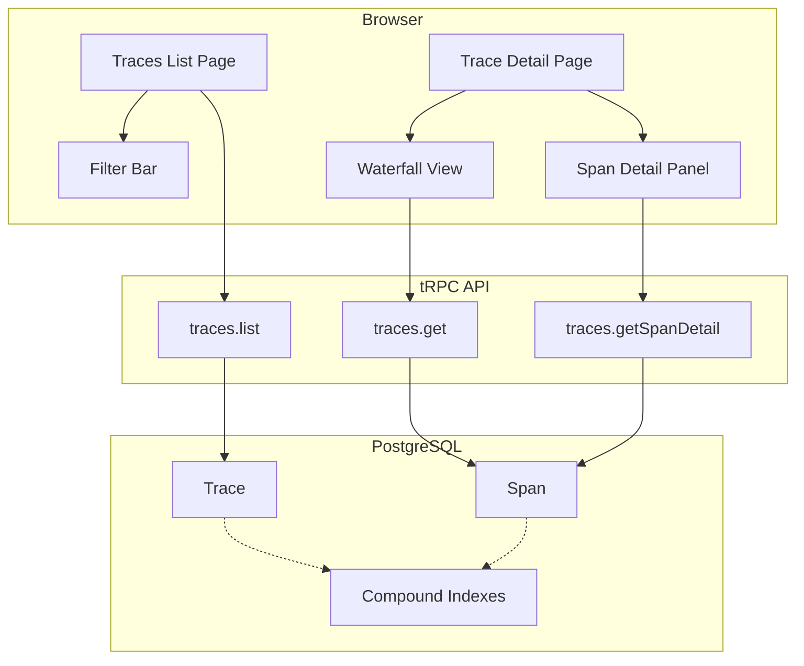
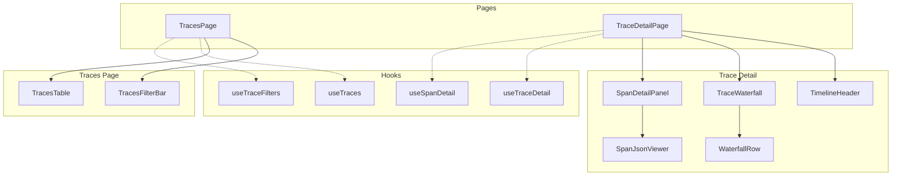
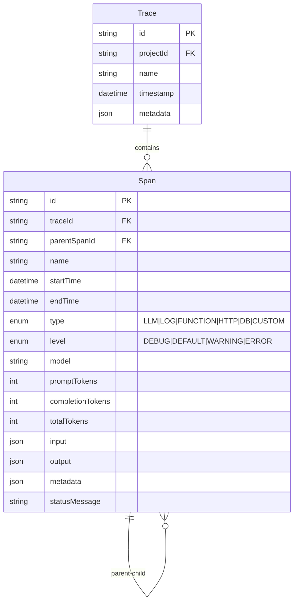

# Trace Visualization - Engineering Specs

**EPIC:** [#3 - Trace Visualization](https://github.com/ducnguyen67201/CognObserve/issues/3)

---

## Sprint Breakdown

| Sprint | Issue | Spec | Focus | Points |
|--------|-------|------|-------|--------|
| 1 | [#70](https://github.com/ducnguyen67201/CognObserve/issues/70) | [SPRINT_1_INFRASTRUCTURE_SPEC.md](./SPRINT_1_INFRASTRUCTURE_SPEC.md) | Infrastructure + Traces List | 8 |
| 2 | [#71](https://github.com/ducnguyen67201/CognObserve/issues/71) | [SPRINT_2_WATERFALL_SPEC.md](./SPRINT_2_WATERFALL_SPEC.md) | Waterfall + Detail Panel | 13 |
| 3 | [#72](https://github.com/ducnguyen67201/CognObserve/issues/72) | [SPRINT_3_FILTERING_SPEC.md](./SPRINT_3_FILTERING_SPEC.md) | Filtering + Polish | 8 |
| Backlog | [#73](https://github.com/ducnguyen67201/CognObserve/issues/73) | [SPRINT_4_PERFORMANCE_SPEC.md](./SPRINT_4_PERFORMANCE_SPEC.md) | Performance | 5 |

**Total MVP: 29 points** (Sprints 1-3)

---

## Architecture Overview



---

## Component Hierarchy



---

## Data Models



---

## Key Files by Sprint

### Sprint 1: Infrastructure
```
packages/db/prisma/schema.prisma          # Indexes
packages/api/src/lib/query-utils.ts       # Timeout utility
packages/api/src/lib/errors.ts            # Error codes
packages/api/src/routers/traces.ts        # API enhancements
apps/web/src/app/.../traces/page.tsx      # List page
apps/web/src/components/traces/traces-table.tsx
apps/web/src/hooks/traces/use-traces.ts
```

### Sprint 2: Waterfall
```
apps/web/src/app/.../traces/[traceId]/page.tsx
apps/web/src/components/traces/trace-waterfall.tsx
apps/web/src/components/traces/trace-waterfall-row.tsx
apps/web/src/components/traces/trace-timeline-header.tsx
apps/web/src/components/traces/span-detail-panel.tsx
apps/web/src/components/traces/span-json-viewer.tsx
apps/web/src/components/traces/span-type-config.ts
apps/web/src/lib/traces/span-tree.ts
apps/web/src/lib/traces/types.ts
apps/web/src/hooks/traces/use-trace-detail.ts
apps/web/src/hooks/traces/use-span-detail.ts
```

### Sprint 3: Filtering
```
apps/web/src/components/traces/traces-filter-bar.tsx
apps/web/src/components/traces/keyboard-help-modal.tsx
apps/web/src/hooks/traces/use-trace-filters.ts
apps/web/src/hooks/traces/use-scroll-to-error.ts
apps/web/src/hooks/traces/use-waterfall-keyboard.ts
apps/web/src/lib/traces/filter-types.ts
apps/web/src/lib/traces/filter-traces.ts
```

### Sprint 4: Performance (Backlog)
```
apps/web/src/components/traces/virtualized-waterfall.tsx
packages/api/src/routers/traces.ts        # Server filtering
packages/db/prisma/schema.prisma          # Filter indexes
```

---

## Quick Reference

### Span Types
| Type | Icon | Color | Description |
|------|------|-------|-------------|
| LLM | ✨ | Purple | AI/ML model calls |
| LOG | 📄 | Gray | Log entries |
| FUNCTION | ⚡ | Blue | Function calls |
| HTTP | 🌐 | Green | HTTP requests |
| DB | 🗄️ | Orange | Database queries |
| CUSTOM | 📦 | Slate | User-defined |

### Span Levels
| Level | Color | Description |
|-------|-------|-------------|
| ERROR | Red | Failed operation |
| WARNING | Yellow | Non-critical issue |
| DEFAULT | Blue | Normal operation |
| DEBUG | Gray | Debug info |

### URL Query Parameters
| Param | Example | Description |
|-------|---------|-------------|
| `type` | `?type=LLM,HTTP` | Filter by span type |
| `level` | `?level=ERROR` | Filter by level |
| `model` | `?model=gpt-4` | Filter by model |
| `minDuration` | `?minDuration=5000` | Min duration (ms) |
| `from` | `?from=2025-01-01` | Start date |
| `to` | `?to=2025-01-31` | End date |

### Keyboard Shortcuts
| Key | Action |
|-----|--------|
| `j` / `↓` | Next span |
| `k` / `↑` | Previous span |
| `Enter` | Toggle collapse |
| `Escape` | Deselect |
| `?` | Show help |
