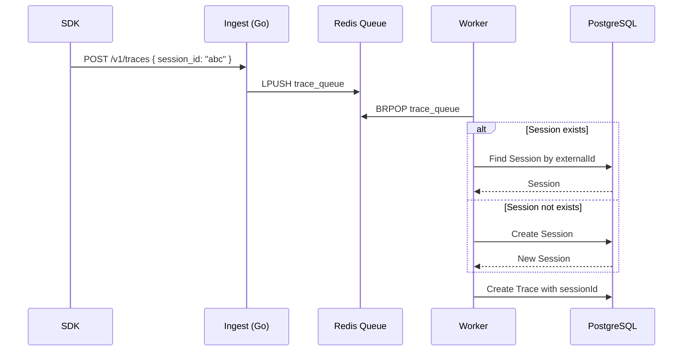
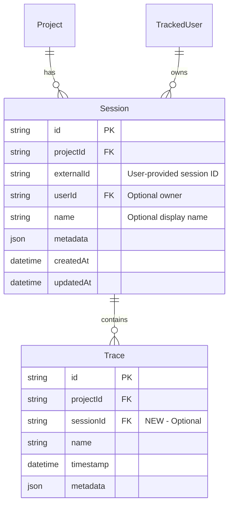

# Sprint 1: Sessions (Multi-turn Conversations)

**Issue:** #102
**Points:** 5
**Dependencies:** None (Foundation sprint)

---

## 1. Overview

Build session support to group related traces into conversations. This enables debugging multi-turn interactions, analyzing conversation flows, and calculating per-conversation metrics.

### What is a Session?

A **Session** groups multiple traces that belong to the same conversation or workflow:

```
SESSION: "chat-abc123"
│
├── TRACE: "What's the weather?"           (turn 1)
│   └── SPAN: openai-completion
│
├── TRACE: "What about tomorrow?"          (turn 2)
│   └── SPAN: openai-completion
│
└── TRACE: "Should I bring an umbrella?"   (turn 3)
    └── SPAN: openai-completion
```

### Deliverables

| Component | Type | Priority |
|-----------|------|----------|
| Session model | Migration | P0 |
| Trace.sessionId foreign key | Migration | P0 |
| Session auto-create in Worker | Worker | P0 |
| Sessions tRPC router | API | P0 |
| SDK session support | SDK | P0 |
| Ingest API session_id field | Ingest | P0 |

---

## 2. Architecture

### 2.1 Data Flow



### 2.2 Session Resolution Logic

```typescript
// Worker: Resolve session from trace data
async function resolveSession(
  projectId: string,
  sessionExternalId: string | null,
  userId: string | null
): Promise<string | null> {
  if (!sessionExternalId) {
    return null; // No session requested
  }

  // Find or create session
  const session = await prisma.session.upsert({
    where: {
      projectId_externalId: { projectId, externalId: sessionExternalId }
    },
    create: {
      projectId,
      externalId: sessionExternalId,
      userId, // Link to user if provided
    },
    update: {
      updatedAt: new Date(), // Touch timestamp
    },
  });

  return session.id;
}
```

---

## 3. Database Design

### 3.1 Schema Diagram



### 3.2 Prisma Schema Changes

```prisma
// packages/db/prisma/schema.prisma

// NEW MODEL
model Session {
  id         String       @id @default(cuid())
  projectId  String
  project    Project      @relation(fields: [projectId], references: [id], onDelete: Cascade)
  externalId String?      // User-provided session ID (optional)
  userId     String?      // Link to TrackedUser (Sprint 2)
  user       TrackedUser? @relation(fields: [userId], references: [id], onDelete: SetNull)
  name       String?      // Optional display name
  metadata   Json?
  createdAt  DateTime     @default(now())
  updatedAt  DateTime     @updatedAt

  traces     Trace[]

  @@unique([projectId, externalId])
  @@index([projectId, createdAt(sort: Desc)])
  @@index([userId])
  @@map("sessions")
}

// MODIFY: Add sessionId to Trace
model Trace {
  id        String   @id @default(cuid())
  projectId String
  project   Project  @relation(fields: [projectId], references: [id], onDelete: Cascade)
  sessionId String?                    // NEW - Optional session link
  session   Session? @relation(fields: [sessionId], references: [id], onDelete: SetNull)  // NEW
  name      String
  timestamp DateTime @default(now())
  metadata  Json?

  spans Span[]

  @@index([projectId, timestamp(sort: Desc)])
  @@index([projectId, id])
  @@index([projectId])
  @@index([timestamp])
  @@index([sessionId])                 // NEW
}

// MODIFY: Add sessions relation to Project
model Project {
  // ... existing fields
  sessions Session[]                   // NEW
}
```

### 3.3 Migration SQL

```sql
-- Migration: 102_add_sessions

-- 1. Create sessions table
CREATE TABLE "sessions" (
  "id" TEXT PRIMARY KEY,
  "projectId" TEXT NOT NULL,
  "externalId" TEXT,
  "userId" TEXT,
  "name" TEXT,
  "metadata" JSONB,
  "createdAt" TIMESTAMPTZ NOT NULL DEFAULT NOW(),
  "updatedAt" TIMESTAMPTZ NOT NULL DEFAULT NOW(),

  CONSTRAINT "sessions_projectId_fkey"
    FOREIGN KEY ("projectId") REFERENCES "Project"("id") ON DELETE CASCADE,
  CONSTRAINT "sessions_userId_fkey"
    FOREIGN KEY ("userId") REFERENCES "tracked_users"("id") ON DELETE SET NULL
);

-- 2. Add unique constraint for project + externalId
CREATE UNIQUE INDEX "sessions_projectId_externalId_key"
  ON "sessions" ("projectId", "externalId")
  WHERE "externalId" IS NOT NULL;

-- 3. Add indexes
CREATE INDEX "sessions_projectId_createdAt_idx" ON "sessions" ("projectId", "createdAt" DESC);
CREATE INDEX "sessions_userId_idx" ON "sessions" ("userId");

-- 4. Add sessionId to Trace
ALTER TABLE "Trace" ADD COLUMN "sessionId" TEXT;

-- 5. Add foreign key constraint
ALTER TABLE "Trace" ADD CONSTRAINT "Trace_sessionId_fkey"
  FOREIGN KEY ("sessionId") REFERENCES "sessions"("id") ON DELETE SET NULL;

-- 6. Add index for session lookups
CREATE INDEX "Trace_sessionId_idx" ON "Trace" ("sessionId");
```

---

## 4. Zod Schemas

```typescript
// packages/api/src/schemas/session.ts

import { z } from "zod";

/**
 * Session input from SDK/Ingest
 */
export const SessionInputSchema = z.object({
  id: z.string().min(1).max(255).optional(),     // External session ID
  name: z.string().max(255).optional(),
  metadata: z.record(z.unknown()).optional(),
});
export type SessionInput = z.infer<typeof SessionInputSchema>;

/**
 * Create session request
 */
export const CreateSessionSchema = z.object({
  projectId: z.string(),
  externalId: z.string().min(1).max(255).optional(),
  name: z.string().max(255).optional(),
  metadata: z.record(z.unknown()).optional(),
});
export type CreateSessionInput = z.infer<typeof CreateSessionSchema>;

/**
 * Session list filters
 */
export const SessionListFiltersSchema = z.object({
  projectId: z.string(),
  userId: z.string().optional(),
  search: z.string().optional(),
  from: z.date().optional(),
  to: z.date().optional(),
  limit: z.number().int().min(1).max(100).default(50),
  cursor: z.string().optional(),
});
export type SessionListFilters = z.infer<typeof SessionListFiltersSchema>;

/**
 * Session with aggregated stats
 */
export const SessionWithStatsSchema = z.object({
  id: z.string(),
  projectId: z.string(),
  externalId: z.string().nullable(),
  userId: z.string().nullable(),
  name: z.string().nullable(),
  metadata: z.record(z.unknown()).nullable(),
  createdAt: z.date(),
  updatedAt: z.date(),
  // Aggregated stats
  traceCount: z.number(),
  totalTokens: z.number(),
  totalCost: z.number(),
  errorCount: z.number(),
  avgLatencyMs: z.number().nullable(),
});
export type SessionWithStats = z.infer<typeof SessionWithStatsSchema>;
```

---

## 5. Ingest API Changes

### 5.1 Update Proto Definition

```protobuf
// proto/cognobserve/v1/ingest.proto

message IngestTraceRequest {
  optional string trace_id = 1;
  string name = 2;
  optional google.protobuf.Struct metadata = 3;
  repeated IngestSpan spans = 4;

  // NEW: Session support
  optional string session_id = 5;      // External session ID
  optional string user_id = 6;         // External user ID (Sprint 2)
}
```

### 5.2 Go Ingest Handler Update

```go
// apps/ingest/internal/handler/trace.go

type IngestTraceRequest struct {
    TraceID   *string                `json:"trace_id,omitempty"`
    Name      string                 `json:"name"`
    Metadata  map[string]interface{} `json:"metadata,omitempty"`
    Spans     []IngestSpan           `json:"spans"`
    SessionID *string                `json:"session_id,omitempty"` // NEW
    UserID    *string                `json:"user_id,omitempty"`    // NEW (Sprint 2)
}

// Pass through to queue message
type QueueMessage struct {
    // ... existing fields
    SessionID *string `json:"session_id,omitempty"` // NEW
    UserID    *string `json:"user_id,omitempty"`    // NEW
}
```

---

## 6. Worker Changes

### 6.1 Session Resolution

```typescript
// apps/worker/src/processors/trace.ts

import { prisma } from "@cognobserve/db";

interface TraceQueueMessage {
  // ... existing fields
  session_id?: string;  // NEW
  user_id?: string;     // NEW (Sprint 2)
}

/**
 * Resolve or create session from external ID
 */
async function resolveSessionId(
  projectId: string,
  externalSessionId: string | null | undefined,
  externalUserId: string | null | undefined
): Promise<string | null> {
  if (!externalSessionId) {
    return null;
  }

  // Upsert session (create if not exists, update timestamp if exists)
  const session = await prisma.session.upsert({
    where: {
      projectId_externalId: {
        projectId,
        externalId: externalSessionId,
      },
    },
    create: {
      projectId,
      externalId: externalSessionId,
      // userId will be resolved in Sprint 2
    },
    update: {
      updatedAt: new Date(),
    },
  });

  return session.id;
}

/**
 * Process trace from queue (updated)
 */
async function processTrace(message: TraceQueueMessage): Promise<void> {
  const { project_id, trace_id, name, metadata, spans, session_id, user_id } = message;

  // Resolve session
  const sessionId = await resolveSessionId(project_id, session_id, user_id);

  // Create trace with session link
  const trace = await prisma.trace.create({
    data: {
      id: trace_id,
      projectId: project_id,
      sessionId,  // NEW - nullable
      name,
      metadata,
    },
  });

  // ... rest of span processing
}
```

---

## 7. Sessions tRPC Router

```typescript
// packages/api/src/routers/sessions.ts

import { z } from "zod";
import { TRPCError } from "@trpc/server";
import { prisma } from "@cognobserve/db";
import { createRouter, protectedProcedure } from "../trpc";
import {
  CreateSessionSchema,
  SessionListFiltersSchema,
} from "../schemas/session";

export const sessionsRouter = createRouter({
  /**
   * List sessions for a project with stats
   */
  list: protectedProcedure
    .input(SessionListFiltersSchema)
    .query(async ({ input }) => {
      const { projectId, userId, search, from, to, limit, cursor } = input;

      const where = {
        projectId,
        ...(userId && { userId }),
        ...(search && {
          OR: [
            { name: { contains: search, mode: "insensitive" as const } },
            { externalId: { contains: search, mode: "insensitive" as const } },
          ],
        }),
        ...(from && { createdAt: { gte: from } }),
        ...(to && { createdAt: { lte: to } }),
      };

      const sessions = await prisma.session.findMany({
        where,
        take: limit + 1,
        cursor: cursor ? { id: cursor } : undefined,
        orderBy: { updatedAt: "desc" },
        include: {
          _count: { select: { traces: true } },
          traces: {
            select: {
              spans: {
                select: {
                  totalTokens: true,
                  totalCost: true,
                  level: true,
                  startTime: true,
                  endTime: true,
                },
              },
            },
          },
        },
      });

      // Calculate aggregated stats
      const sessionsWithStats = sessions.slice(0, limit).map((session) => {
        let totalTokens = 0;
        let totalCost = 0;
        let errorCount = 0;
        let totalLatency = 0;
        let spanCount = 0;

        for (const trace of session.traces) {
          for (const span of trace.spans) {
            totalTokens += span.totalTokens ?? 0;
            totalCost += Number(span.totalCost ?? 0);
            if (span.level === "ERROR") errorCount++;
            if (span.endTime && span.startTime) {
              totalLatency += span.endTime.getTime() - span.startTime.getTime();
              spanCount++;
            }
          }
        }

        return {
          id: session.id,
          projectId: session.projectId,
          externalId: session.externalId,
          userId: session.userId,
          name: session.name,
          metadata: session.metadata,
          createdAt: session.createdAt,
          updatedAt: session.updatedAt,
          traceCount: session._count.traces,
          totalTokens,
          totalCost,
          errorCount,
          avgLatencyMs: spanCount > 0 ? totalLatency / spanCount : null,
        };
      });

      let nextCursor: string | undefined;
      if (sessions.length > limit) {
        nextCursor = sessions[limit]?.id;
      }

      return { items: sessionsWithStats, nextCursor };
    }),

  /**
   * Get single session with traces
   */
  get: protectedProcedure
    .input(z.object({ id: z.string() }))
    .query(async ({ input }) => {
      const session = await prisma.session.findUnique({
        where: { id: input.id },
        include: {
          user: {
            select: { id: true, externalId: true, name: true, email: true },
          },
          traces: {
            orderBy: { timestamp: "asc" },
            include: {
              spans: {
                orderBy: { startTime: "asc" },
              },
            },
          },
        },
      });

      if (!session) {
        throw new TRPCError({ code: "NOT_FOUND", message: "Session not found" });
      }

      return session;
    }),

  /**
   * Create session manually (optional - usually auto-created)
   */
  create: protectedProcedure
    .input(CreateSessionSchema)
    .mutation(async ({ input }) => {
      return prisma.session.create({
        data: input,
      });
    }),

  /**
   * Update session metadata
   */
  update: protectedProcedure
    .input(
      z.object({
        id: z.string(),
        name: z.string().max(255).optional(),
        metadata: z.record(z.unknown()).optional(),
      })
    )
    .mutation(async ({ input }) => {
      const { id, ...data } = input;
      return prisma.session.update({
        where: { id },
        data,
      });
    }),

  /**
   * Delete session (cascades to unlink traces)
   */
  delete: protectedProcedure
    .input(z.object({ id: z.string() }))
    .mutation(async ({ input }) => {
      // Note: Traces are NOT deleted, just unlinked (SET NULL)
      await prisma.session.delete({ where: { id: input.id } });
      return { success: true };
    }),

  /**
   * Get session timeline (for visualization)
   */
  timeline: protectedProcedure
    .input(z.object({ id: z.string() }))
    .query(async ({ input }) => {
      const traces = await prisma.trace.findMany({
        where: { sessionId: input.id },
        orderBy: { timestamp: "asc" },
        select: {
          id: true,
          name: true,
          timestamp: true,
          spans: {
            select: {
              id: true,
              name: true,
              startTime: true,
              endTime: true,
              level: true,
              model: true,
              totalTokens: true,
              totalCost: true,
            },
            orderBy: { startTime: "asc" },
          },
        },
      });

      return traces;
    }),
});

export type SessionsRouter = typeof sessionsRouter;
```

---

## 8. SDK Changes

### 8.1 Types Update

```typescript
// packages/sdk/src/types.ts

export interface TraceOptions {
  name: string;
  id?: string;
  metadata?: Record<string, unknown>;
  sessionId?: string;  // NEW - Link to session
  userId?: string;     // NEW - Link to user (Sprint 2)
}

export interface ObserveOptions {
  name?: string;
  type?: 'generation' | 'span';
  metadata?: Record<string, unknown>;
  captureInput?: boolean;
  captureOutput?: boolean;
  sessionId?: string;  // NEW
  userId?: string;     // NEW
}
```

### 8.2 Transport Update

```typescript
// packages/sdk/src/transport.ts

export interface IngestRequest {
  trace_id?: string;
  name: string;
  metadata?: Record<string, unknown>;
  spans: IngestSpan[];
  session_id?: string;  // NEW
  user_id?: string;     // NEW
}

function traceToIngestRequest(trace: TraceData): IngestRequest {
  return {
    trace_id: trace.id,
    name: trace.name,
    metadata: trace.metadata ?? undefined,
    spans: trace.spans.map(spanToIngestSpan),
    session_id: trace.sessionId ?? undefined,  // NEW
    user_id: trace.userId ?? undefined,        // NEW
  };
}
```

### 8.3 SDK Usage Examples

```typescript
// Example 1: Basic session usage
import { CognObserve } from '@cognobserve/sdk';

CognObserve.init({ apiKey: 'co_...' });

// All traces in this conversation share the same session
const sessionId = 'chat-' + Date.now();

await CognObserve.observe({
  name: 'user-message-1',
  sessionId,
  type: 'generation',
}, async () => {
  return openai.chat.completions.create({...});
});

await CognObserve.observe({
  name: 'user-message-2',
  sessionId,  // Same session
  type: 'generation',
}, async () => {
  return openai.chat.completions.create({...});
});


// Example 2: Manual trace with session
const trace = CognObserve.trace({
  name: 'multi-turn-chat',
  sessionId: 'session-123',
});

const span = trace.span({ name: 'llm-call' });
// ...
span.end();
trace.end();
```

---

## 9. File Structure

```
packages/
├── api/
│   └── src/
│       ├── routers/
│       │   ├── index.ts              # MODIFY: Add sessions router
│       │   └── sessions.ts           # NEW: Sessions CRUD API
│       └── schemas/
│           └── session.ts            # NEW: Zod schemas
│
├── db/
│   └── prisma/
│       ├── schema.prisma             # MODIFY: Add Session model
│       └── migrations/
│           └── XXXXXX_add_sessions/
│               └── migration.sql
│
├── sdk/
│   └── src/
│       ├── types.ts                  # MODIFY: Add sessionId
│       └── transport.ts              # MODIFY: Send session_id
│
apps/
├── ingest/
│   └── internal/
│       ├── handler/trace.go          # MODIFY: Accept session_id
│       └── model/trace.go            # MODIFY: Add SessionID field
│
└── worker/
    └── src/
        └── processors/trace.ts       # MODIFY: Resolve session
```

---

## 10. Testing Checklist

### Unit Tests
- [ ] `SessionInputSchema` validates correctly
- [ ] `CreateSessionSchema` validates required fields
- [ ] `resolveSessionId` returns null when no session provided
- [ ] `resolveSessionId` creates session when not exists
- [ ] `resolveSessionId` returns existing session ID
- [ ] `resolveSessionId` updates timestamp on existing session

### Integration Tests
- [ ] `sessions.create` creates session with valid input
- [ ] `sessions.list` returns sessions for project
- [ ] `sessions.list` filters by userId
- [ ] `sessions.list` filters by date range
- [ ] `sessions.get` returns session with traces
- [ ] `sessions.timeline` returns ordered traces
- [ ] Trace created with sessionId links correctly
- [ ] Session delete unlinks traces (not deletes)

### End-to-End Tests
- [ ] SDK sends session_id to ingest
- [ ] Ingest passes session_id to queue
- [ ] Worker creates session on first trace
- [ ] Worker links subsequent traces to same session
- [ ] Dashboard shows session list
- [ ] Dashboard shows session detail with traces

---

## 11. Definition of Done

- [ ] Database migration applied successfully
- [ ] Session model created with indexes
- [ ] Trace.sessionId column added
- [ ] Sessions tRPC router has all CRUD endpoints
- [ ] Worker resolves sessions from external IDs
- [ ] SDK supports sessionId in trace options
- [ ] Ingest API accepts session_id field
- [ ] Proto definition updated
- [ ] All unit tests passing
- [ ] Integration tests passing
- [ ] Code reviewed and merged
