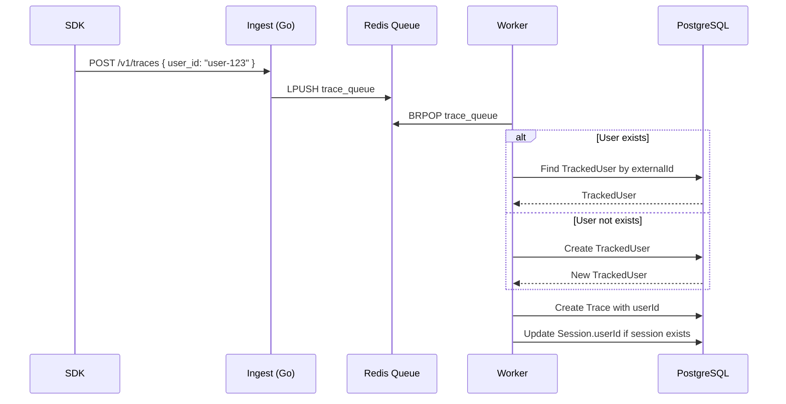
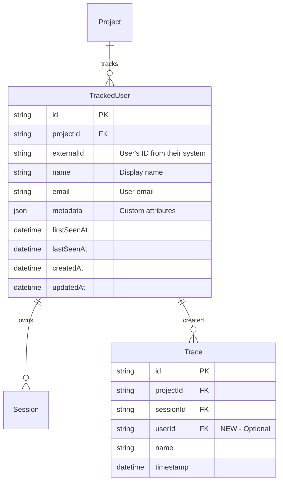

# Sprint 2: User Tracking (End-User Analytics)

**Issue:** #103
**Points:** 5
**Dependencies:** #102 Sessions (Sprint 1)

---

## 1. Overview

Build end-user tracking to analyze per-user metrics, debug user-specific issues, and enable cost allocation. This tracks YOUR customers (end-users of your AI app), not your developers.

### What is User Tracking?

Track individual users of your AI application:

```
┌─────────────────────────────────────────────────────────────────────┐
│                      User Analytics Dashboard                        │
├─────────────────────────────────────────────────────────────────────┤
│                                                                     │
│  User: john@acme.com                                                │
│  ├── Total Traces: 1,234                                            │
│  ├── Total Cost: $45.67                                             │
│  ├── Error Rate: 2.3%                                               │
│  ├── Avg Latency: 1.2s                                              │
│  │                                                                  │
│  └── Sessions: 45                                                   │
│      ├── Session "chat-001" (12 traces)                             │
│      ├── Session "chat-002" (8 traces)                              │
│      └── ...                                                        │
│                                                                     │
└─────────────────────────────────────────────────────────────────────┘
```

### Use Cases

| Use Case | Example |
|----------|---------|
| **Debug user issues** | "User X reports slow responses" → Look up their traces |
| **Cost allocation** | Charge enterprise customers based on actual usage |
| **Identify abuse** | Detect users making excessive requests |
| **Support tickets** | Customer says "AI not working" → Find their error traces |
| **Usage analytics** | Which users are power users vs occasional |

### Deliverables

| Component | Type | Priority |
|-----------|------|----------|
| TrackedUser model | Migration | P0 |
| Trace.userId foreign key | Migration | P0 |
| User auto-create in Worker | Worker | P0 |
| Users tRPC router | API | P0 |
| User analytics queries | API | P0 |
| SDK user support | SDK | P0 |
| User list/detail UI | Web | P1 |

---

## 2. Architecture

### 2.1 Data Flow



### 2.2 User Resolution Logic

```typescript
// Worker: Resolve user from trace data
async function resolveUser(
  projectId: string,
  externalUserId: string | null | undefined,
  userMetadata?: { name?: string; email?: string; [key: string]: unknown }
): Promise<string | null> {
  if (!externalUserId) {
    return null; // No user tracking requested
  }

  // Upsert user (create if not exists, update metadata if exists)
  const user = await prisma.trackedUser.upsert({
    where: {
      projectId_externalId: { projectId, externalId: externalUserId }
    },
    create: {
      projectId,
      externalId: externalUserId,
      name: userMetadata?.name,
      email: userMetadata?.email,
      metadata: userMetadata,
    },
    update: {
      // Update name/email if provided and changed
      ...(userMetadata?.name && { name: userMetadata.name }),
      ...(userMetadata?.email && { email: userMetadata.email }),
      updatedAt: new Date(),
    },
  });

  return user.id;
}
```

---

## 3. Database Design

### 3.1 Schema Diagram



### 3.2 Prisma Schema

```prisma
// packages/db/prisma/schema.prisma

// NEW MODEL
model TrackedUser {
  id         String   @id @default(cuid())
  projectId  String
  project    Project  @relation(fields: [projectId], references: [id], onDelete: Cascade)
  externalId String   // User's ID from their system (required)
  name       String?  // Display name
  email      String?  // User email (for lookup)
  metadata   Json?    // Custom attributes (plan, company, etc.)
  firstSeenAt DateTime @default(now())
  lastSeenAt  DateTime @default(now())
  createdAt  DateTime @default(now())
  updatedAt  DateTime @updatedAt

  sessions   Session[]
  traces     Trace[]

  @@unique([projectId, externalId])
  @@index([projectId, lastSeenAt(sort: Desc)])
  @@index([projectId, email])
  @@map("tracked_users")
}

// MODIFY: Add userId to Trace
model Trace {
  id        String       @id @default(cuid())
  projectId String
  project   Project      @relation(fields: [projectId], references: [id], onDelete: Cascade)
  sessionId String?
  session   Session?     @relation(fields: [sessionId], references: [id], onDelete: SetNull)
  userId    String?                       // NEW
  user      TrackedUser? @relation(fields: [userId], references: [id], onDelete: SetNull)  // NEW
  name      String
  timestamp DateTime @default(now())
  metadata  Json?

  spans Span[]

  @@index([projectId, timestamp(sort: Desc)])
  @@index([sessionId])
  @@index([userId])                       // NEW
}

// MODIFY: Update Session to link with TrackedUser
model Session {
  id         String       @id @default(cuid())
  projectId  String
  project    Project      @relation(fields: [projectId], references: [id], onDelete: Cascade)
  externalId String?
  userId     String?                       // Link to TrackedUser
  user       TrackedUser? @relation(fields: [userId], references: [id], onDelete: SetNull)
  name       String?
  metadata   Json?
  createdAt  DateTime     @default(now())
  updatedAt  DateTime     @updatedAt

  traces     Trace[]

  @@unique([projectId, externalId])
  @@index([projectId, createdAt(sort: Desc)])
  @@index([userId])
}

// MODIFY: Add trackedUsers to Project
model Project {
  // ... existing fields
  trackedUsers TrackedUser[]              // NEW
}
```

### 3.3 Migration SQL

```sql
-- Migration: 103_add_user_tracking

-- 1. Create tracked_users table
CREATE TABLE "tracked_users" (
  "id" TEXT PRIMARY KEY,
  "projectId" TEXT NOT NULL,
  "externalId" TEXT NOT NULL,
  "name" TEXT,
  "email" TEXT,
  "metadata" JSONB,
  "firstSeenAt" TIMESTAMPTZ NOT NULL DEFAULT NOW(),
  "lastSeenAt" TIMESTAMPTZ NOT NULL DEFAULT NOW(),
  "createdAt" TIMESTAMPTZ NOT NULL DEFAULT NOW(),
  "updatedAt" TIMESTAMPTZ NOT NULL DEFAULT NOW(),

  CONSTRAINT "tracked_users_projectId_fkey"
    FOREIGN KEY ("projectId") REFERENCES "Project"("id") ON DELETE CASCADE
);

-- 2. Add unique constraint for project + externalId
CREATE UNIQUE INDEX "tracked_users_projectId_externalId_key"
  ON "tracked_users" ("projectId", "externalId");

-- 3. Add indexes
CREATE INDEX "tracked_users_projectId_lastSeenAt_idx"
  ON "tracked_users" ("projectId", "lastSeenAt" DESC);
CREATE INDEX "tracked_users_projectId_email_idx"
  ON "tracked_users" ("projectId", "email");

-- 4. Add userId to Trace
ALTER TABLE "Trace" ADD COLUMN "userId" TEXT;

-- 5. Add foreign key constraint
ALTER TABLE "Trace" ADD CONSTRAINT "Trace_userId_fkey"
  FOREIGN KEY ("userId") REFERENCES "tracked_users"("id") ON DELETE SET NULL;

-- 6. Add index for user lookups
CREATE INDEX "Trace_userId_idx" ON "Trace" ("userId");

-- 7. Add userId foreign key to Session (if not already done in Sprint 1)
ALTER TABLE "sessions" ADD CONSTRAINT "sessions_userId_fkey"
  FOREIGN KEY ("userId") REFERENCES "tracked_users"("id") ON DELETE SET NULL;
```

---

## 4. Zod Schemas

```typescript
// packages/api/src/schemas/user.ts

import { z } from "zod";

/**
 * User input from SDK/Ingest
 */
export const UserInputSchema = z.object({
  id: z.string().min(1).max(255),           // Required external user ID
  name: z.string().max(255).optional(),
  email: z.string().email().optional(),
  metadata: z.record(z.unknown()).optional(),
});
export type UserInput = z.infer<typeof UserInputSchema>;

/**
 * User list filters
 */
export const UserListFiltersSchema = z.object({
  projectId: z.string(),
  search: z.string().optional(),            // Search by name, email, or externalId
  from: z.date().optional(),                // Filter by lastSeenAt
  to: z.date().optional(),
  sortBy: z.enum(["lastSeenAt", "firstSeenAt", "traceCount", "totalCost"]).default("lastSeenAt"),
  sortOrder: z.enum(["asc", "desc"]).default("desc"),
  limit: z.number().int().min(1).max(100).default(50),
  cursor: z.string().optional(),
});
export type UserListFilters = z.infer<typeof UserListFiltersSchema>;

/**
 * User with aggregated stats
 */
export const UserWithStatsSchema = z.object({
  id: z.string(),
  projectId: z.string(),
  externalId: z.string(),
  name: z.string().nullable(),
  email: z.string().nullable(),
  metadata: z.record(z.unknown()).nullable(),
  firstSeenAt: z.date(),
  lastSeenAt: z.date(),
  // Aggregated stats
  traceCount: z.number(),
  sessionCount: z.number(),
  totalTokens: z.number(),
  totalCost: z.number(),
  errorCount: z.number(),
  errorRate: z.number(),              // Percentage
  avgLatencyMs: z.number().nullable(),
});
export type UserWithStats = z.infer<typeof UserWithStatsSchema>;

/**
 * User analytics over time
 */
export const UserAnalyticsSchema = z.object({
  date: z.date(),
  traceCount: z.number(),
  totalTokens: z.number(),
  totalCost: z.number(),
  errorCount: z.number(),
});
export type UserAnalytics = z.infer<typeof UserAnalyticsSchema>;
```

---

## 5. Users tRPC Router

```typescript
// packages/api/src/routers/users.ts

import { z } from "zod";
import { TRPCError } from "@trpc/server";
import { prisma, Prisma } from "@cognobserve/db";
import { createRouter, protectedProcedure } from "../trpc";
import { UserListFiltersSchema } from "../schemas/user";

export const usersRouter = createRouter({
  /**
   * List tracked users for a project with stats
   */
  list: protectedProcedure
    .input(UserListFiltersSchema)
    .query(async ({ input }) => {
      const { projectId, search, from, to, sortBy, sortOrder, limit, cursor } = input;

      // Build where clause
      const where: Prisma.TrackedUserWhereInput = {
        projectId,
        ...(search && {
          OR: [
            { name: { contains: search, mode: "insensitive" } },
            { email: { contains: search, mode: "insensitive" } },
            { externalId: { contains: search, mode: "insensitive" } },
          ],
        }),
        ...(from && { lastSeenAt: { gte: from } }),
        ...(to && { lastSeenAt: { lte: to } }),
      };

      // Get users with counts
      const users = await prisma.trackedUser.findMany({
        where,
        take: limit + 1,
        cursor: cursor ? { id: cursor } : undefined,
        orderBy: sortBy === "lastSeenAt" || sortBy === "firstSeenAt"
          ? { [sortBy]: sortOrder }
          : { lastSeenAt: "desc" }, // Default sort, will re-sort after aggregation
        include: {
          _count: {
            select: { traces: true, sessions: true },
          },
        },
      });

      // Calculate detailed stats for each user
      const usersWithStats = await Promise.all(
        users.slice(0, limit).map(async (user) => {
          // Get aggregated metrics
          const metrics = await prisma.span.aggregate({
            where: {
              trace: {
                userId: user.id,
              },
            },
            _sum: {
              totalTokens: true,
              totalCost: true,
            },
            _count: {
              id: true,
            },
          });

          // Get error count
          const errorCount = await prisma.span.count({
            where: {
              trace: { userId: user.id },
              level: "ERROR",
            },
          });

          // Get average latency
          const latencyResult = await prisma.$queryRaw<[{ avg_latency: number }]>`
            SELECT AVG(EXTRACT(EPOCH FROM (s."endTime" - s."startTime")) * 1000) as avg_latency
            FROM "Span" s
            INNER JOIN "Trace" t ON s."traceId" = t."id"
            WHERE t."userId" = ${user.id}
              AND s."endTime" IS NOT NULL
          `;

          const traceCount = user._count.traces;
          const spanCount = metrics._count.id;

          return {
            id: user.id,
            projectId: user.projectId,
            externalId: user.externalId,
            name: user.name,
            email: user.email,
            metadata: user.metadata,
            firstSeenAt: user.firstSeenAt,
            lastSeenAt: user.lastSeenAt,
            traceCount,
            sessionCount: user._count.sessions,
            totalTokens: metrics._sum.totalTokens ?? 0,
            totalCost: Number(metrics._sum.totalCost ?? 0),
            errorCount,
            errorRate: spanCount > 0 ? (errorCount / spanCount) * 100 : 0,
            avgLatencyMs: latencyResult[0]?.avg_latency ?? null,
          };
        })
      );

      // Re-sort if needed
      if (sortBy === "traceCount" || sortBy === "totalCost") {
        usersWithStats.sort((a, b) => {
          const aVal = sortBy === "traceCount" ? a.traceCount : a.totalCost;
          const bVal = sortBy === "traceCount" ? b.traceCount : b.totalCost;
          return sortOrder === "desc" ? bVal - aVal : aVal - bVal;
        });
      }

      let nextCursor: string | undefined;
      if (users.length > limit) {
        nextCursor = users[limit]?.id;
      }

      return { items: usersWithStats, nextCursor };
    }),

  /**
   * Get single user with details
   */
  get: protectedProcedure
    .input(z.object({ id: z.string() }))
    .query(async ({ input }) => {
      const user = await prisma.trackedUser.findUnique({
        where: { id: input.id },
        include: {
          sessions: {
            take: 10,
            orderBy: { updatedAt: "desc" },
            include: {
              _count: { select: { traces: true } },
            },
          },
          _count: {
            select: { traces: true, sessions: true },
          },
        },
      });

      if (!user) {
        throw new TRPCError({ code: "NOT_FOUND", message: "User not found" });
      }

      // Get aggregated metrics
      const metrics = await prisma.span.aggregate({
        where: { trace: { userId: input.id } },
        _sum: { totalTokens: true, totalCost: true },
      });

      const errorCount = await prisma.span.count({
        where: { trace: { userId: input.id }, level: "ERROR" },
      });

      return {
        ...user,
        totalTokens: metrics._sum.totalTokens ?? 0,
        totalCost: Number(metrics._sum.totalCost ?? 0),
        errorCount,
      };
    }),

  /**
   * Get user by external ID
   */
  getByExternalId: protectedProcedure
    .input(z.object({ projectId: z.string(), externalId: z.string() }))
    .query(async ({ input }) => {
      const user = await prisma.trackedUser.findUnique({
        where: {
          projectId_externalId: {
            projectId: input.projectId,
            externalId: input.externalId,
          },
        },
      });

      if (!user) {
        throw new TRPCError({ code: "NOT_FOUND", message: "User not found" });
      }

      return user;
    }),

  /**
   * Get user's traces
   */
  traces: protectedProcedure
    .input(
      z.object({
        userId: z.string(),
        limit: z.number().int().min(1).max(100).default(50),
        cursor: z.string().optional(),
      })
    )
    .query(async ({ input }) => {
      const { userId, limit, cursor } = input;

      const traces = await prisma.trace.findMany({
        where: { userId },
        take: limit + 1,
        cursor: cursor ? { id: cursor } : undefined,
        orderBy: { timestamp: "desc" },
        include: {
          session: { select: { id: true, externalId: true, name: true } },
          spans: {
            select: {
              id: true,
              name: true,
              level: true,
              totalTokens: true,
              totalCost: true,
            },
          },
        },
      });

      let nextCursor: string | undefined;
      if (traces.length > limit) {
        const next = traces.pop();
        nextCursor = next?.id;
      }

      return { items: traces, nextCursor };
    }),

  /**
   * Get user analytics over time (daily breakdown)
   */
  analytics: protectedProcedure
    .input(
      z.object({
        userId: z.string(),
        days: z.number().int().min(1).max(90).default(30),
      })
    )
    .query(async ({ input }) => {
      const { userId, days } = input;
      const startDate = new Date();
      startDate.setDate(startDate.getDate() - days);

      const result = await prisma.$queryRaw<
        Array<{
          date: Date;
          trace_count: bigint;
          total_tokens: bigint;
          total_cost: number;
          error_count: bigint;
        }>
      >`
        SELECT
          DATE(t."timestamp") as date,
          COUNT(DISTINCT t."id") as trace_count,
          COALESCE(SUM(s."totalTokens"), 0) as total_tokens,
          COALESCE(SUM(s."totalCost"::numeric), 0) as total_cost,
          COUNT(*) FILTER (WHERE s."level" = 'ERROR') as error_count
        FROM "Trace" t
        LEFT JOIN "Span" s ON s."traceId" = t."id"
        WHERE t."userId" = ${userId}
          AND t."timestamp" >= ${startDate}
        GROUP BY DATE(t."timestamp")
        ORDER BY date ASC
      `;

      return result.map((row) => ({
        date: row.date,
        traceCount: Number(row.trace_count),
        totalTokens: Number(row.total_tokens),
        totalCost: Number(row.total_cost),
        errorCount: Number(row.error_count),
      }));
    }),

  /**
   * Update user metadata
   */
  update: protectedProcedure
    .input(
      z.object({
        id: z.string(),
        name: z.string().max(255).optional(),
        email: z.string().email().optional(),
        metadata: z.record(z.unknown()).optional(),
      })
    )
    .mutation(async ({ input }) => {
      const { id, ...data } = input;

      // Merge metadata if provided
      const existing = await prisma.trackedUser.findUnique({ where: { id } });
      if (!existing) {
        throw new TRPCError({ code: "NOT_FOUND" });
      }

      const mergedMetadata = data.metadata
        ? { ...(existing.metadata as object ?? {}), ...data.metadata }
        : undefined;

      return prisma.trackedUser.update({
        where: { id },
        data: {
          ...data,
          metadata: mergedMetadata,
        },
      });
    }),

  /**
   * Delete tracked user (unlinks traces, doesn't delete them)
   */
  delete: protectedProcedure
    .input(z.object({ id: z.string() }))
    .mutation(async ({ input }) => {
      await prisma.trackedUser.delete({ where: { id: input.id } });
      return { success: true };
    }),

  /**
   * Project-level user summary stats
   */
  summary: protectedProcedure
    .input(z.object({ projectId: z.string() }))
    .query(async ({ input }) => {
      const { projectId } = input;

      const [totalUsers, activeUsers, newUsers] = await Promise.all([
        // Total users
        prisma.trackedUser.count({ where: { projectId } }),
        // Active in last 7 days
        prisma.trackedUser.count({
          where: {
            projectId,
            lastSeenAt: { gte: new Date(Date.now() - 7 * 24 * 60 * 60 * 1000) },
          },
        }),
        // New in last 7 days
        prisma.trackedUser.count({
          where: {
            projectId,
            firstSeenAt: { gte: new Date(Date.now() - 7 * 24 * 60 * 60 * 1000) },
          },
        }),
      ]);

      // Top users by cost
      const topUsersByCost = await prisma.$queryRaw<
        Array<{ user_id: string; external_id: string; name: string | null; total_cost: number }>
      >`
        SELECT
          u."id" as user_id,
          u."externalId" as external_id,
          u."name",
          COALESCE(SUM(s."totalCost"::numeric), 0) as total_cost
        FROM "tracked_users" u
        LEFT JOIN "Trace" t ON t."userId" = u."id"
        LEFT JOIN "Span" s ON s."traceId" = t."id"
        WHERE u."projectId" = ${projectId}
        GROUP BY u."id", u."externalId", u."name"
        ORDER BY total_cost DESC
        LIMIT 5
      `;

      return {
        totalUsers,
        activeUsers,
        newUsers,
        topUsersByCost: topUsersByCost.map((u) => ({
          userId: u.user_id,
          externalId: u.external_id,
          name: u.name,
          totalCost: Number(u.total_cost),
        })),
      };
    }),
});

export type UsersRouter = typeof usersRouter;
```

---

## 6. Worker Changes

### 6.1 Update Trace Processor

```typescript
// apps/worker/src/processors/trace.ts

interface TraceQueueMessage {
  // ... existing fields
  session_id?: string;
  user_id?: string;
  user?: {
    name?: string;
    email?: string;
    [key: string]: unknown;
  };
}

/**
 * Resolve or create user from external ID
 */
async function resolveUserId(
  projectId: string,
  externalUserId: string | null | undefined,
  userMetadata?: { name?: string; email?: string; [key: string]: unknown }
): Promise<string | null> {
  if (!externalUserId) {
    return null;
  }

  const user = await prisma.trackedUser.upsert({
    where: {
      projectId_externalId: { projectId, externalId: externalUserId },
    },
    create: {
      projectId,
      externalId: externalUserId,
      name: userMetadata?.name,
      email: userMetadata?.email,
      metadata: userMetadata,
      firstSeenAt: new Date(),
      lastSeenAt: new Date(),
    },
    update: {
      ...(userMetadata?.name && { name: userMetadata.name }),
      ...(userMetadata?.email && { email: userMetadata.email }),
      lastSeenAt: new Date(),
    },
  });

  return user.id;
}

/**
 * Process trace from queue (updated)
 */
async function processTrace(message: TraceQueueMessage): Promise<void> {
  const {
    project_id,
    trace_id,
    name,
    metadata,
    spans,
    session_id,
    user_id,
    user: userMetadata,
  } = message;

  // Resolve user first (needed for session)
  const userId = await resolveUserId(project_id, user_id, userMetadata);

  // Resolve session (now with userId)
  const sessionId = await resolveSessionId(project_id, session_id, userId);

  // If session was created/found and we have a userId, ensure session is linked to user
  if (sessionId && userId) {
    await prisma.session.update({
      where: { id: sessionId },
      data: { userId },
    });
  }

  // Create trace with both session and user links
  const trace = await prisma.trace.create({
    data: {
      id: trace_id,
      projectId: project_id,
      sessionId,
      userId,  // NEW
      name,
      metadata,
    },
  });

  // ... rest of span processing
}
```

---

## 7. SDK Changes

### 7.1 Types Update

```typescript
// packages/sdk/src/types.ts

export interface UserInfo {
  id: string;           // Required: your user's ID
  name?: string;        // Optional: display name
  email?: string;       // Optional: email
  [key: string]: unknown; // Any additional metadata
}

export interface TraceOptions {
  name: string;
  id?: string;
  metadata?: Record<string, unknown>;
  sessionId?: string;
  userId?: string;        // Simple: just the ID
  user?: UserInfo;        // Or provide full user info
}

export interface ObserveOptions {
  name?: string;
  type?: 'generation' | 'span';
  metadata?: Record<string, unknown>;
  captureInput?: boolean;
  captureOutput?: boolean;
  sessionId?: string;
  userId?: string;
  user?: UserInfo;
}
```

### 7.2 Transport Update

```typescript
// packages/sdk/src/transport.ts

export interface IngestRequest {
  trace_id?: string;
  name: string;
  metadata?: Record<string, unknown>;
  spans: IngestSpan[];
  session_id?: string;
  user_id?: string;
  user?: {
    name?: string;
    email?: string;
    [key: string]: unknown;
  };
}

function traceToIngestRequest(trace: TraceData): IngestRequest {
  return {
    trace_id: trace.id,
    name: trace.name,
    metadata: trace.metadata ?? undefined,
    spans: trace.spans.map(spanToIngestSpan),
    session_id: trace.sessionId ?? undefined,
    user_id: trace.userId ?? trace.user?.id ?? undefined,
    user: trace.user ? {
      name: trace.user.name,
      email: trace.user.email,
      ...trace.user,
    } : undefined,
  };
}
```

### 7.3 SDK Usage Examples

```typescript
// Example 1: Simple user ID
import { CognObserve } from '@cognobserve/sdk';

CognObserve.init({ apiKey: 'co_...' });

await CognObserve.observe({
  name: 'chat-completion',
  userId: 'user-123',           // Just the ID
  sessionId: 'session-456',
  type: 'generation',
}, async () => {
  return openai.chat.completions.create({...});
});


// Example 2: Full user info
await CognObserve.observe({
  name: 'chat-completion',
  user: {
    id: 'user-123',
    name: 'John Doe',
    email: 'john@acme.com',
    plan: 'enterprise',         // Custom metadata
    company: 'Acme Corp',
  },
  sessionId: 'session-456',
  type: 'generation',
}, async () => {
  return openai.chat.completions.create({...});
});


// Example 3: Setting user globally
CognObserve.setUser({
  id: 'user-123',
  name: 'John Doe',
  email: 'john@acme.com',
});

// All subsequent traces will include this user
await CognObserve.observe('action-1', async () => { ... });
await CognObserve.observe('action-2', async () => { ... });
```

---

## 8. Ingest API Changes

### 8.1 Update Proto Definition

```protobuf
// proto/cognobserve/v1/ingest.proto

message IngestTraceRequest {
  optional string trace_id = 1;
  string name = 2;
  optional google.protobuf.Struct metadata = 3;
  repeated IngestSpan spans = 4;
  optional string session_id = 5;
  optional string user_id = 6;
  optional UserInfo user = 7;           // NEW
}

message UserInfo {
  string id = 1;
  optional string name = 2;
  optional string email = 3;
  optional google.protobuf.Struct metadata = 4;
}
```

### 8.2 Go Ingest Handler Update

```go
// apps/ingest/internal/handler/trace.go

type UserInfo struct {
    ID       string                 `json:"id"`
    Name     *string                `json:"name,omitempty"`
    Email    *string                `json:"email,omitempty"`
    Metadata map[string]interface{} `json:"metadata,omitempty"`
}

type IngestTraceRequest struct {
    TraceID   *string                `json:"trace_id,omitempty"`
    Name      string                 `json:"name"`
    Metadata  map[string]interface{} `json:"metadata,omitempty"`
    Spans     []IngestSpan           `json:"spans"`
    SessionID *string                `json:"session_id,omitempty"`
    UserID    *string                `json:"user_id,omitempty"`
    User      *UserInfo              `json:"user,omitempty"`
}
```

---

## 9. File Structure

```
packages/
├── api/
│   └── src/
│       ├── routers/
│       │   ├── index.ts              # MODIFY: Add users router
│       │   └── users.ts              # NEW: Users CRUD + analytics API
│       └── schemas/
│           └── user.ts               # NEW: Zod schemas
│
├── db/
│   └── prisma/
│       ├── schema.prisma             # MODIFY: Add TrackedUser model
│       └── migrations/
│           └── XXXXXX_add_user_tracking/
│               └── migration.sql
│
├── sdk/
│   └── src/
│       ├── types.ts                  # MODIFY: Add user types
│       ├── transport.ts              # MODIFY: Send user info
│       └── cognobserve.ts            # MODIFY: Add setUser()
│
apps/
├── ingest/
│   └── internal/
│       ├── handler/trace.go          # MODIFY: Accept user info
│       └── model/trace.go            # MODIFY: Add User field
│
├── worker/
│   └── src/
│       └── processors/trace.ts       # MODIFY: Resolve user
│
└── web/
    └── src/
        ├── app/
        │   └── (dashboard)/[workspaceSlug]/projects/[projectId]/
        │       └── users/
        │           ├── page.tsx      # NEW: User list page
        │           └── [userId]/
        │               └── page.tsx  # NEW: User detail page
        └── components/
            └── users/
                ├── user-table.tsx    # NEW: User list table
                ├── user-card.tsx     # NEW: User stats card
                └── user-analytics.tsx # NEW: User analytics chart
```

---

## 10. Testing Checklist

### Unit Tests
- [ ] `UserInputSchema` validates required id field
- [ ] `UserListFiltersSchema` validates sort options
- [ ] `resolveUserId` returns null when no user provided
- [ ] `resolveUserId` creates user when not exists
- [ ] `resolveUserId` updates lastSeenAt on existing user
- [ ] `resolveUserId` merges metadata on existing user

### Integration Tests
- [ ] `users.list` returns users for project
- [ ] `users.list` filters by search term
- [ ] `users.list` sorts by different fields
- [ ] `users.get` returns user with sessions
- [ ] `users.traces` returns user's traces
- [ ] `users.analytics` returns daily breakdown
- [ ] `users.summary` returns project stats
- [ ] Trace created with userId links correctly
- [ ] Session inherits userId from trace

### End-to-End Tests
- [ ] SDK sends user_id to ingest
- [ ] SDK sends full user info to ingest
- [ ] Worker creates user on first trace
- [ ] Worker updates user metadata on subsequent traces
- [ ] Dashboard shows user list
- [ ] Dashboard shows user detail with analytics
- [ ] User search works

---

## 11. Definition of Done

- [ ] Database migration applied successfully
- [ ] TrackedUser model created with indexes
- [ ] Trace.userId column added
- [ ] Session.userId properly linked
- [ ] Users tRPC router has all endpoints
- [ ] User analytics queries working
- [ ] Worker resolves users from external IDs
- [ ] SDK supports userId and user object
- [ ] Ingest API accepts user info
- [ ] Proto definition updated
- [ ] User list page in dashboard
- [ ] User detail page with analytics
- [ ] All unit tests passing
- [ ] Integration tests passing
- [ ] Code reviewed and merged
