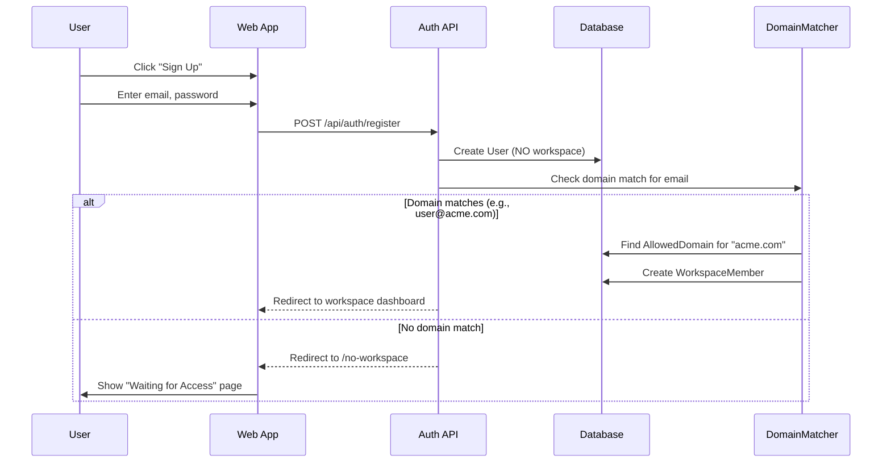
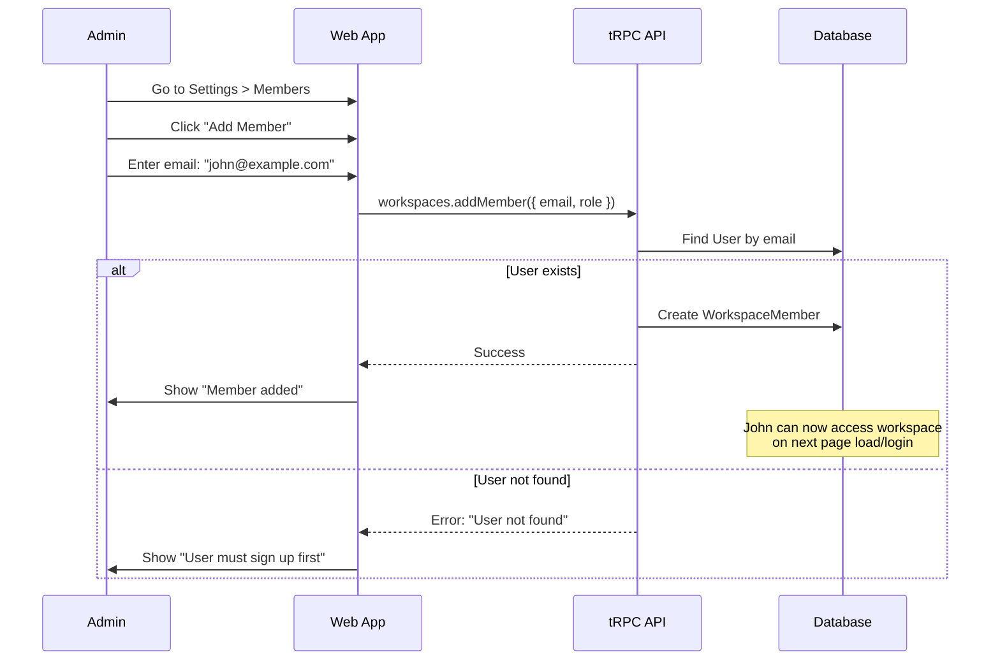

# Engineering Specification: User Management

## Epic Overview

**Epic:** #6 - User Management
**Status:** Draft
**Version:** 1.1
**Date:** 2025-11-30

---

## Table of Contents

1. [Goals & Requirements](#1-goals--requirements)
2. [Architecture](#2-architecture)
3. [Database Schema](#3-database-schema)
4. [User Flows](#4-user-flows)
5. [API Design](#5-api-design)
6. [Implementation Plan](#6-implementation-plan)
7. [UI Components](#7-ui-components)
8. [Testing](#8-testing)

---

## 1. Goals & Requirements

### 1.1 Problem Statement

Currently, when users sign up they automatically get a personal workspace. The client requires:
- Users sign up and are recorded in DB, but have **no workspace** assigned
- Users without a workspace see a "waiting" or "no access" page
- Existing workspace admins can **add users** to their workspace by email
- Domain-based auto-provisioning for enterprise (e.g., `@acme.com` users auto-join Acme workspace)
- RBAC to be handled in a future phase

### 1.2 Core Concept

```
┌─────────────────────────────────────────────────────────────────────────┐
│                         Simplified User Flow                             │
└─────────────────────────────────────────────────────────────────────────┘

  1. User signs up → Created in User table (no workspace)
  2. User sees "No Workspace" page → Cannot access anything
  3. Admin adds user by email → User becomes workspace member
  4. User refreshes → Now sees workspace and can work
```

**No email invitations. No tokens. Direct membership creation.**

### 1.3 User Stories

| ID | Story | Priority |
|----|-------|----------|
| US-1 | As a new user, I can sign up and land on a "No Workspace" page | P0 |
| US-2 | As a workspace admin, I can add existing users by email | P0 |
| US-3 | As an added user, I can see the workspace after refresh/login | P0 |
| US-4 | As an admin, I can configure allowed email domains for auto-join | P1 |
| US-5 | As a new user with matching domain, I'm auto-added to workspace on signup | P1 |

### 1.4 Functional Requirements

| ID | Requirement | Priority |
|----|-------------|----------|
| FR-1 | New users start with no workspace membership | P0 |
| FR-2 | Admins can add users by email (user must exist) | P0 |
| FR-3 | Users without workspace see "No Access" page | P0 |
| FR-4 | Domain matcher auto-adds users to workspace on signup | P1 |
| FR-5 | Multiple domains can map to same workspace | P1 |

### 1.5 Out of Scope (Future)

- Role-based access control (RBAC) - separate epic
- Email invitation flow with tokens
- SSO/SAML integration
- Audit logging for membership changes

---

## 2. Architecture

### 2.1 System Flow

```
┌─────────────────────────────────────────────────────────────────────────┐
│                           User Signup Flow                               │
└─────────────────────────────────────────────────────────────────────────┘

                          ┌──────────────┐
                          │   New User   │
                          │   Signs Up   │
                          └──────┬───────┘
                                 │
                                 ▼
                          ┌──────────────┐
                          │ Create User  │
                          │ (no workspace)│
                          └──────┬───────┘
                                 │
                    ┌────────────┴────────────┐
                    ▼                         ▼
            ┌──────────────┐          ┌──────────────┐
            │ Check Domain │          │  No Domain   │
            │   Matcher    │          │    Match     │
            └──────┬───────┘          └──────┬───────┘
                   │                         │
                   ▼                         ▼
            ┌──────────────┐          ┌──────────────┐
            │ Auto-Join    │          │ Show "No     │
            │ Workspace    │          │ Workspace"   │
            └──────────────┘          └──────────────┘


┌─────────────────────────────────────────────────────────────────────────┐
│                           Add Member Flow                                │
└─────────────────────────────────────────────────────────────────────────┘

  ┌──────────────┐     ┌──────────────┐     ┌──────────────┐
  │   Admin      │────▶│ Enter Email  │────▶│ User Exists? │
  │   Action     │     │              │     │              │
  └──────────────┘     └──────────────┘     └──────┬───────┘
                                                   │
                              ┌────────────────────┴────────────────────┐
                              ▼                                         ▼
                       ┌──────────────┐                          ┌──────────────┐
                       │    YES       │                          │     NO       │
                       │ Add to WS    │                          │ Show Error   │
                       └──────────────┘                          └──────────────┘
```

### 2.2 Component Architecture

```
┌─────────────────────────────────────────────────────────────────────────┐
│                              Frontend                                    │
├─────────────────────────────────────────────────────────────────────────┤
│  /no-workspace       │  /settings/members    │  /settings/domains       │
│  Waiting Page        │  Add/Remove Members   │  Domain Allowlist        │
└─────────────────────────────────────────────────────────────────────────┘
                                    │
                                    ▼
┌─────────────────────────────────────────────────────────────────────────┐
│                              API Layer                                   │
├─────────────────────────────────────────────────────────────────────────┤
│  workspaces.addMember  │  workspaces.removeMember  │  domains.create    │
│  workspaces.listMembers│                           │  domains.list      │
└─────────────────────────────────────────────────────────────────────────┘
                                    │
                                    ▼
┌─────────────────────────────────────────────────────────────────────────┐
│                              Database                                    │
├─────────────────────────────────────────────────────────────────────────┤
│  User                  │  WorkspaceMember          │  AllowedDomain     │
└─────────────────────────────────────────────────────────────────────────┘
```

---

## 3. Database Schema

### 3.1 New Model: AllowedDomain

Add to `packages/db/prisma/schema.prisma`:

```prisma
// ============================================================
// Allowed Domain Model (Domain Matcher for Auto-Join)
// ============================================================

model AllowedDomain {
  id          String        @id @default(cuid())
  workspaceId String
  domain      String        // e.g., "acme.com"
  role        WorkspaceRole @default(MEMBER)
  createdById String
  createdAt   DateTime      @default(now())
  updatedAt   DateTime      @updatedAt

  workspace   Workspace @relation(fields: [workspaceId], references: [id], onDelete: Cascade)
  createdBy   User      @relation("DomainCreatedBy", fields: [createdById], references: [id])

  @@unique([domain])  // One domain = one workspace (globally unique)
  @@index([domain])
  @@map("allowed_domains")
}
```

### 3.2 Updated Models

```prisma
model User {
  id            String    @id @default(cuid())
  name          String?
  email         String    @unique
  emailVerified DateTime?
  password      String?
  image         String?
  createdAt     DateTime  @default(now())
  updatedAt     DateTime  @updatedAt

  accounts          Account[]
  sessions          Session[]
  projects          ProjectMember[]
  workspaces        WorkspaceMember[]
  domainsCreated    AllowedDomain[] @relation("DomainCreatedBy")  // NEW

  @@map("users")
}

model Workspace {
  id             String   @id @default(cuid())
  name           String
  slug           String   @unique
  isPersonal     Boolean  @default(false)
  createdAt      DateTime @default(now())
  updatedAt      DateTime @updatedAt

  members        WorkspaceMember[]
  projects       Project[]
  allowedDomains AllowedDomain[]  // NEW

  @@index([slug])
  @@map("workspaces")
}
```

### 3.3 Entity Relationship

```
┌─────────────────┐       ┌─────────────────┐       ┌─────────────────┐
│      User       │       │    Workspace    │       │ WorkspaceMember │
├─────────────────┤       ├─────────────────┤       ├─────────────────┤
│ id              │       │ id              │◄──────┤ workspaceId     │
│ email           │◄──────┤                 │       │ userId          │
│ name            │       │ name            │       │ role            │
└─────────────────┘       │ slug            │       └─────────────────┘
                          └────────┬────────┘
                                   │
                                   ▼
                          ┌─────────────────┐
                          │  AllowedDomain  │
                          ├─────────────────┤
                          │ workspaceId     │
                          │ domain          │  ← "acme.com"
                          │ role            │  ← MEMBER
                          │ createdById     │
                          └─────────────────┘
```

---

## 4. User Flows

### 4.1 New User Signup



### 4.2 Admin Adds Member



### 4.3 User Without Workspace

```
┌─────────────────────────────────────────────────────────────────────────┐
│                                                                          │
│                         🔒 No Workspace Access                           │
│                                                                          │
│         You don't have access to any workspace yet.                      │
│                                                                          │
│         Please wait for a workspace admin to add you,                    │
│         or create your own workspace.                                    │
│                                                                          │
│         ┌─────────────────────┐    ┌─────────────────────┐              │
│         │  Create Workspace   │    │     Sign Out        │              │
│         └─────────────────────┘    └─────────────────────┘              │
│                                                                          │
└─────────────────────────────────────────────────────────────────────────┘
```

---

## 5. API Design

### 5.1 Update Workspaces Router

```typescript
// packages/api/src/routers/workspaces.ts

/**
 * Add a member to workspace by email (admin only)
 * User must already exist in the system.
 */
addMember: protectedProcedure
  .input(AddMemberSchema)
  .use(workspaceAdminMiddleware)
  .mutation(async ({ ctx, input }) => {
    const { workspaceId, email, role } = input;

    // Find user by email
    const user = await prisma.user.findUnique({
      where: { email: email.toLowerCase() },
      select: { id: true, name: true, email: true, image: true },
    });

    if (!user) {
      throw new TRPCError({
        code: "NOT_FOUND",
        message: "User not found. They must sign up first.",
      });
    }

    // Check if already a member
    const existingMember = await prisma.workspaceMember.findUnique({
      where: {
        userId_workspaceId: { userId: user.id, workspaceId },
      },
    });

    if (existingMember) {
      throw new TRPCError({
        code: "CONFLICT",
        message: "User is already a member of this workspace",
      });
    }

    // Add member
    const member = await prisma.workspaceMember.create({
      data: {
        userId: user.id,
        workspaceId,
        role,
      },
    });

    return {
      id: member.id,
      role: member.role,
      createdAt: member.createdAt.toISOString(),
      user,
    };
  }),
```

### 5.2 Domain Router

```typescript
// packages/api/src/routers/domains.ts

export const domainsRouter = createRouter({
  /**
   * List allowed domains for workspace (admin only)
   */
  list: protectedProcedure
    .input(z.object({ workspaceId: z.string() }))
    .use(workspaceAdminMiddleware)
    .query(async ({ input }) => {
      return prisma.allowedDomain.findMany({
        where: { workspaceId: input.workspaceId },
        include: { createdBy: { select: { name: true, email: true } } },
        orderBy: { createdAt: "desc" },
      });
    }),

  /**
   * Add allowed domain (admin only)
   */
  create: protectedProcedure
    .input(CreateAllowedDomainSchema)
    .use(workspaceAdminMiddleware)
    .mutation(async ({ ctx, input }) => {
      const domain = input.domain.toLowerCase();

      // Check if domain already claimed by any workspace
      const existing = await prisma.allowedDomain.findUnique({
        where: { domain },
      });

      if (existing) {
        throw new TRPCError({
          code: "CONFLICT",
          message: "This domain is already claimed by another workspace",
        });
      }

      return prisma.allowedDomain.create({
        data: {
          workspaceId: input.workspaceId,
          domain,
          role: input.role,
          createdById: ctx.session.user.id,
        },
      });
    }),

  /**
   * Remove allowed domain (admin only)
   */
  delete: protectedProcedure
    .input(z.object({ domainId: z.string(), workspaceId: z.string() }))
    .use(workspaceAdminMiddleware)
    .mutation(async ({ input }) => {
      await prisma.allowedDomain.delete({
        where: { id: input.domainId },
      });
      return { success: true };
    }),
});
```

### 5.3 Domain Matcher Service

```typescript
// packages/api/src/services/domain-matcher.ts

/**
 * Check if user's email domain matches any workspace and auto-add them.
 * Called during signup.
 */
export async function matchDomainAndAddToWorkspace(
  userId: string,
  email: string
): Promise<{ matched: boolean; workspaceId?: string }> {
  // Extract domain from email
  const domain = email.split("@")[1]?.toLowerCase();
  if (!domain) {
    return { matched: false };
  }

  // Find matching domain
  const allowedDomain = await prisma.allowedDomain.findUnique({
    where: { domain },
    include: { workspace: true },
  });

  if (!allowedDomain) {
    return { matched: false };
  }

  // Check if already a member (edge case)
  const existing = await prisma.workspaceMember.findUnique({
    where: {
      userId_workspaceId: {
        userId,
        workspaceId: allowedDomain.workspaceId,
      },
    },
  });

  if (existing) {
    return { matched: true, workspaceId: allowedDomain.workspaceId };
  }

  // Add user to workspace
  await prisma.workspaceMember.create({
    data: {
      userId,
      workspaceId: allowedDomain.workspaceId,
      role: allowedDomain.role,
    },
  });

  console.info("Domain matcher: Auto-added user to workspace", {
    userId,
    email,
    domain,
    workspaceId: allowedDomain.workspaceId,
  });

  return { matched: true, workspaceId: allowedDomain.workspaceId };
}
```

### 5.4 Zod Schemas

```typescript
// packages/api/src/schemas/member.ts

export const AddMemberSchema = z.object({
  workspaceId: z.string().min(1),
  email: z.string().email().transform((e) => e.toLowerCase()),
  role: WorkspaceRoleSchema.exclude(["OWNER"]).default("MEMBER"),
});

export type AddMemberInput = z.infer<typeof AddMemberSchema>;

// packages/api/src/schemas/domain.ts

export const DomainSchema = z
  .string()
  .min(3)
  .max(255)
  .regex(
    /^[a-z0-9]([a-z0-9-]*[a-z0-9])?(\.[a-z0-9]([a-z0-9-]*[a-z0-9])?)+$/i,
    "Invalid domain format"
  )
  .transform((d) => d.toLowerCase());

export const CreateAllowedDomainSchema = z.object({
  workspaceId: z.string().min(1),
  domain: DomainSchema,
  role: WorkspaceRoleSchema.exclude(["OWNER"]).default("MEMBER"),
});

export type CreateAllowedDomainInput = z.infer<typeof CreateAllowedDomainSchema>;
```

---

## 6. Implementation Plan

### 6.1 Sprint Breakdown

#### Sprint 1: Core Member Management (5 points)

| Task | Points | Files |
|------|--------|-------|
| Remove auto-workspace creation on signup | 1 | `apps/web/src/lib/auth/config.ts` |
| Create "No Workspace" page | 1 | `apps/web/src/app/no-workspace/page.tsx` |
| Add `addMember` endpoint | 1 | `packages/api/src/routers/workspaces.ts` |
| Create "Add Member" dialog UI | 1 | `apps/web/src/components/settings/add-member-dialog.tsx` |
| Update middleware to redirect no-workspace users | 1 | `apps/web/src/middleware.ts` |

#### Sprint 2: Domain Matcher (5 points)

| Task | Points | Files |
|------|--------|-------|
| Add AllowedDomain model + migration | 1 | `packages/db/prisma/schema.prisma` |
| Create domains tRPC router | 1 | `packages/api/src/routers/domains.ts` |
| Create domain matcher service | 1 | `packages/api/src/services/domain-matcher.ts` |
| Integrate matcher into signup flow | 1 | `apps/web/src/lib/auth/config.ts` |
| Create domain settings UI | 1 | `apps/web/src/app/.../settings/domains/page.tsx` |

### 6.2 File Structure

```
apps/web/src/
├── app/
│   ├── no-workspace/
│   │   └── page.tsx              # "Waiting for access" page
│   └── (dashboard)/
│       └── [workspaceSlug]/
│           └── settings/
│               ├── members/
│               │   └── page.tsx  # Member list + add
│               └── domains/
│                   └── page.tsx  # Domain allowlist
├── components/
│   └── settings/
│       ├── add-member-dialog.tsx
│       ├── member-list.tsx
│       └── domain-allowlist.tsx
└── middleware.ts                 # Redirect logic

packages/api/src/
├── routers/
│   ├── workspaces.ts            # Updated with addMember
│   └── domains.ts               # NEW
├── schemas/
│   ├── member.ts                # NEW
│   └── domain.ts                # NEW
└── services/
    └── domain-matcher.ts        # NEW
```

---

## 7. UI Components

### 7.1 No Workspace Page

```tsx
// apps/web/src/app/no-workspace/page.tsx

export default function NoWorkspacePage() {
  return (
    <div className="flex min-h-screen items-center justify-center">
      <Card className="w-full max-w-md">
        <CardHeader className="text-center">
          <div className="mx-auto mb-4 rounded-full bg-muted p-3">
            <Lock className="h-6 w-6 text-muted-foreground" />
          </div>
          <CardTitle>No Workspace Access</CardTitle>
          <CardDescription>
            You don't have access to any workspace yet.
          </CardDescription>
        </CardHeader>
        <CardContent className="space-y-4 text-center">
          <p className="text-sm text-muted-foreground">
            Please wait for a workspace admin to add you, or create your own workspace.
          </p>
          <div className="flex gap-2 justify-center">
            <Button asChild>
              <Link href="/workspace/create">Create Workspace</Link>
            </Button>
            <Button variant="outline" asChild>
              <Link href="/api/auth/signout">Sign Out</Link>
            </Button>
          </div>
        </CardContent>
      </Card>
    </div>
  );
}
```

### 7.2 Add Member Dialog

```tsx
// apps/web/src/components/settings/add-member-dialog.tsx

export function AddMemberDialog({ workspaceId }: { workspaceId: string }) {
  const [email, setEmail] = useState("");
  const [role, setRole] = useState<"ADMIN" | "MEMBER">("MEMBER");

  const addMember = trpc.workspaces.addMember.useMutation({
    onSuccess: () => {
      toast.success("Member added successfully");
      setEmail("");
    },
    onError: (error) => {
      toast.error(error.message);
    },
  });

  const handleSubmit = () => {
    addMember.mutate({ workspaceId, email, role });
  };

  return (
    <Dialog>
      <DialogTrigger asChild>
        <Button>
          <UserPlus className="mr-2 h-4 w-4" />
          Add Member
        </Button>
      </DialogTrigger>
      <DialogContent>
        <DialogHeader>
          <DialogTitle>Add Member</DialogTitle>
          <DialogDescription>
            Add an existing user to this workspace by their email address.
            They must have already signed up.
          </DialogDescription>
        </DialogHeader>
        <div className="space-y-4">
          <div>
            <Label htmlFor="email">Email</Label>
            <Input
              id="email"
              type="email"
              placeholder="user@example.com"
              value={email}
              onChange={(e) => setEmail(e.target.value)}
            />
          </div>
          <div>
            <Label htmlFor="role">Role</Label>
            <Select value={role} onValueChange={setRole}>
              <SelectTrigger>
                <SelectValue />
              </SelectTrigger>
              <SelectContent>
                <SelectItem value="MEMBER">Member</SelectItem>
                <SelectItem value="ADMIN">Admin</SelectItem>
              </SelectContent>
            </Select>
          </div>
        </div>
        <DialogFooter>
          <Button onClick={handleSubmit} disabled={addMember.isPending}>
            {addMember.isPending ? "Adding..." : "Add Member"}
          </Button>
        </DialogFooter>
      </DialogContent>
    </Dialog>
  );
}
```

---

## 8. Testing

### 8.1 Unit Tests

```typescript
// packages/api/src/routers/__tests__/workspaces.test.ts

describe("workspaces.addMember", () => {
  it("should add existing user to workspace", async () => {});
  it("should reject if user does not exist", async () => {});
  it("should reject if user already a member", async () => {});
  it("should require admin role", async () => {});
  it("should not allow adding as OWNER", async () => {});
});

// packages/api/src/services/__tests__/domain-matcher.test.ts

describe("matchDomainAndAddToWorkspace", () => {
  it("should match user email to workspace domain", async () => {});
  it("should return false for unmatched domain", async () => {});
  it("should not duplicate membership", async () => {});
  it("should use correct role from AllowedDomain", async () => {});
});
```

### 8.2 E2E Tests

```typescript
// apps/web/e2e/user-management.spec.ts

test("new user without domain match sees no-workspace page", async ({ page }) => {
  await page.goto("/register");
  await page.fill('[name="email"]', "user@random.com");
  await page.fill('[name="password"]', "password123");
  await page.click('button[type="submit"]');

  await expect(page).toHaveURL("/no-workspace");
  await expect(page.getByText("No Workspace Access")).toBeVisible();
});

test("admin can add member by email", async ({ page }) => {
  // Login as admin
  // Go to settings > members
  // Click "Add Member"
  // Enter email of existing user
  // Verify member appears in list
});

test("domain matcher auto-adds user on signup", async ({ page }) => {
  // Prerequisite: AllowedDomain "acme.com" → Workspace "Acme"
  await page.goto("/register");
  await page.fill('[name="email"]', "newuser@acme.com");
  await page.fill('[name="password"]', "password123");
  await page.click('button[type="submit"]');

  // Should redirect to Acme workspace, not no-workspace page
  await expect(page).toHaveURL(/\/workspace\/acme/);
});
```

---

## 9. Definition of Done

### Sprint 1: Core Member Management
- [ ] Signup creates user without workspace
- [ ] No-workspace page shows for users without access
- [ ] `addMember` endpoint working
- [ ] Add Member dialog UI complete
- [ ] Middleware redirects correctly
- [ ] Unit tests passing

### Sprint 2: Domain Matcher
- [ ] AllowedDomain model + migration
- [ ] Domain CRUD endpoints
- [ ] Domain settings UI
- [ ] Signup integrates domain matcher
- [ ] Unit tests passing
- [ ] E2E tests passing

---

## Revision History

| Version | Date | Author | Changes |
|---------|------|--------|---------|
| 1.0 | 2025-11-30 | Claude | Initial specification |
| 1.1 | 2025-11-30 | Claude | Simplified: removed email invitations, direct member add |
